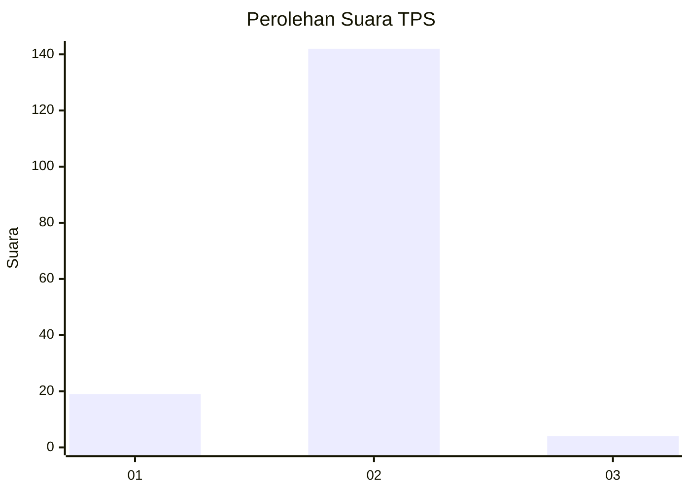
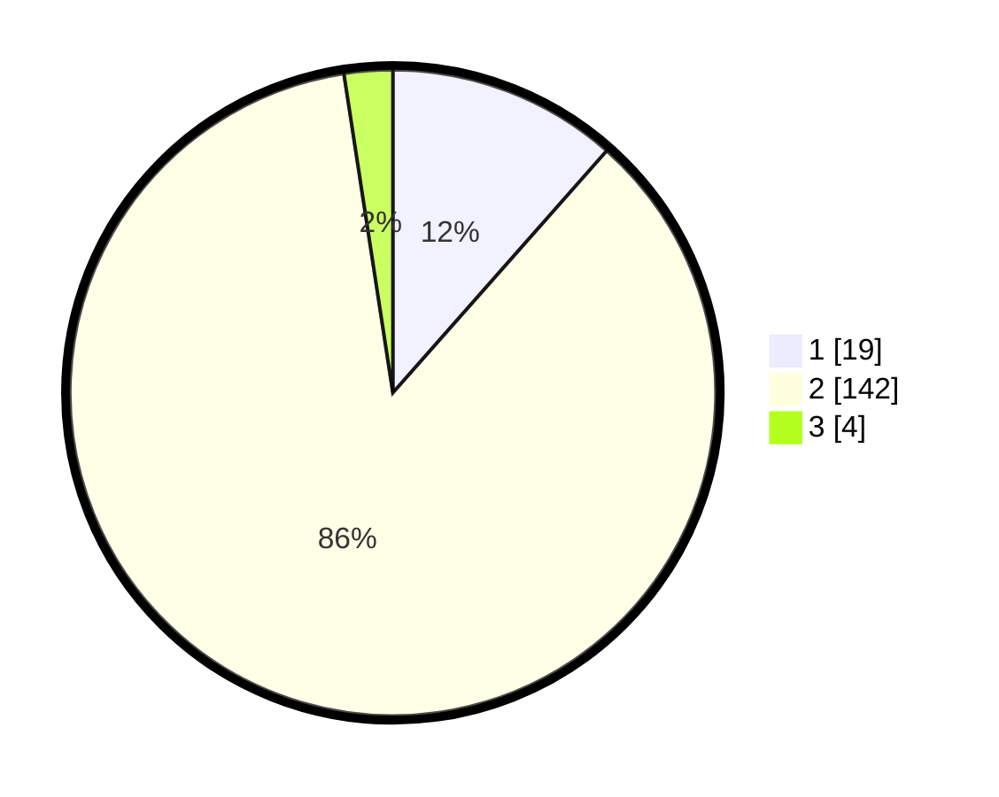

# Hasil

## Grafik

## Tabel

| No. | Nama Paslon    | Suara | Suara (raw) | Persentase |
|:--- |:-------------- | -----:| -----------:| ----------:|
| 1   | ANIES MUHAIMIN | 19    | [19][p-1]   | 11,52      |
| 2   | PRABOWO GIBRAN | 142   | [142][p-2]  | 86,06      |
| 3   | GANJAR MAHFUD  | 4     | [4][p-3]    | 2,42       |

[p-1]: https://github.com/gigit-pemilu/pemilu-2024-16-sumatera-selatan/blob/main/pilpres/hitung-suara/sub/16-sumatera-selatan/sub/01-ogan-komering-ulu/sub/07-sosoh-buay-rayap/sub/2001-negeri-sindang/sub/001-tps/sub/paslon-1.txt
[p-2]: https://github.com/gigit-pemilu/pemilu-2024-16-sumatera-selatan/blob/main/pilpres/hitung-suara/sub/16-sumatera-selatan/sub/01-ogan-komering-ulu/sub/07-sosoh-buay-rayap/sub/2001-negeri-sindang/sub/001-tps/sub/paslon-2.txt
[p-3]: https://github.com/gigit-pemilu/pemilu-2024-16-sumatera-selatan/blob/main/pilpres/hitung-suara/sub/16-sumatera-selatan/sub/01-ogan-komering-ulu/sub/07-sosoh-buay-rayap/sub/2001-negeri-sindang/sub/001-tps/sub/paslon-3.txt

## Foto C Plano

https://sirekap-obj-formc.kpu.go.id/0b87/pemilu/ppwp/16/01/07/20/01/1601072001001-20240215-024224--700b4f1d-e676-4adb-9fed-221716b1b532.jpg

https://sirekap-obj-formc.kpu.go.id/0b87/pemilu/ppwp/16/01/07/20/01/1601072001001-20240221-095657--87f55bcf-b167-4d0e-b7f6-e66d56a5e7d9.jpg

https://sirekap-obj-formc.kpu.go.id/0b87/pemilu/ppwp/16/01/07/20/01/1601072001001-20240215-024306--d9237de4-8010-462d-9d93-b71e7aac5306.jpg

## Metadata

| Key        | Value               |
| ---------- | ------------------- |
| Time Stamp | 2024-02-25 14:00:00 |

## DATA PEMILIH TETAP

Jumlah pemilih dalam DPT: **220**.
 * L: **122**.
 * P: **98**.

## DATA PENGGUNA HAK PILIH

Jumlah pengguna hak pilih dalam DPT: **173**.
 * L: **93**.
 * P: **80**.

Jumlah pengguna hak pilih dalam DPTb: **1**.
 * L: **1**.
 * P: **0**.

Jumlah pengguna hak pilih dalam DPK: **0**.
 * L: **0**.
 * P: **0**.

Jumlah pengguna hak pilih: **174**.
 * L: **94**.
 * P: **80**.

## JUMLAH SUARA SAH DAN TIDAK SAH

JUMLAH SELURUH SUARA SAH: **165**.

JUMLAH SUARA TIDAK SAH: **9**.

JUMLAH SELURUH SUARA SAH DAN SUARA TIDAK SAH: **174**.

