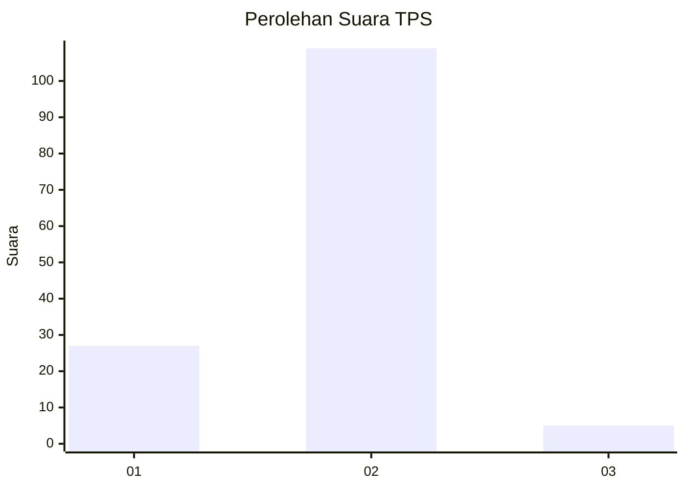
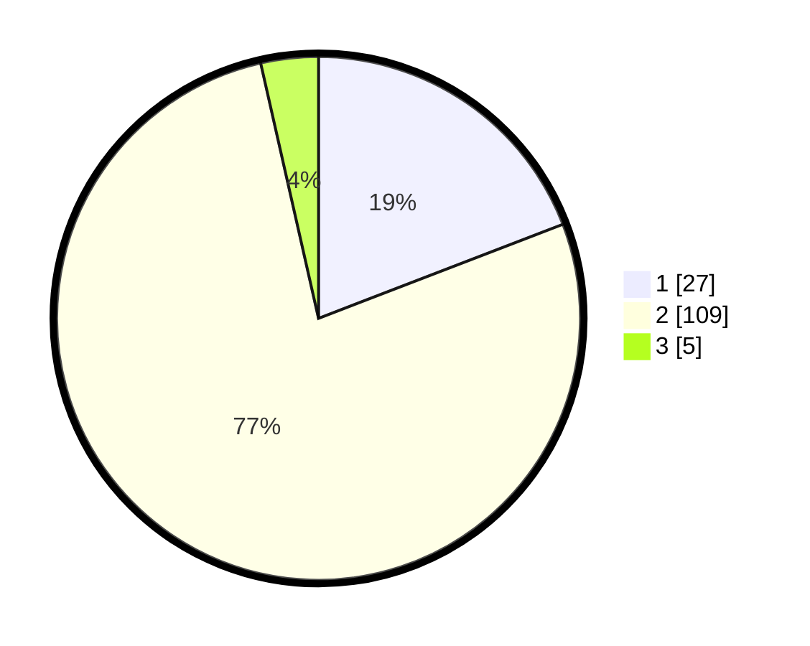

# Hasil

## Grafik

## Tabel

| No. | Nama Paslon    | Suara | Suara (raw) | Persentase |
|:--- |:-------------- | -----:| -----------:| ----------:|
| 1   | ANIES MUHAIMIN | 27    | [27][p-1]   | 19,15      |
| 2   | PRABOWO GIBRAN | 109   | [109][p-2]  | 77,30      |
| 3   | GANJAR MAHFUD  | 5     | [5][p-3]    | 3,55       |

[p-1]: https://github.com/gigit-pemilu/pemilu-2024-16-sumatera-selatan/blob/main/pilpres/hitung-suara/sub/16-sumatera-selatan/sub/01-ogan-komering-ulu/sub/07-sosoh-buay-rayap/sub/2001-negeri-sindang/sub/002-tps/sub/paslon-1.txt
[p-2]: https://github.com/gigit-pemilu/pemilu-2024-16-sumatera-selatan/blob/main/pilpres/hitung-suara/sub/16-sumatera-selatan/sub/01-ogan-komering-ulu/sub/07-sosoh-buay-rayap/sub/2001-negeri-sindang/sub/002-tps/sub/paslon-2.txt
[p-3]: https://github.com/gigit-pemilu/pemilu-2024-16-sumatera-selatan/blob/main/pilpres/hitung-suara/sub/16-sumatera-selatan/sub/01-ogan-komering-ulu/sub/07-sosoh-buay-rayap/sub/2001-negeri-sindang/sub/002-tps/sub/paslon-3.txt

## Foto C Plano

https://sirekap-obj-formc.kpu.go.id/8751/pemilu/ppwp/16/01/07/20/01/1601072001002-20240216-143256--0e236518-bd37-451b-b250-7c156c25692c.jpg

https://sirekap-obj-formc.kpu.go.id/8751/pemilu/ppwp/16/01/07/20/01/1601072001002-20240216-143258--33a9e8a5-3430-454d-8b91-57bd48090174.jpg

https://sirekap-obj-formc.kpu.go.id/8751/pemilu/ppwp/16/01/07/20/01/1601072001002-20240216-143257--32bd7d79-df96-4228-94a9-468a88aafe06.jpg

## Metadata

| Key        | Value               |
| ---------- | ------------------- |
| Time Stamp | 2024-02-16 16:25:10 |

## DATA PEMILIH TETAP

Jumlah pemilih dalam DPT: **188**.
 * L: **111**.
 * P: **77**.

## DATA PENGGUNA HAK PILIH

Jumlah pengguna hak pilih dalam DPT: **150**.
 * L: **79**.
 * P: **71**.

Jumlah pengguna hak pilih dalam DPTb: **0**.
 * L: **0**.
 * P: **0**.

Jumlah pengguna hak pilih dalam DPK: **0**.
 * L: **0**.
 * P: **0**.

Jumlah pengguna hak pilih: **150**.
 * L: **79**.
 * P: **71**.

## JUMLAH SUARA SAH DAN TIDAK SAH

JUMLAH SELURUH SUARA SAH: **141**.

JUMLAH SUARA TIDAK SAH: **9**.

JUMLAH SELURUH SUARA SAH DAN SUARA TIDAK SAH: **150**.

