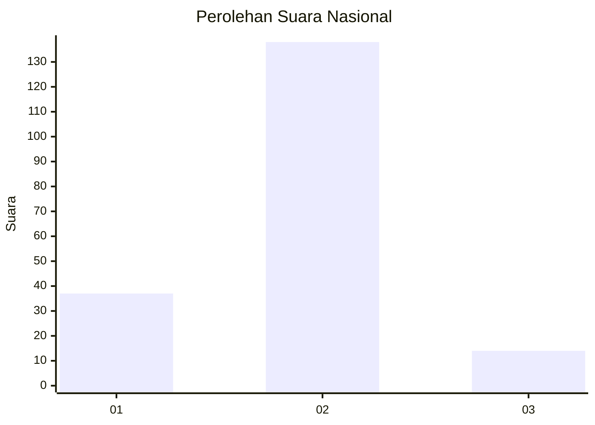
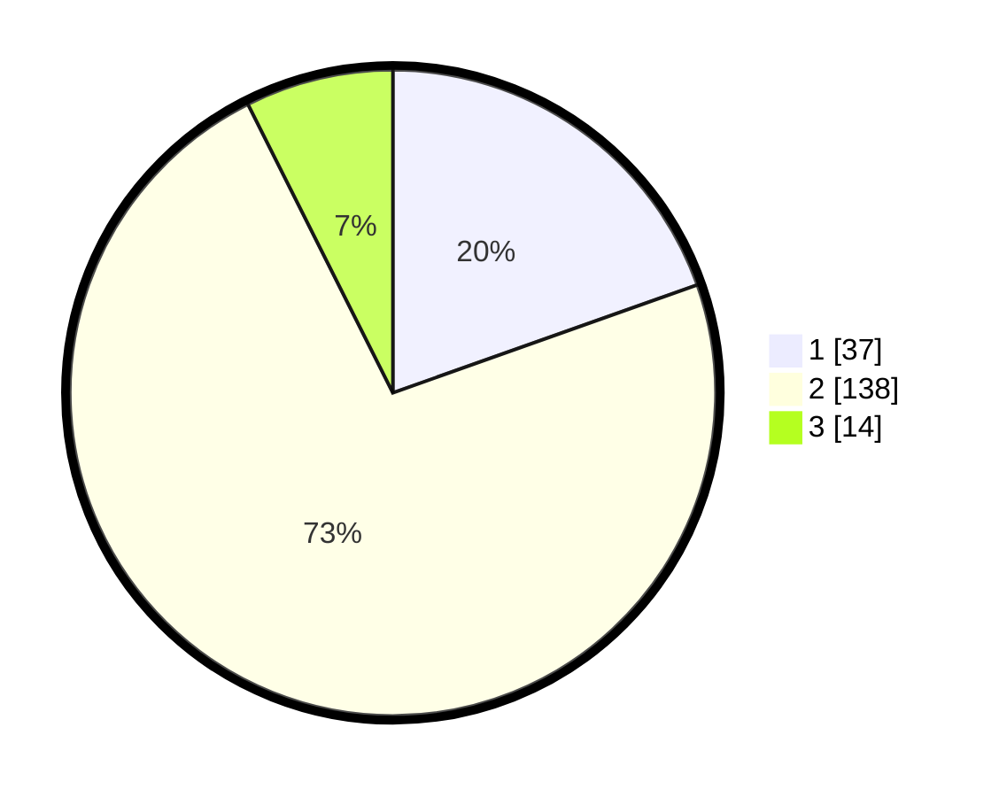

# Hasil

## Grafik

## Tabel

| No. | Nama Paslon    | Suara | Suara (raw) | Persentase |
|:--- |:-------------- | -----:| -----------:| ----------:|
| 1   | ANIES MUHAIMIN | 37    | [37][p-1]   | 19,58      |
| 2   | PRABOWO GIBRAN | 138   | [138][p-2]  | 73,02      |
| 3   | GANJAR MAHFUD  | 14    | [14][p-3]   | 7,41       |

[p-1]: https://github.com/gigit-pemilu/pemilu-2024/blob/main/pilpres/hitung-suara/sub/16-sumatera-selatan/sub/01-ogan-komering-ulu/sub/07-sosoh-buay-rayap/sub/2001-negeri-sindang/sub/004-tps/sub/paslon-1.txt
[p-2]: https://github.com/gigit-pemilu/pemilu-2024/blob/main/pilpres/hitung-suara/sub/16-sumatera-selatan/sub/01-ogan-komering-ulu/sub/07-sosoh-buay-rayap/sub/2001-negeri-sindang/sub/004-tps/sub/paslon-2.txt
[p-3]: https://github.com/gigit-pemilu/pemilu-2024/blob/main/pilpres/hitung-suara/sub/16-sumatera-selatan/sub/01-ogan-komering-ulu/sub/07-sosoh-buay-rayap/sub/2001-negeri-sindang/sub/004-tps/sub/paslon-3.txt

## Foto C Plano

https://sirekap-obj-formc.kpu.go.id/556e/pemilu/ppwp/16/01/07/20/01/1601072001004-20240221-113043--8228d380-8a18-4a7f-83b1-f97bdf74ca3c.jpg

https://sirekap-obj-formc.kpu.go.id/556e/pemilu/ppwp/16/01/07/20/01/1601072001004-20240221-113303--c71b1a71-3102-42b7-8d23-3204a4412bfc.jpg

https://sirekap-obj-formc.kpu.go.id/556e/pemilu/ppwp/16/01/07/20/01/1601072001004-20240221-113420--1dc034c6-a83d-43bf-9922-25b426aef5f4.jpg

## Metadata

| Key        | Value               |
| ---------- | ------------------- |
| Time Stamp | 2024-02-25 17:00:00 |

