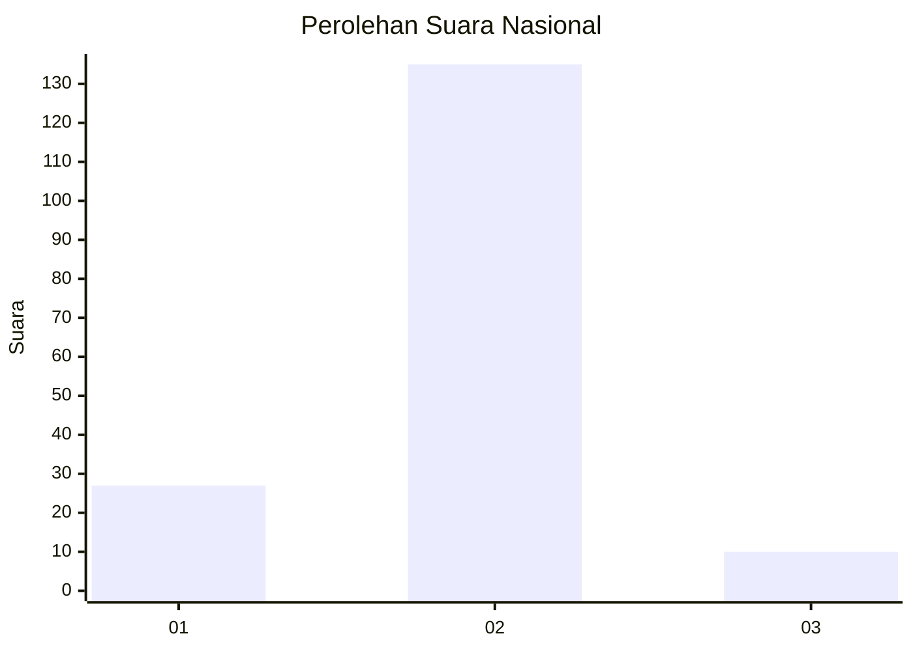
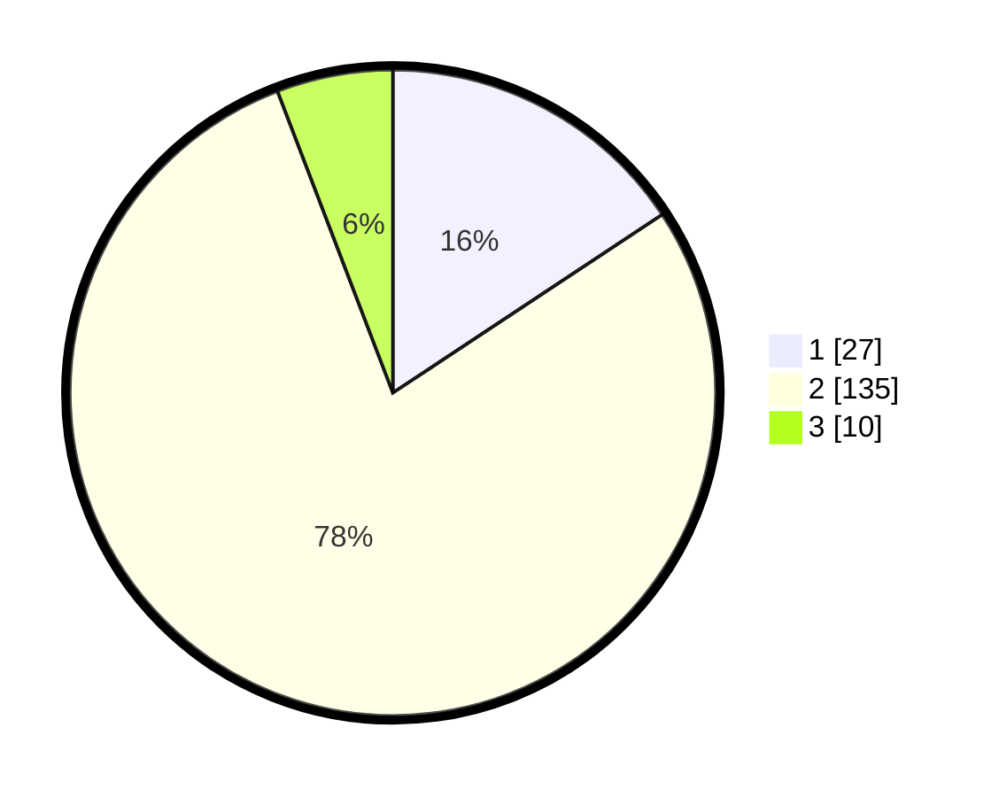

# Hasil

## Grafik

## Tabel

| No. | Nama Paslon    | Suara | Suara (raw) | Persentase |
|:--- |:-------------- | -----:| -----------:| ----------:|
| 1   | ANIES MUHAIMIN | 27    | [27][p-1]   | 15,70      |
| 2   | PRABOWO GIBRAN | 135   | [135][p-2]  | 78,49      |
| 3   | GANJAR MAHFUD  | 10    | [10][p-3]   | 5,81       |

[p-1]: https://github.com/gigit-pemilu/pemilu-2024/blob/main/pilpres/hitung-suara/sub/16-sumatera-selatan/sub/01-ogan-komering-ulu/sub/07-sosoh-buay-rayap/sub/2001-negeri-sindang/sub/005-tps/sub/paslon-1.txt
[p-2]: https://github.com/gigit-pemilu/pemilu-2024/blob/main/pilpres/hitung-suara/sub/16-sumatera-selatan/sub/01-ogan-komering-ulu/sub/07-sosoh-buay-rayap/sub/2001-negeri-sindang/sub/005-tps/sub/paslon-2.txt
[p-3]: https://github.com/gigit-pemilu/pemilu-2024/blob/main/pilpres/hitung-suara/sub/16-sumatera-selatan/sub/01-ogan-komering-ulu/sub/07-sosoh-buay-rayap/sub/2001-negeri-sindang/sub/005-tps/sub/paslon-3.txt

## Foto C Plano

https://sirekap-obj-formc.kpu.go.id/61c5/pemilu/ppwp/16/01/07/20/01/1601072001005-20240216-032546--2d4b3eec-79fe-49bd-ac3e-7c7a9ea5c6e7.jpg

https://sirekap-obj-formc.kpu.go.id/61c5/pemilu/ppwp/16/01/07/20/01/1601072001005-20240216-033530--367cd966-941a-4d5e-bf8a-b18584318430.jpg

https://sirekap-obj-formc.kpu.go.id/61c5/pemilu/ppwp/16/01/07/20/01/1601072001005-20240216-032552--5b3053ee-e934-441e-98eb-a8696dada659.jpg

## Metadata

| Key        | Value               |
| ---------- | ------------------- |
| Time Stamp | 2024-02-16 16:25:10 |

## DATA PEMILIH TETAP

Jumlah pemilih dalam DPT: **232**.
 * L: **125**.
 * P: **107**.

## DATA PENGGUNA HAK PILIH

Jumlah pengguna hak pilih dalam DPT: **179**.
 * L: **94**.
 * P: **85**.

Jumlah pengguna hak pilih dalam DPTb: **0**.
 * L: **0**.
 * P: **0**.

Jumlah pengguna hak pilih dalam DPK: **1**.
 * L: **0**.
 * P: **1**.

Jumlah pengguna hak pilih: **180**.
 * L: **94**.
 * P: **86**.

## JUMLAH SUARA SAH DAN TIDAK SAH

JUMLAH SELURUH SUARA SAH: **172**.

JUMLAH SUARA TIDAK SAH: **8**.

JUMLAH SELURUH SUARA SAH DAN SUARA TIDAK SAH: **180**.

