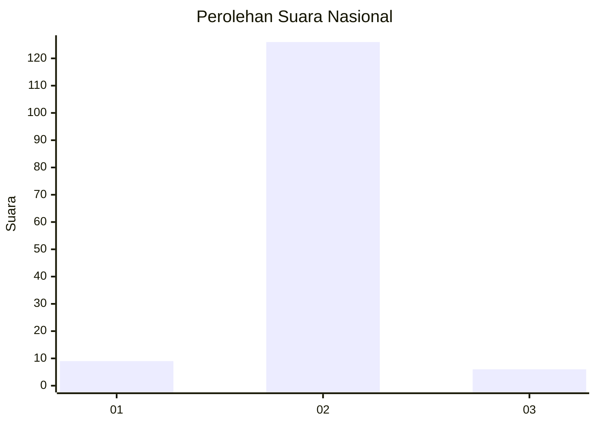
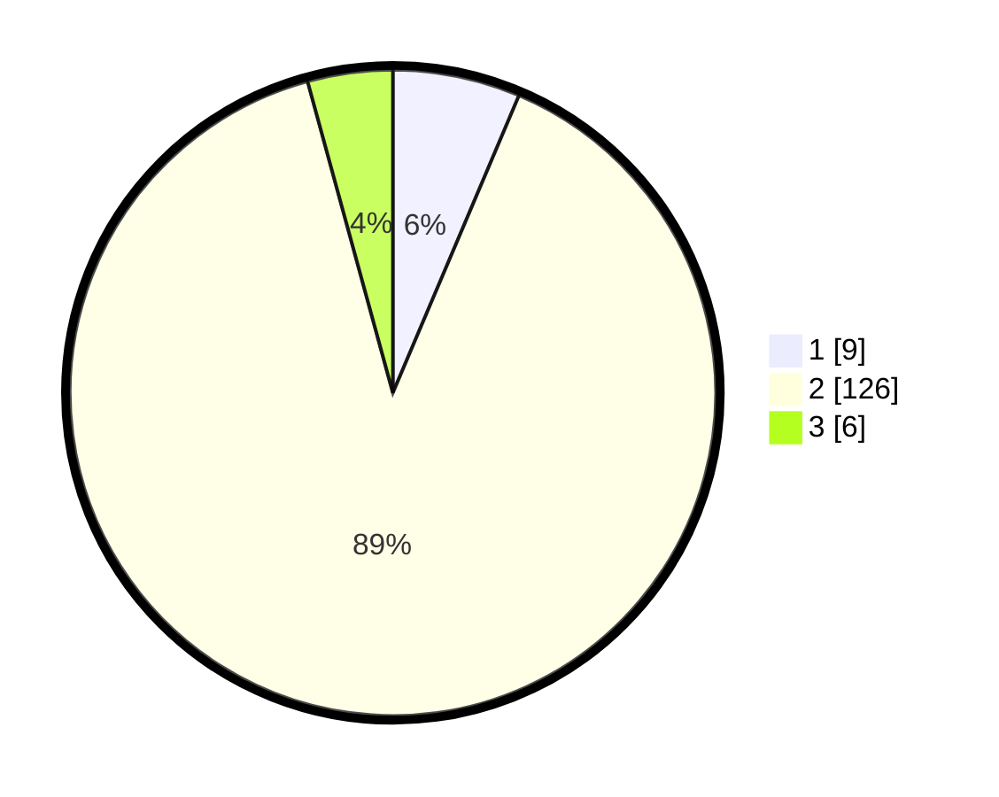

# Hasil

## Grafik

## Tabel

| No. | Nama Paslon    | Suara | Suara (raw) | Persentase |
|:--- |:-------------- | -----:| -----------:| ----------:|
| 1   | ANIES MUHAIMIN | 9     | [9][p-1]    | 6,38       |
| 2   | PRABOWO GIBRAN | 126   | [126][p-2]  | 89,36      |
| 3   | GANJAR MAHFUD  | 6     | [6][p-3]    | 4,26       |

[p-1]: https://github.com/gigit-pemilu/pemilu-2024/blob/main/pilpres/hitung-suara/sub/16-sumatera-selatan/sub/01-ogan-komering-ulu/sub/07-sosoh-buay-rayap/sub/2001-negeri-sindang/sub/006-tps/sub/paslon-1.txt
[p-2]: https://github.com/gigit-pemilu/pemilu-2024/blob/main/pilpres/hitung-suara/sub/16-sumatera-selatan/sub/01-ogan-komering-ulu/sub/07-sosoh-buay-rayap/sub/2001-negeri-sindang/sub/006-tps/sub/paslon-2.txt
[p-3]: https://github.com/gigit-pemilu/pemilu-2024/blob/main/pilpres/hitung-suara/sub/16-sumatera-selatan/sub/01-ogan-komering-ulu/sub/07-sosoh-buay-rayap/sub/2001-negeri-sindang/sub/006-tps/sub/paslon-3.txt

## Foto C Plano

https://sirekap-obj-formc.kpu.go.id/12d4/pemilu/ppwp/16/01/07/20/01/1601072001006-20240215-035701--aa4330eb-d914-42da-ab0b-da2f4a7e707f.jpg

https://sirekap-obj-formc.kpu.go.id/12d4/pemilu/ppwp/16/01/07/20/01/1601072001006-20240215-035648--d100bf0b-81fb-4546-8ef9-39744a4549d1.jpg

## Metadata

| Key        | Value               |
| ---------- | ------------------- |
| Time Stamp | 2024-02-15 12:00:28 |

