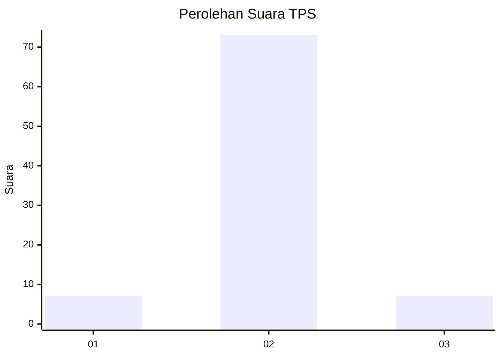
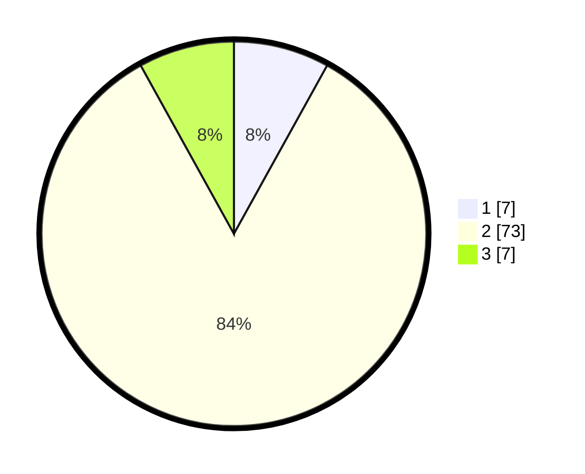

# Hasil

## Grafik

## Tabel

| No. | Nama Paslon    | Suara | Suara (raw) | Persentase |
|:--- |:-------------- | -----:| -----------:| ----------:|
| 1   | ANIES MUHAIMIN | 7     | [7][p-1]    | 8,05       |
| 2   | PRABOWO GIBRAN | 73    | [73][p-2]   | 83,91      |
| 3   | GANJAR MAHFUD  | 7     | [7][p-3]    | 8,05       |

[p-1]: https://github.com/gigit-pemilu/pemilu-2024-16-sumatera-selatan/blob/main/pilpres/hitung-suara/sub/16-sumatera-selatan/sub/01-ogan-komering-ulu/sub/07-sosoh-buay-rayap/sub/2001-negeri-sindang/sub/009-tps/sub/paslon-1.txt
[p-2]: https://github.com/gigit-pemilu/pemilu-2024-16-sumatera-selatan/blob/main/pilpres/hitung-suara/sub/16-sumatera-selatan/sub/01-ogan-komering-ulu/sub/07-sosoh-buay-rayap/sub/2001-negeri-sindang/sub/009-tps/sub/paslon-2.txt
[p-3]: https://github.com/gigit-pemilu/pemilu-2024-16-sumatera-selatan/blob/main/pilpres/hitung-suara/sub/16-sumatera-selatan/sub/01-ogan-komering-ulu/sub/07-sosoh-buay-rayap/sub/2001-negeri-sindang/sub/009-tps/sub/paslon-3.txt

## Foto C Plano

https://sirekap-obj-formc.kpu.go.id/76c2/pemilu/ppwp/16/01/07/20/01/1601072001009-20240215-114419--df87efdf-fd38-48e4-a645-fb7706dc54a5.jpg

https://sirekap-obj-formc.kpu.go.id/76c2/pemilu/ppwp/16/01/07/20/01/1601072001009-20240215-114514--fe7b0c5c-88a4-4330-9de7-7ae37a8016a6.jpg

https://sirekap-obj-formc.kpu.go.id/76c2/pemilu/ppwp/16/01/07/20/01/1601072001009-20240215-114531--c46e6a85-88e2-413b-ab9e-c55eabb7a0a5.jpg

## Metadata

| Key        | Value               |
| ---------- | ------------------- |
| Time Stamp | 2024-02-25 18:00:00 |

## DATA PEMILIH TETAP

Jumlah pemilih dalam DPT: **88**.
 * L: **53**.
 * P: **35**.

## DATA PENGGUNA HAK PILIH

Jumlah pengguna hak pilih dalam DPT: **83**.
 * L: **53**.
 * P: **30**.

Jumlah pengguna hak pilih dalam DPTb: **4**.
 * L: **4**.
 * P: **0**.

Jumlah pengguna hak pilih dalam DPK: **3**.
 * L: **3**.
 * P: **0**.

Jumlah pengguna hak pilih: **90**.
 * L: **60**.
 * P: **30**.

## JUMLAH SUARA SAH DAN TIDAK SAH

JUMLAH SELURUH SUARA SAH: **87**.

JUMLAH SUARA TIDAK SAH: **3**.

JUMLAH SELURUH SUARA SAH DAN SUARA TIDAK SAH: **90**.

