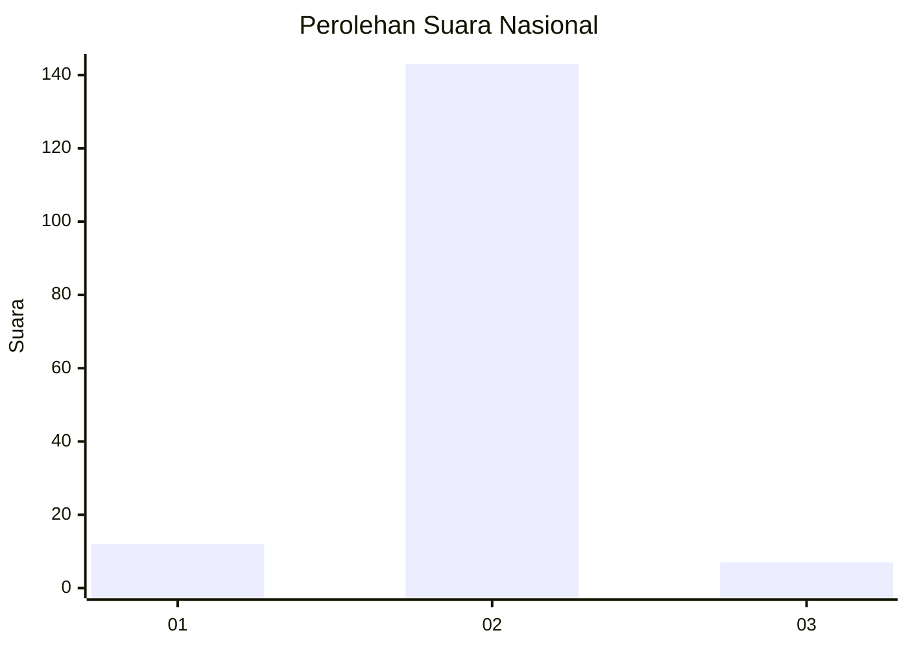
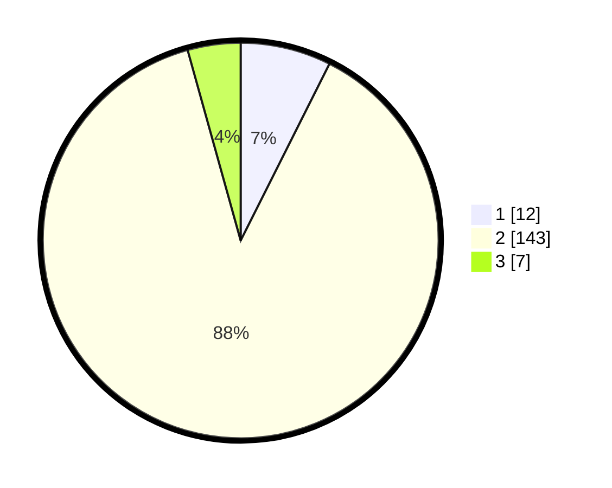

# Hasil

## Grafik

## Tabel

| No. | Nama Paslon    | Suara | Suara (raw) | Persentase |
|:--- |:-------------- | -----:| -----------:| ----------:|
| 1   | ANIES MUHAIMIN | 12    | [12][p-1]   | 7,41       |
| 2   | PRABOWO GIBRAN | 143   | [143][p-2]  | 88,27      |
| 3   | GANJAR MAHFUD  | 7     | [7][p-3]    | 4,32       |

[p-1]: https://github.com/gigit-pemilu/pemilu-2024/blob/main/pilpres/hitung-suara/sub/16-sumatera-selatan/sub/01-ogan-komering-ulu/sub/07-sosoh-buay-rayap/sub/2007-lubuk-leban/sub/001-tps/sub/paslon-1.txt
[p-2]: https://github.com/gigit-pemilu/pemilu-2024/blob/main/pilpres/hitung-suara/sub/16-sumatera-selatan/sub/01-ogan-komering-ulu/sub/07-sosoh-buay-rayap/sub/2007-lubuk-leban/sub/001-tps/sub/paslon-2.txt
[p-3]: https://github.com/gigit-pemilu/pemilu-2024/blob/main/pilpres/hitung-suara/sub/16-sumatera-selatan/sub/01-ogan-komering-ulu/sub/07-sosoh-buay-rayap/sub/2007-lubuk-leban/sub/001-tps/sub/paslon-3.txt

## Foto C Plano

https://sirekap-obj-formc.kpu.go.id/5417/pemilu/ppwp/16/01/07/20/07/1601072007001-20240214-194919--e7faae80-37e2-4a75-b759-1b7780fc435f.jpg

https://sirekap-obj-formc.kpu.go.id/5417/pemilu/ppwp/16/01/07/20/07/1601072007001-20240214-194925--69a82a9a-b063-45a3-9553-f8480ca8b274.jpg

https://sirekap-obj-formc.kpu.go.id/5417/pemilu/ppwp/16/01/07/20/07/1601072007001-20240214-194930--b1cc8f8d-66a7-481f-bbd5-b751960c037d.jpg

## Metadata

| Key        | Value               |
| ---------- | ------------------- |
| Time Stamp | 2024-02-25 17:00:00 |

