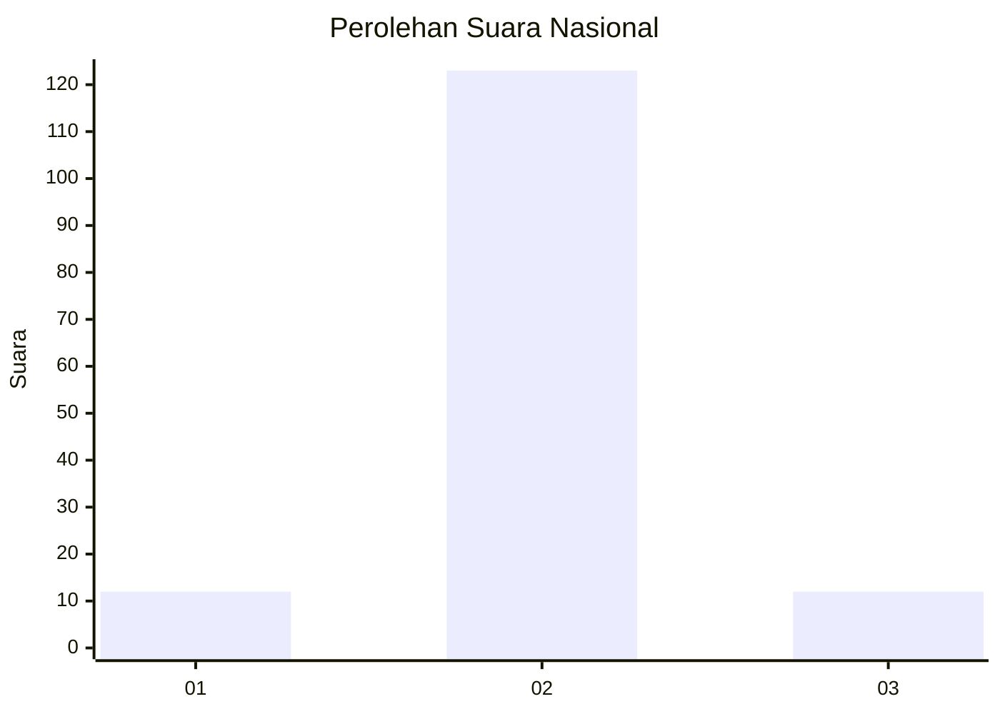
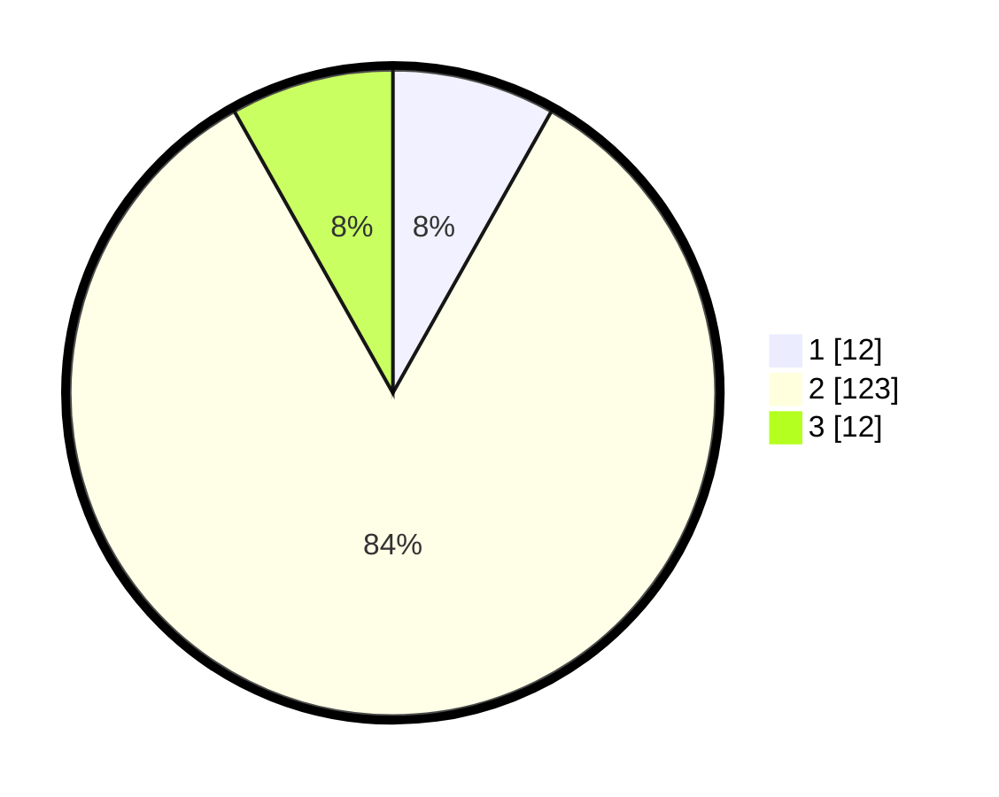

# Hasil

## Grafik

## Tabel

| No. | Nama Paslon    | Suara | Suara (raw) | Persentase |
|:--- |:-------------- | -----:| -----------:| ----------:|
| 1   | ANIES MUHAIMIN | 12    | [12][p-1]   | 8,16       |
| 2   | PRABOWO GIBRAN | 123   | [123][p-2]  | 83,67      |
| 3   | GANJAR MAHFUD  | 12    | [12][p-3]   | 8,16       |

[p-1]: https://github.com/gigit-pemilu/pemilu-2024/blob/main/pilpres/hitung-suara/sub/16-sumatera-selatan/sub/01-ogan-komering-ulu/sub/07-sosoh-buay-rayap/sub/2007-lubuk-leban/sub/002-tps/sub/paslon-1.txt
[p-2]: https://github.com/gigit-pemilu/pemilu-2024/blob/main/pilpres/hitung-suara/sub/16-sumatera-selatan/sub/01-ogan-komering-ulu/sub/07-sosoh-buay-rayap/sub/2007-lubuk-leban/sub/002-tps/sub/paslon-2.txt
[p-3]: https://github.com/gigit-pemilu/pemilu-2024/blob/main/pilpres/hitung-suara/sub/16-sumatera-selatan/sub/01-ogan-komering-ulu/sub/07-sosoh-buay-rayap/sub/2007-lubuk-leban/sub/002-tps/sub/paslon-3.txt

## Foto C Plano

https://sirekap-obj-formc.kpu.go.id/acb5/pemilu/ppwp/16/01/07/20/07/1601072007002-20240215-005551--3e651dbb-f742-47d6-bde3-4afb821abe13.jpg

https://sirekap-obj-formc.kpu.go.id/acb5/pemilu/ppwp/16/01/07/20/07/1601072007002-20240215-010415--6c1255d4-75ba-4861-be98-c034bf758ef6.jpg

https://sirekap-obj-formc.kpu.go.id/acb5/pemilu/ppwp/16/01/07/20/07/1601072007002-20240215-013607--cd1a6348-c143-435c-9b3a-46d78ab4998a.jpg

## Metadata

| Key        | Value               |
| ---------- | ------------------- |
| Time Stamp | 2024-02-26 11:00:00 |

