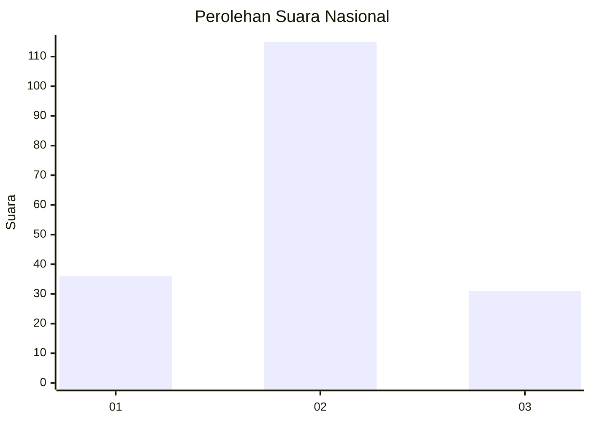

# Hasil

## Grafik

## Tabel

| No. | Nama Paslon    | Suara | Suara (raw) | Persentase |
|:--- |:-------------- | -----:| -----------:| ----------:|
| 1   | ANIES MUHAIMIN | 36    | [36][p-1]   | 19,78      |
| 2   | PRABOWO GIBRAN | 115   | [115][p-2]  | 63,19      |
| 3   | GANJAR MAHFUD  | 31    | [31][p-3]   | 17,03      |

[p-1]: https://github.com/gigit-pemilu/pemilu-2024/blob/main/pilpres/hitung-suara/sub/16-sumatera-selatan/sub/01-ogan-komering-ulu/sub/08-pengandonan/sub/2001-gunung-meraksa/sub/002-tps/sub/paslon-1.txt
[p-2]: https://github.com/gigit-pemilu/pemilu-2024/blob/main/pilpres/hitung-suara/sub/16-sumatera-selatan/sub/01-ogan-komering-ulu/sub/08-pengandonan/sub/2001-gunung-meraksa/sub/002-tps/sub/paslon-2.txt
[p-3]: https://github.com/gigit-pemilu/pemilu-2024/blob/main/pilpres/hitung-suara/sub/16-sumatera-selatan/sub/01-ogan-komering-ulu/sub/08-pengandonan/sub/2001-gunung-meraksa/sub/002-tps/sub/paslon-3.txt

## Foto C Plano

https://sirekap-obj-formc.kpu.go.id/5898/pemilu/ppwp/16/01/08/20/01/1601082001002-20240215-103738--6beec17b-ea7d-4a7c-9d24-9805b1116ac1.jpg

https://sirekap-obj-formc.kpu.go.id/5898/pemilu/ppwp/16/01/08/20/01/1601082001002-20240215-103922--aa89e5b9-f6cf-4554-835d-1e72c93c8d96.jpg

https://sirekap-obj-formc.kpu.go.id/5898/pemilu/ppwp/16/01/08/20/01/1601082001002-20240215-104216--bfbdba5b-61ff-4b2a-b05b-c14bed17890f.jpg

## Metadata

| Key        | Value               |
| ---------- | ------------------- |
| Time Stamp | 2024-02-25 11:00:00 |

