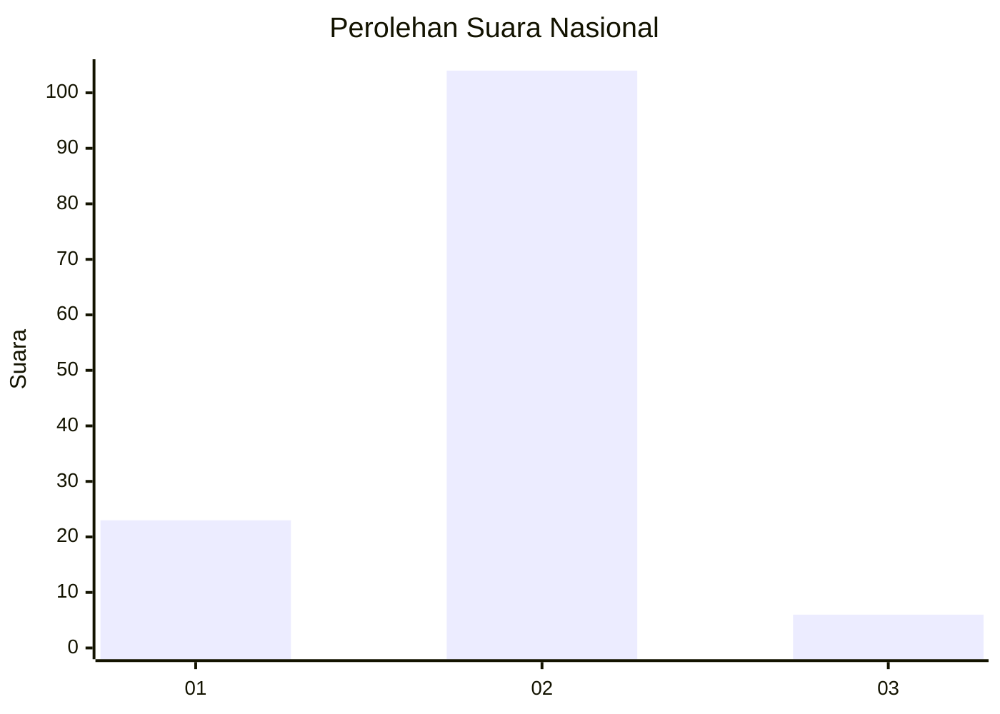
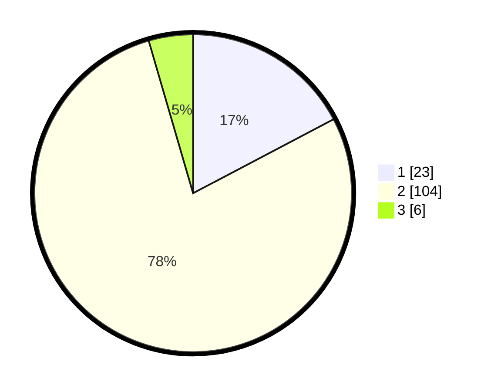

# Hasil

## Grafik

## Tabel

| No. | Nama Paslon    | Suara | Suara (raw) | Persentase |
|:--- |:-------------- | -----:| -----------:| ----------:|
| 1   | ANIES MUHAIMIN | 23    | [23][p-1]   | 17,29      |
| 2   | PRABOWO GIBRAN | 104   | [104][p-2]  | 78,20      |
| 3   | GANJAR MAHFUD  | 6     | [6][p-3]    | 4,51       |

[p-1]: https://github.com/gigit-pemilu/pemilu-2024/blob/main/pilpres/hitung-suara/sub/16-sumatera-selatan/sub/01-ogan-komering-ulu/sub/08-pengandonan/sub/2004-tanjung-sari/sub/002-tps/sub/paslon-1.txt
[p-2]: https://github.com/gigit-pemilu/pemilu-2024/blob/main/pilpres/hitung-suara/sub/16-sumatera-selatan/sub/01-ogan-komering-ulu/sub/08-pengandonan/sub/2004-tanjung-sari/sub/002-tps/sub/paslon-2.txt
[p-3]: https://github.com/gigit-pemilu/pemilu-2024/blob/main/pilpres/hitung-suara/sub/16-sumatera-selatan/sub/01-ogan-komering-ulu/sub/08-pengandonan/sub/2004-tanjung-sari/sub/002-tps/sub/paslon-3.txt

## Foto C Plano

https://sirekap-obj-formc.kpu.go.id/94fc/pemilu/ppwp/16/01/08/20/04/1601082004002-20240215-013442--c287a5e0-4df3-40f6-bb7c-a82ce6f3b9de.jpg

https://sirekap-obj-formc.kpu.go.id/94fc/pemilu/ppwp/16/01/08/20/04/1601082004002-20240215-013641--f8a804c6-cb89-490b-b0e2-ce7a055453f6.jpg

https://sirekap-obj-formc.kpu.go.id/94fc/pemilu/ppwp/16/01/08/20/04/1601082004002-20240215-013817--f64b1395-5cd3-4bcf-849e-637496468db8.jpg

## Metadata

| Key        | Value               |
| ---------- | ------------------- |
| Time Stamp | 2024-02-25 17:00:00 |

