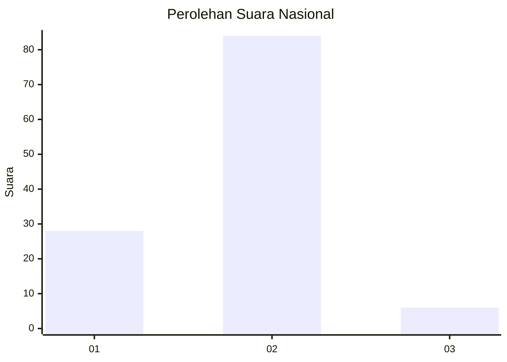
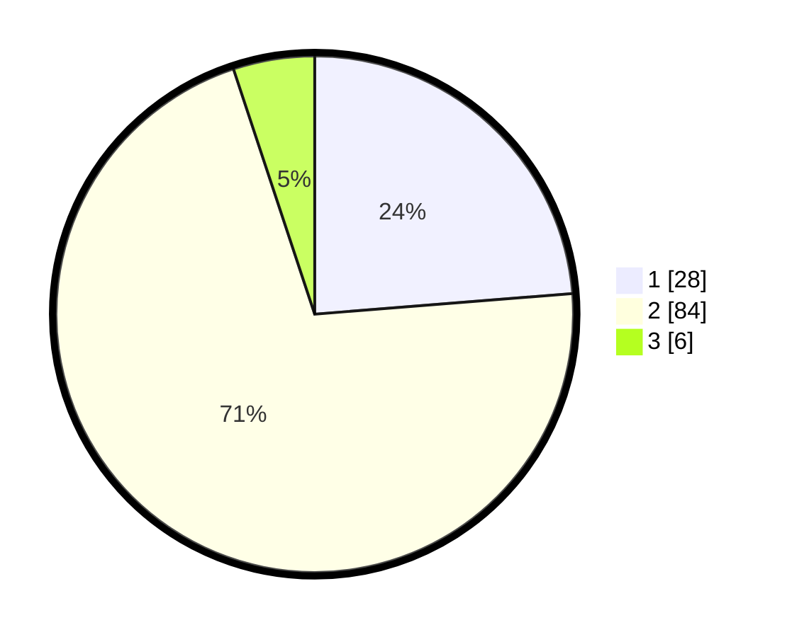

# Hasil

## Grafik

## Tabel

| No. | Nama Paslon    | Suara | Suara (raw) | Persentase |
|:--- |:-------------- | -----:| -----------:| ----------:|
| 1   | ANIES MUHAIMIN | 28    | [28][p-1]   | 23,73      |
| 2   | PRABOWO GIBRAN | 84    | [84][p-2]   | 71,19      |
| 3   | GANJAR MAHFUD  | 6     | [6][p-3]    | 5,08       |

[p-1]: https://github.com/gigit-pemilu/pemilu-2024/blob/main/pilpres/hitung-suara/sub/16-sumatera-selatan/sub/01-ogan-komering-ulu/sub/08-pengandonan/sub/2005-tangsi-lontar/sub/001-tps/sub/paslon-1.txt
[p-2]: https://github.com/gigit-pemilu/pemilu-2024/blob/main/pilpres/hitung-suara/sub/16-sumatera-selatan/sub/01-ogan-komering-ulu/sub/08-pengandonan/sub/2005-tangsi-lontar/sub/001-tps/sub/paslon-2.txt
[p-3]: https://github.com/gigit-pemilu/pemilu-2024/blob/main/pilpres/hitung-suara/sub/16-sumatera-selatan/sub/01-ogan-komering-ulu/sub/08-pengandonan/sub/2005-tangsi-lontar/sub/001-tps/sub/paslon-3.txt

## Foto C Plano

https://sirekap-obj-formc.kpu.go.id/2aa4/pemilu/ppwp/16/01/08/20/05/1601082005001-20240214-215705--acb321f2-ce3e-4438-8a46-138b194b0cf0.jpg

https://sirekap-obj-formc.kpu.go.id/2aa4/pemilu/ppwp/16/01/08/20/05/1601082005001-20240214-215723--09fbd5e2-c8da-4685-9d4a-bf82e9a78690.jpg

https://sirekap-obj-formc.kpu.go.id/2aa4/pemilu/ppwp/16/01/08/20/05/1601082005001-20240214-215739--9e07371b-3729-4492-a5df-36f23049f16f.jpg

## Metadata

| Key        | Value               |
| ---------- | ------------------- |
| Time Stamp | 2024-02-15 18:00:26 |

## DATA PEMILIH TETAP

Jumlah pemilih dalam DPT: **162**.
 * L: **76**.
 * P: **86**.

## DATA PENGGUNA HAK PILIH

Jumlah pengguna hak pilih dalam DPT: **117**.
 * L: **57**.
 * P: **60**.

Jumlah pengguna hak pilih dalam DPTb: **4**.
 * L: **4**.
 * P: **0**.

Jumlah pengguna hak pilih dalam DPK: **1**.
 * L: **1**.
 * P: **0**.

Jumlah pengguna hak pilih: **122**.
 * L: **62**.
 * P: **60**.

## JUMLAH SUARA SAH DAN TIDAK SAH

JUMLAH SELURUH SUARA SAH: **118**.

JUMLAH SUARA TIDAK SAH: **4**.

JUMLAH SELURUH SUARA SAH DAN SUARA TIDAK SAH: **122**.

