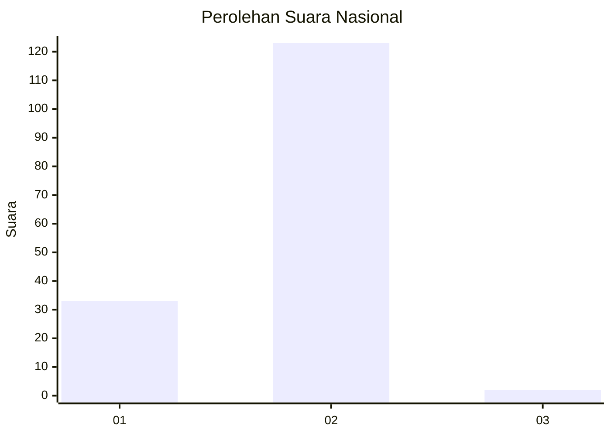
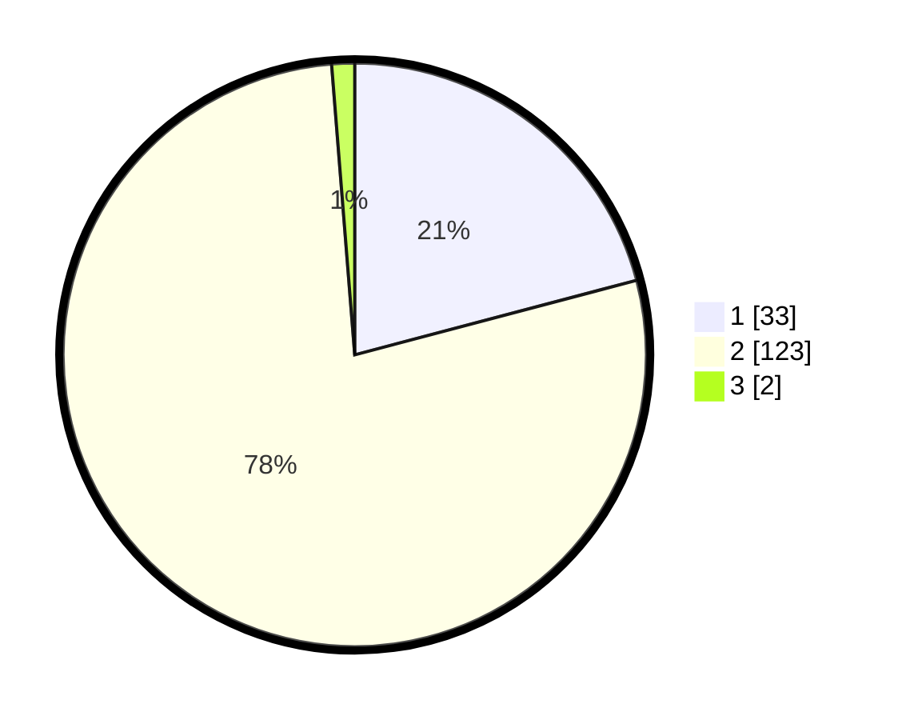

# Hasil

## Grafik

## Tabel

| No. | Nama Paslon    | Suara | Suara (raw) | Persentase |
|:--- |:-------------- | -----:| -----------:| ----------:|
| 1   | ANIES MUHAIMIN | 33    | [33][p-1]   | 20,89      |
| 2   | PRABOWO GIBRAN | 123   | [123][p-2]  | 77,85      |
| 3   | GANJAR MAHFUD  | 2     | [2][p-3]    | 1,27       |

[p-1]: https://github.com/gigit-pemilu/pemilu-2024/blob/main/pilpres/hitung-suara/sub/16-sumatera-selatan/sub/01-ogan-komering-ulu/sub/08-pengandonan/sub/2006-belambangan/sub/001-tps/sub/paslon-1.txt
[p-2]: https://github.com/gigit-pemilu/pemilu-2024/blob/main/pilpres/hitung-suara/sub/16-sumatera-selatan/sub/01-ogan-komering-ulu/sub/08-pengandonan/sub/2006-belambangan/sub/001-tps/sub/paslon-2.txt
[p-3]: https://github.com/gigit-pemilu/pemilu-2024/blob/main/pilpres/hitung-suara/sub/16-sumatera-selatan/sub/01-ogan-komering-ulu/sub/08-pengandonan/sub/2006-belambangan/sub/001-tps/sub/paslon-3.txt

## Foto C Plano

https://sirekap-obj-formc.kpu.go.id/fc4b/pemilu/ppwp/16/01/08/20/06/1601082006001-20240215-031136--c545cd6d-e340-4cec-bae1-dde4fb3d1bfe.jpg

https://sirekap-obj-formc.kpu.go.id/fc4b/pemilu/ppwp/16/01/08/20/06/1601082006001-20240215-133538--5f26871a-6bef-4f4e-baba-c44b4e09ed02.jpg

https://sirekap-obj-formc.kpu.go.id/fc4b/pemilu/ppwp/16/01/08/20/06/1601082006001-20240215-133724--53228cd1-d046-4502-b1e3-a56f67bcdc93.jpg

## Metadata

| Key        | Value               |
| ---------- | ------------------- |
| Time Stamp | 2024-02-24 22:31:28 |

