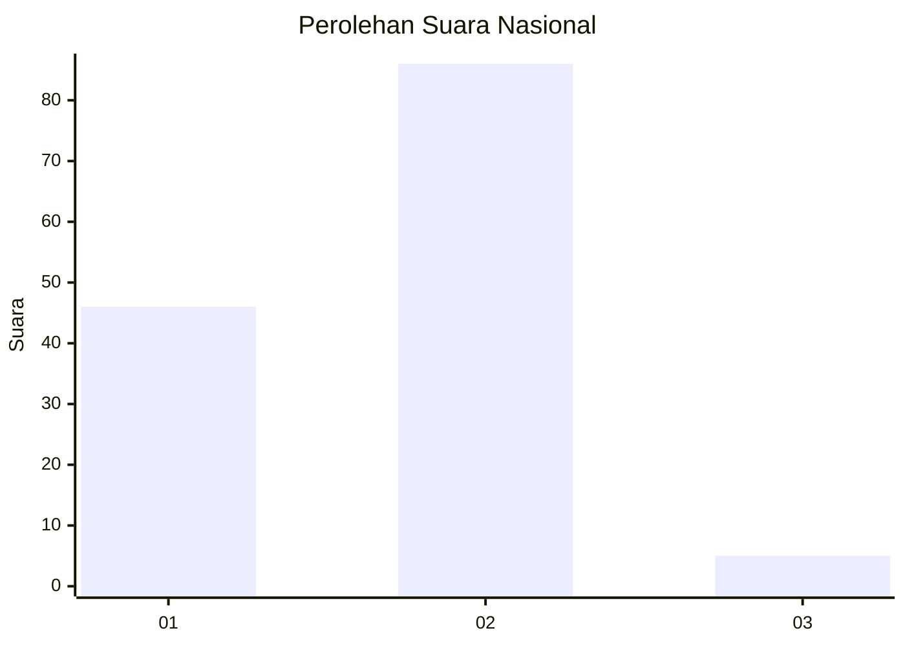
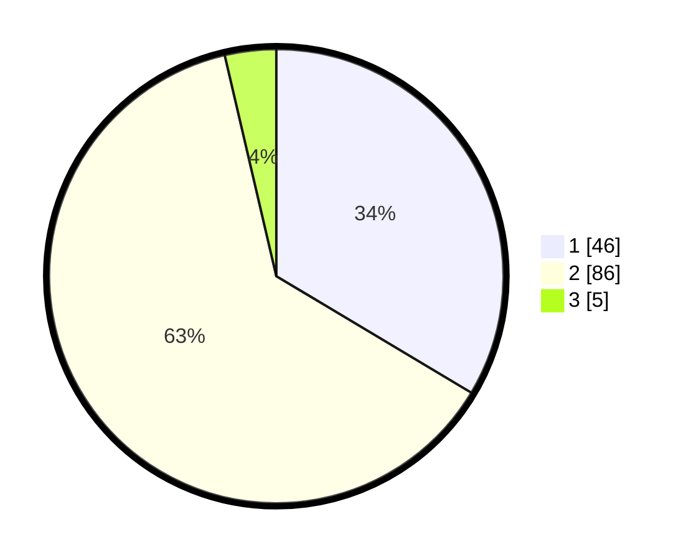

# Hasil

## Grafik

## Tabel

| No. | Nama Paslon    | Suara | Suara (raw) | Persentase |
|:--- |:-------------- | -----:| -----------:| ----------:|
| 1   | ANIES MUHAIMIN | 46    | [46][p-1]   | 33,58      |
| 2   | PRABOWO GIBRAN | 86    | [86][p-2]   | 62,77      |
| 3   | GANJAR MAHFUD  | 5     | [5][p-3]    | 3,65       |

[p-1]: https://github.com/gigit-pemilu/pemilu-2024/blob/main/pilpres/hitung-suara/sub/16-sumatera-selatan/sub/01-ogan-komering-ulu/sub/08-pengandonan/sub/2007-kesambirata/sub/003-tps/sub/paslon-1.txt
[p-2]: https://github.com/gigit-pemilu/pemilu-2024/blob/main/pilpres/hitung-suara/sub/16-sumatera-selatan/sub/01-ogan-komering-ulu/sub/08-pengandonan/sub/2007-kesambirata/sub/003-tps/sub/paslon-2.txt
[p-3]: https://github.com/gigit-pemilu/pemilu-2024/blob/main/pilpres/hitung-suara/sub/16-sumatera-selatan/sub/01-ogan-komering-ulu/sub/08-pengandonan/sub/2007-kesambirata/sub/003-tps/sub/paslon-3.txt

## Foto C Plano

https://sirekap-obj-formc.kpu.go.id/3dbc/pemilu/ppwp/16/01/08/20/07/1601082007003-20240214-232621--975b3c6e-c08f-4c24-b0cd-70b3119d080f.jpg

https://sirekap-obj-formc.kpu.go.id/3dbc/pemilu/ppwp/16/01/08/20/07/1601082007003-20240214-232749--18f6285a-fdc5-40a0-8848-84d3f6fe7af7.jpg

https://sirekap-obj-formc.kpu.go.id/3dbc/pemilu/ppwp/16/01/08/20/07/1601082007003-20240214-233015--0e2bf403-0960-419d-a16d-b485ffff15fc.jpg

## Metadata

| Key        | Value               |
| ---------- | ------------------- |
| Time Stamp | 2024-02-25 13:00:00 |

