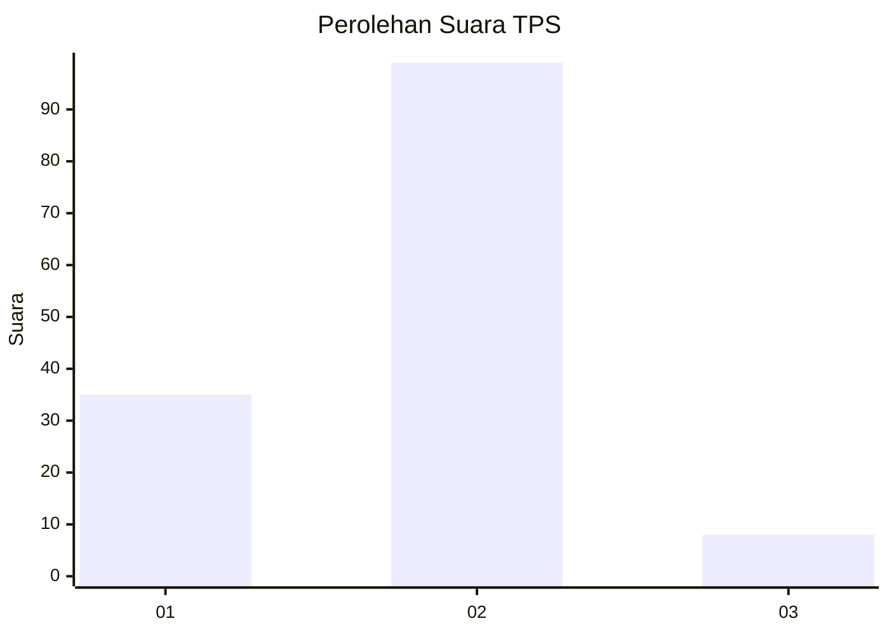
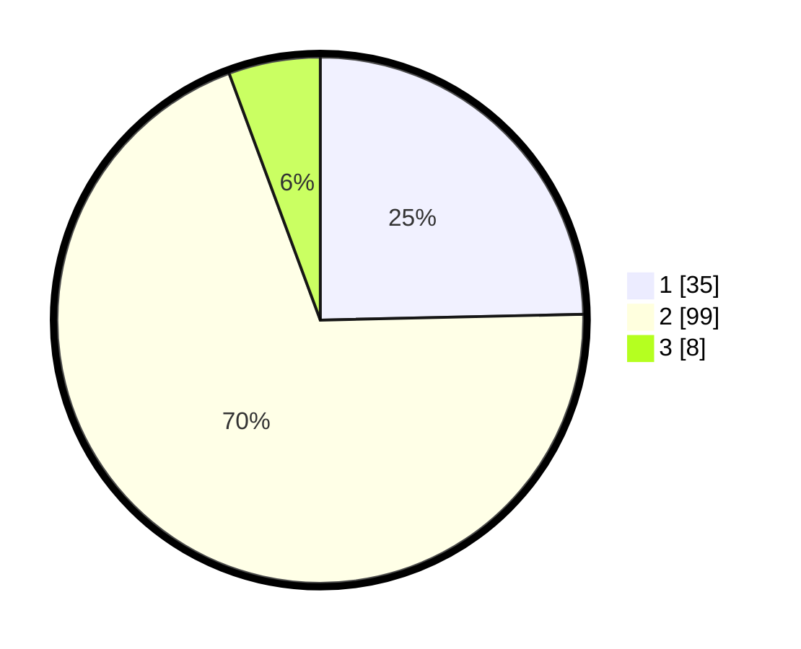

# Hasil

## Grafik

## Tabel

| No. | Nama Paslon    | Suara | Suara (raw) | Persentase |
|:--- |:-------------- | -----:| -----------:| ----------:|
| 1   | ANIES MUHAIMIN | 35    | [35][p-1]   | 24,65      |
| 2   | PRABOWO GIBRAN | 99    | [99][p-2]   | 69,72      |
| 3   | GANJAR MAHFUD  | 8     | [8][p-3]    | 5,63       |

[p-1]: https://github.com/gigit-pemilu/pemilu-2024-16-sumatera-selatan/blob/main/pilpres/hitung-suara/sub/16-sumatera-selatan/sub/01-ogan-komering-ulu/sub/08-pengandonan/sub/2008-gunung-liwat/sub/001-tps/sub/paslon-1.txt
[p-2]: https://github.com/gigit-pemilu/pemilu-2024-16-sumatera-selatan/blob/main/pilpres/hitung-suara/sub/16-sumatera-selatan/sub/01-ogan-komering-ulu/sub/08-pengandonan/sub/2008-gunung-liwat/sub/001-tps/sub/paslon-2.txt
[p-3]: https://github.com/gigit-pemilu/pemilu-2024-16-sumatera-selatan/blob/main/pilpres/hitung-suara/sub/16-sumatera-selatan/sub/01-ogan-komering-ulu/sub/08-pengandonan/sub/2008-gunung-liwat/sub/001-tps/sub/paslon-3.txt

## Foto C Plano

https://sirekap-obj-formc.kpu.go.id/3fcf/pemilu/ppwp/16/01/08/20/08/1601082008001-20240215-013716--927f40c4-75ed-49eb-b614-94a13e666f88.jpg

https://sirekap-obj-formc.kpu.go.id/3fcf/pemilu/ppwp/16/01/08/20/08/1601082008001-20240215-013801--98791cb0-ef7e-48f8-accd-30ecca3a5081.jpg

https://sirekap-obj-formc.kpu.go.id/3fcf/pemilu/ppwp/16/01/08/20/08/1601082008001-20240215-013837--8b737627-e8e7-4b18-b8ab-7e608757c2d8.jpg

## Metadata

| Key        | Value               |
| ---------- | ------------------- |
| Time Stamp | 2024-02-15 07:00:44 |

