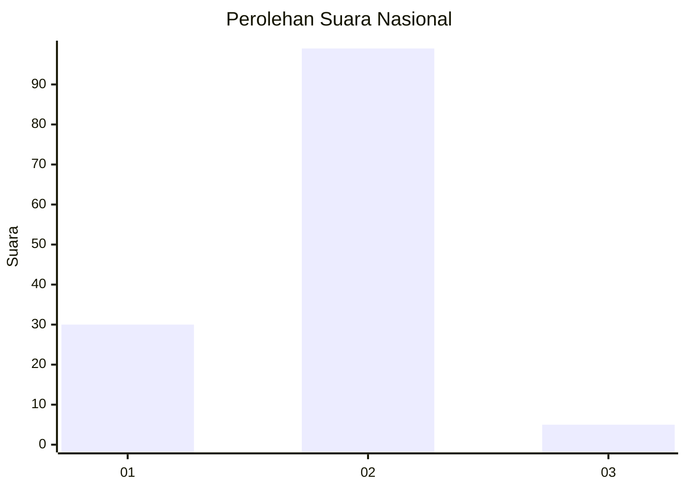

# Hasil

## Grafik

## Tabel

| No. | Nama Paslon    | Suara | Suara (raw) | Persentase |
|:--- |:-------------- | -----:| -----------:| ----------:|
| 1   | ANIES MUHAIMIN | 30    | [30][p-1]   | 22,39      |
| 2   | PRABOWO GIBRAN | 99    | [99][p-2]   | 73,88      |
| 3   | GANJAR MAHFUD  | 5     | [5][p-3]    | 3,73       |

[p-1]: https://github.com/gigit-pemilu/pemilu-2024/blob/main/pilpres/hitung-suara/sub/16-sumatera-selatan/sub/01-ogan-komering-ulu/sub/08-pengandonan/sub/2008-gunung-liwat/sub/003-tps/sub/paslon-1.txt
[p-2]: https://github.com/gigit-pemilu/pemilu-2024/blob/main/pilpres/hitung-suara/sub/16-sumatera-selatan/sub/01-ogan-komering-ulu/sub/08-pengandonan/sub/2008-gunung-liwat/sub/003-tps/sub/paslon-2.txt
[p-3]: https://github.com/gigit-pemilu/pemilu-2024/blob/main/pilpres/hitung-suara/sub/16-sumatera-selatan/sub/01-ogan-komering-ulu/sub/08-pengandonan/sub/2008-gunung-liwat/sub/003-tps/sub/paslon-3.txt

## Foto C Plano

https://sirekap-obj-formc.kpu.go.id/b1e6/pemilu/ppwp/16/01/08/20/08/1601082008003-20240214-221536--73f43369-dc34-464d-8cfc-2d0bcd34d978.jpg

https://sirekap-obj-formc.kpu.go.id/b1e6/pemilu/ppwp/16/01/08/20/08/1601082008003-20240214-221552--2ca8d64b-fc31-4d8f-b7f8-f1cadd9685f3.jpg

https://sirekap-obj-formc.kpu.go.id/b1e6/pemilu/ppwp/16/01/08/20/08/1601082008003-20240214-221616--574d392c-78ae-450d-88a1-9211cec04754.jpg

## Metadata

| Key        | Value               |
| ---------- | ------------------- |
| Time Stamp | 2024-02-15 15:00:29 |

