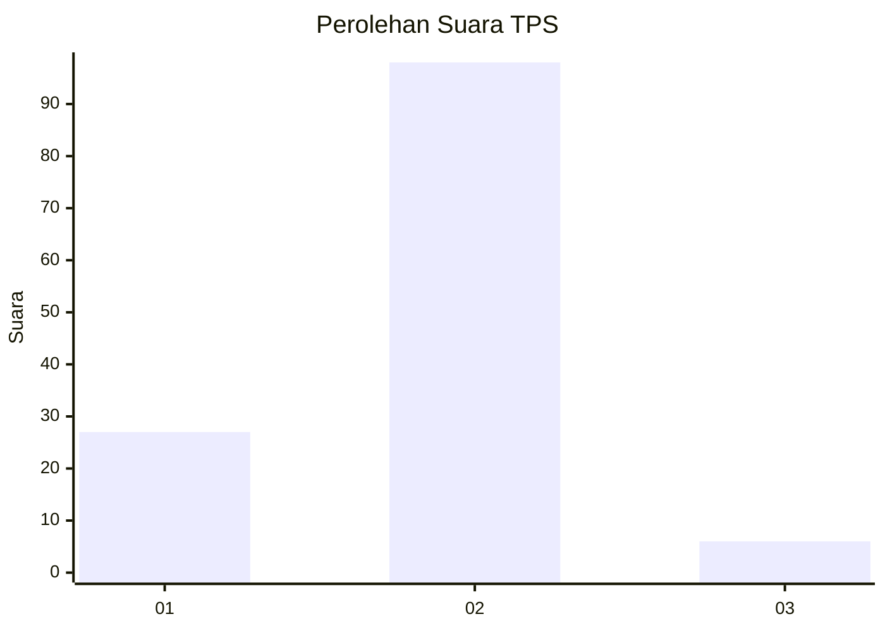
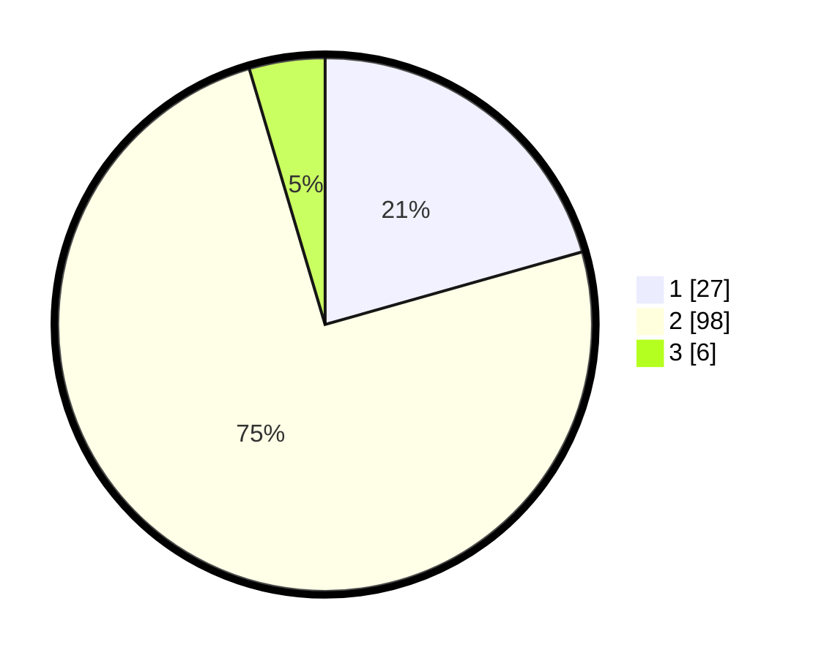

# Hasil

## Grafik

## Tabel

| No. | Nama Paslon    | Suara | Suara (raw) | Persentase |
|:--- |:-------------- | -----:| -----------:| ----------:|
| 1   | ANIES MUHAIMIN | 27    | [27][p-1]   | 20,61      |
| 2   | PRABOWO GIBRAN | 98    | [98][p-2]   | 74,81      |
| 3   | GANJAR MAHFUD  | 6     | [6][p-3]    | 4,58       |

[p-1]: https://github.com/gigit-pemilu/pemilu-2024-16-sumatera-selatan/blob/main/pilpres/hitung-suara/sub/16-sumatera-selatan/sub/01-ogan-komering-ulu/sub/08-pengandonan/sub/2008-gunung-liwat/sub/007-tps/sub/paslon-1.txt
[p-2]: https://github.com/gigit-pemilu/pemilu-2024-16-sumatera-selatan/blob/main/pilpres/hitung-suara/sub/16-sumatera-selatan/sub/01-ogan-komering-ulu/sub/08-pengandonan/sub/2008-gunung-liwat/sub/007-tps/sub/paslon-2.txt
[p-3]: https://github.com/gigit-pemilu/pemilu-2024-16-sumatera-selatan/blob/main/pilpres/hitung-suara/sub/16-sumatera-selatan/sub/01-ogan-komering-ulu/sub/08-pengandonan/sub/2008-gunung-liwat/sub/007-tps/sub/paslon-3.txt

## Foto C Plano

https://sirekap-obj-formc.kpu.go.id/073c/pemilu/ppwp/16/01/08/20/08/1601082008007-20240214-200849--9932070f-daaf-41de-8067-5826562ea800.jpg

https://sirekap-obj-formc.kpu.go.id/073c/pemilu/ppwp/16/01/08/20/08/1601082008007-20240214-200906--bc6a48d6-c6e1-461c-95c8-d91c306c6746.jpg

https://sirekap-obj-formc.kpu.go.id/073c/pemilu/ppwp/16/01/08/20/08/1601082008007-20240214-200923--7f98964a-666e-4bdf-8ee5-b426ea457926.jpg

## Metadata

| Key        | Value               |
| ---------- | ------------------- |
| Time Stamp | 2024-02-15 12:00:28 |

