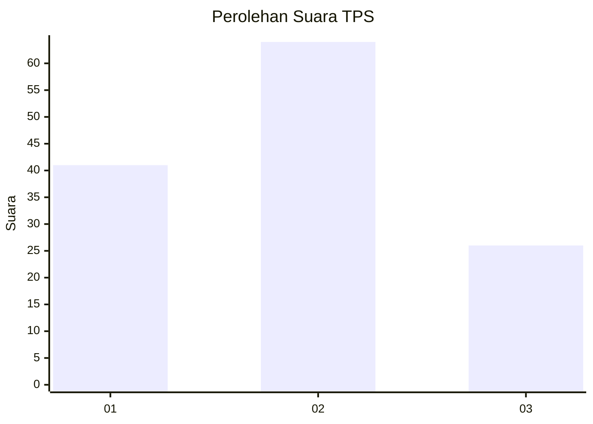
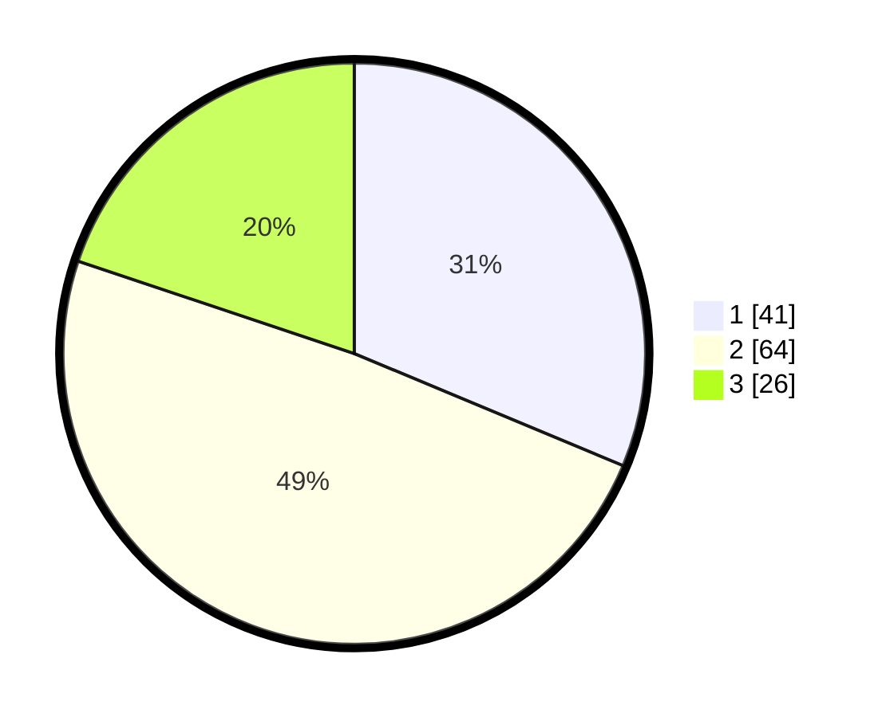

# Hasil

## Grafik

## Tabel

| No. | Nama Paslon    | Suara | Suara (raw) | Persentase |
|:--- |:-------------- | -----:| -----------:| ----------:|
| 1   | ANIES MUHAIMIN | 41    | [41][p-1]   | 31,30      |
| 2   | PRABOWO GIBRAN | 64    | [64][p-2]   | 48,85      |
| 3   | GANJAR MAHFUD  | 26    | [26][p-3]   | 19,85      |

[p-1]: https://github.com/gigit-pemilu/pemilu-2024-16-sumatera-selatan/blob/main/pilpres/hitung-suara/sub/16-sumatera-selatan/sub/01-ogan-komering-ulu/sub/08-pengandonan/sub/2019-gunung-kuripan/sub/001-tps/sub/paslon-1.txt
[p-2]: https://github.com/gigit-pemilu/pemilu-2024-16-sumatera-selatan/blob/main/pilpres/hitung-suara/sub/16-sumatera-selatan/sub/01-ogan-komering-ulu/sub/08-pengandonan/sub/2019-gunung-kuripan/sub/001-tps/sub/paslon-2.txt
[p-3]: https://github.com/gigit-pemilu/pemilu-2024-16-sumatera-selatan/blob/main/pilpres/hitung-suara/sub/16-sumatera-selatan/sub/01-ogan-komering-ulu/sub/08-pengandonan/sub/2019-gunung-kuripan/sub/001-tps/sub/paslon-3.txt

## Foto C Plano

https://sirekap-obj-formc.kpu.go.id/1c4c/pemilu/ppwp/16/01/08/20/19/1601082019001-20240215-023601--df8b66b4-97e8-4069-9820-e3e9e8c40321.jpg

https://sirekap-obj-formc.kpu.go.id/1c4c/pemilu/ppwp/16/01/08/20/19/1601082019001-20240215-104729--720654a8-0528-4a8c-b782-5b41d1f8af05.jpg

https://sirekap-obj-formc.kpu.go.id/1c4c/pemilu/ppwp/16/01/08/20/19/1601082019001-20240215-104246--5a2f9c70-ca10-492b-8f2a-9868aa540b78.jpg

## Metadata

| Key        | Value               |
| ---------- | ------------------- |
| Time Stamp | 2024-02-22 00:00:00 |

