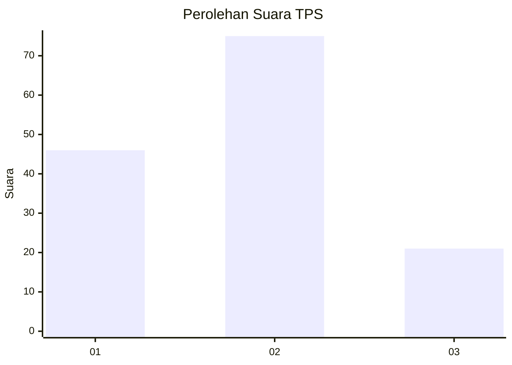
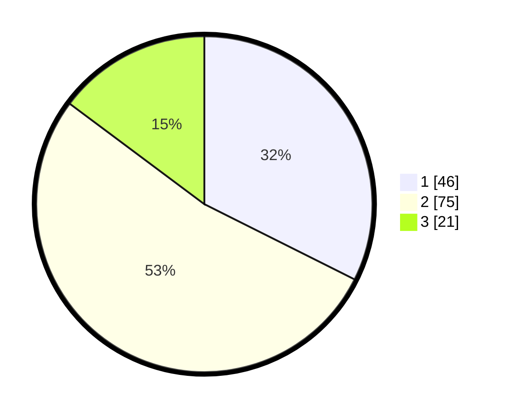

# Hasil

## Grafik

## Tabel

| No. | Nama Paslon    | Suara | Suara (raw) | Persentase |
|:--- |:-------------- | -----:| -----------:| ----------:|
| 1   | ANIES MUHAIMIN | 46    | [46][p-1]   | 32,39      |
| 2   | PRABOWO GIBRAN | 75    | [75][p-2]   | 52,82      |
| 3   | GANJAR MAHFUD  | 21    | [21][p-3]   | 14,79      |

[p-1]: https://github.com/gigit-pemilu/pemilu-2024-16-sumatera-selatan/blob/main/pilpres/hitung-suara/sub/16-sumatera-selatan/sub/01-ogan-komering-ulu/sub/08-pengandonan/sub/2019-gunung-kuripan/sub/002-tps/sub/paslon-1.txt
[p-2]: https://github.com/gigit-pemilu/pemilu-2024-16-sumatera-selatan/blob/main/pilpres/hitung-suara/sub/16-sumatera-selatan/sub/01-ogan-komering-ulu/sub/08-pengandonan/sub/2019-gunung-kuripan/sub/002-tps/sub/paslon-2.txt
[p-3]: https://github.com/gigit-pemilu/pemilu-2024-16-sumatera-selatan/blob/main/pilpres/hitung-suara/sub/16-sumatera-selatan/sub/01-ogan-komering-ulu/sub/08-pengandonan/sub/2019-gunung-kuripan/sub/002-tps/sub/paslon-3.txt

## Foto C Plano

https://sirekap-obj-formc.kpu.go.id/e86c/pemilu/ppwp/16/01/08/20/19/1601082019002-20240215-045557--19e617d8-6599-4403-9c39-630fde784a7f.jpg

https://sirekap-obj-formc.kpu.go.id/e86c/pemilu/ppwp/16/01/08/20/19/1601082019002-20240215-020621--5bb6d8b7-1d13-49c6-a8ec-57167812b531.jpg

https://sirekap-obj-formc.kpu.go.id/e86c/pemilu/ppwp/16/01/08/20/19/1601082019002-20240215-020710--261dc888-b01d-4ea4-9cb2-ff48c620a8ce.jpg

## Metadata

| Key        | Value               |
| ---------- | ------------------- |
| Time Stamp | 2024-02-25 00:00:00 |

