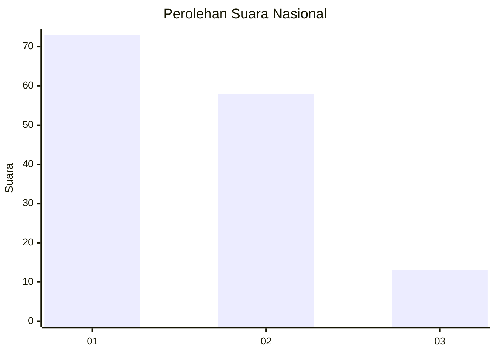
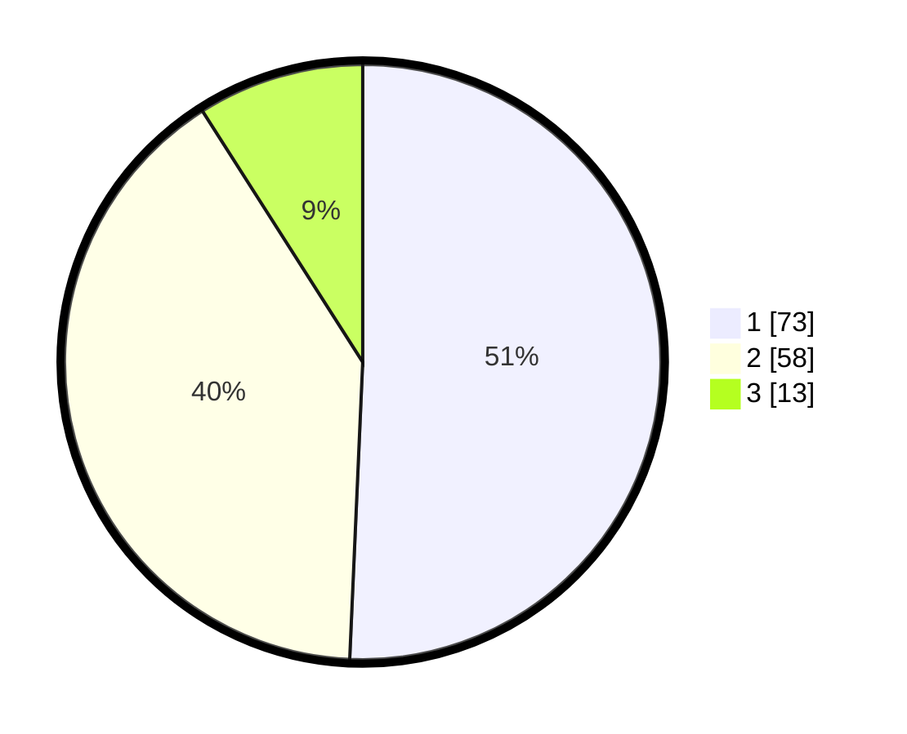

# Hasil

## Grafik

## Tabel

| No. | Nama Paslon    | Suara | Suara (raw) | Persentase |
|:--- |:-------------- | -----:| -----------:| ----------:|
| 1   | ANIES MUHAIMIN | 73    | [73][p-1]   | 50,69      |
| 2   | PRABOWO GIBRAN | 58    | [58][p-2]   | 40,28      |
| 3   | GANJAR MAHFUD  | 13    | [13][p-3]   | 9,03       |

[p-1]: https://github.com/gigit-pemilu/pemilu-2024/blob/main/pilpres/hitung-suara/sub/16-sumatera-selatan/sub/01-ogan-komering-ulu/sub/09-peninjauan/sub/2007-bindu/sub/007-tps/sub/paslon-1.txt
[p-2]: https://github.com/gigit-pemilu/pemilu-2024/blob/main/pilpres/hitung-suara/sub/16-sumatera-selatan/sub/01-ogan-komering-ulu/sub/09-peninjauan/sub/2007-bindu/sub/007-tps/sub/paslon-2.txt
[p-3]: https://github.com/gigit-pemilu/pemilu-2024/blob/main/pilpres/hitung-suara/sub/16-sumatera-selatan/sub/01-ogan-komering-ulu/sub/09-peninjauan/sub/2007-bindu/sub/007-tps/sub/paslon-3.txt

## Foto C Plano

https://sirekap-obj-formc.kpu.go.id/e4df/pemilu/ppwp/16/01/09/20/07/1601092007007-20240215-011907--58b4a799-6e1f-491f-98d6-d327dc6ec7dd.jpg

https://sirekap-obj-formc.kpu.go.id/e4df/pemilu/ppwp/16/01/09/20/07/1601092007007-20240215-011923--e2d4737d-ff35-4793-8c86-6abd843100bb.jpg

https://sirekap-obj-formc.kpu.go.id/e4df/pemilu/ppwp/16/01/09/20/07/1601092007007-20240215-011929--5458d94b-70be-400f-aa70-a0a8554d2666.jpg

## Metadata

| Key        | Value               |
| ---------- | ------------------- |
| Time Stamp | 2024-02-25 00:00:00 |

