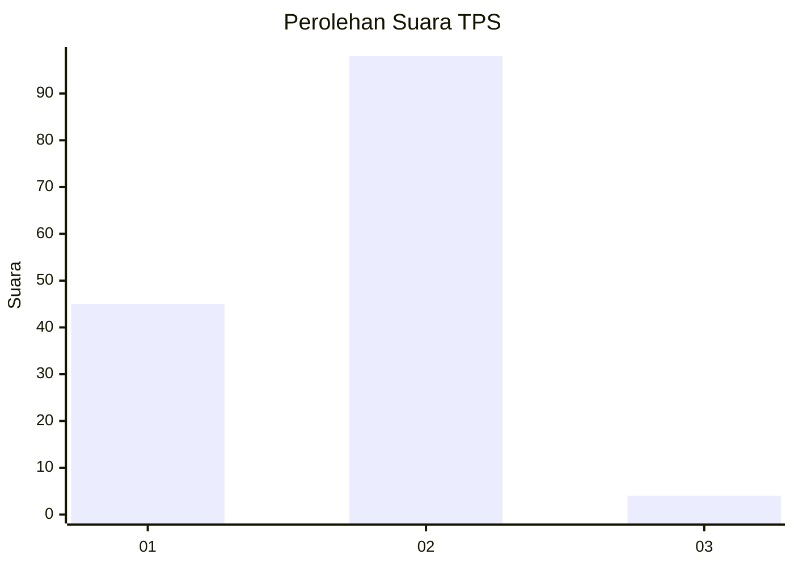
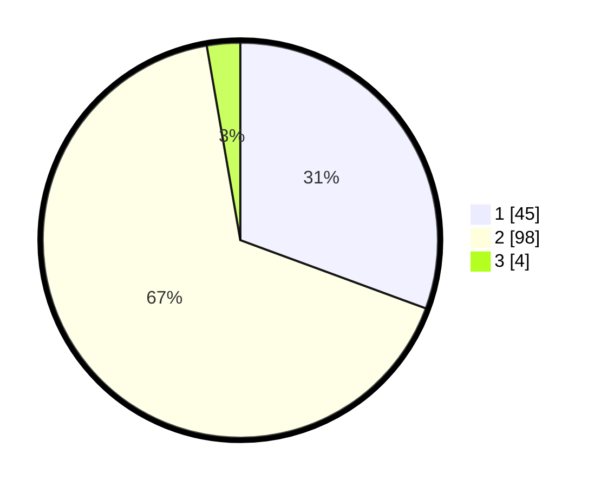

# Hasil

## Grafik

## Tabel

| No. | Nama Paslon    | Suara | Suara (raw) | Persentase |
|:--- |:-------------- | -----:| -----------:| ----------:|
| 1   | ANIES MUHAIMIN | 45    | [45][p-1]   | 30,61      |
| 2   | PRABOWO GIBRAN | 98    | [98][p-2]   | 66,67      |
| 3   | GANJAR MAHFUD  | 4     | [4][p-3]    | 2,72       |

[p-1]: https://github.com/gigit-pemilu/pemilu-2024-16-sumatera-selatan/blob/main/pilpres/hitung-suara/sub/16-sumatera-selatan/sub/01-ogan-komering-ulu/sub/13-baturaja-barat/sub/1004-saung-naga/sub/007-tps/sub/paslon-1.txt
[p-2]: https://github.com/gigit-pemilu/pemilu-2024-16-sumatera-selatan/blob/main/pilpres/hitung-suara/sub/16-sumatera-selatan/sub/01-ogan-komering-ulu/sub/13-baturaja-barat/sub/1004-saung-naga/sub/007-tps/sub/paslon-2.txt
[p-3]: https://github.com/gigit-pemilu/pemilu-2024-16-sumatera-selatan/blob/main/pilpres/hitung-suara/sub/16-sumatera-selatan/sub/01-ogan-komering-ulu/sub/13-baturaja-barat/sub/1004-saung-naga/sub/007-tps/sub/paslon-3.txt

## Foto C Plano

https://sirekap-obj-formc.kpu.go.id/83c4/pemilu/ppwp/16/01/13/10/04/1601131004007-20240222-100734--b2f12d7c-914c-431c-827d-3918d45b245f.jpg

https://sirekap-obj-formc.kpu.go.id/83c4/pemilu/ppwp/16/01/13/10/04/1601131004007-20240214-185937--601d97b5-65dc-4ec6-9a76-d33821a5ee8d.jpg

https://sirekap-obj-formc.kpu.go.id/83c4/pemilu/ppwp/16/01/13/10/04/1601131004007-20240214-190623--b09e3982-c430-437a-a253-a7fe0b39ec1b.jpg

## Metadata

| Key        | Value               |
| ---------- | ------------------- |
| Time Stamp | 2024-02-22 11:00:00 |

