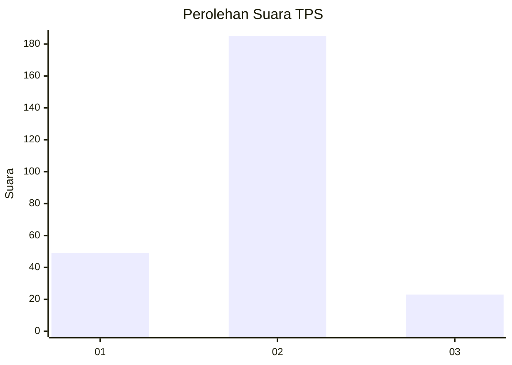
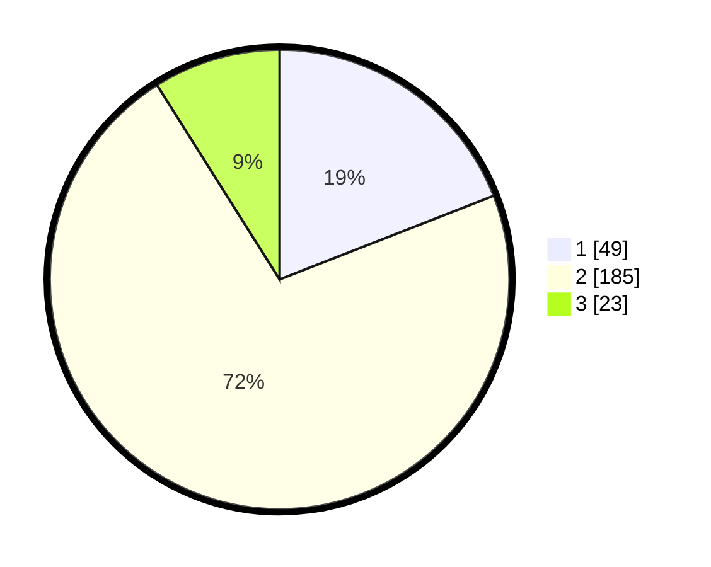

# Hasil

## Grafik

## Tabel

| No. | Nama Paslon    | Suara | Suara (raw) | Persentase |
|:--- |:-------------- | -----:| -----------:| ----------:|
| 1   | ANIES MUHAIMIN | 49    | [49][p-1]   | 19,07      |
| 2   | PRABOWO GIBRAN | 185   | [185][p-2]  | 71,98      |
| 3   | GANJAR MAHFUD  | 23    | [23][p-3]   | 8,95       |

[p-1]: https://github.com/gigit-pemilu/pemilu-2024-16-sumatera-selatan/blob/main/pilpres/hitung-suara/sub/16-sumatera-selatan/sub/01-ogan-komering-ulu/sub/13-baturaja-barat/sub/1005-talang-jawa/sub/022-tps/sub/paslon-1.txt
[p-2]: https://github.com/gigit-pemilu/pemilu-2024-16-sumatera-selatan/blob/main/pilpres/hitung-suara/sub/16-sumatera-selatan/sub/01-ogan-komering-ulu/sub/13-baturaja-barat/sub/1005-talang-jawa/sub/022-tps/sub/paslon-2.txt
[p-3]: https://github.com/gigit-pemilu/pemilu-2024-16-sumatera-selatan/blob/main/pilpres/hitung-suara/sub/16-sumatera-selatan/sub/01-ogan-komering-ulu/sub/13-baturaja-barat/sub/1005-talang-jawa/sub/022-tps/sub/paslon-3.txt

## Foto C Plano

https://sirekap-obj-formc.kpu.go.id/ae0a/pemilu/ppwp/16/01/13/10/05/1601131005022-20240215-023910--ce42726e-862d-406e-9ddb-edab59a5f028.jpg

https://sirekap-obj-formc.kpu.go.id/ae0a/pemilu/ppwp/16/01/13/10/05/1601131005022-20240217-120950--8b24cc11-67ae-4855-b7b0-0aa999a47219.jpg

https://sirekap-obj-formc.kpu.go.id/ae0a/pemilu/ppwp/16/01/13/10/05/1601131005022-20240217-121849--dfb9e6fd-105e-4b40-91ec-2b954d4ad1f3.jpg

## Metadata

| Key        | Value               |
| ---------- | ------------------- |
| Time Stamp | 2024-02-25 12:00:00 |

