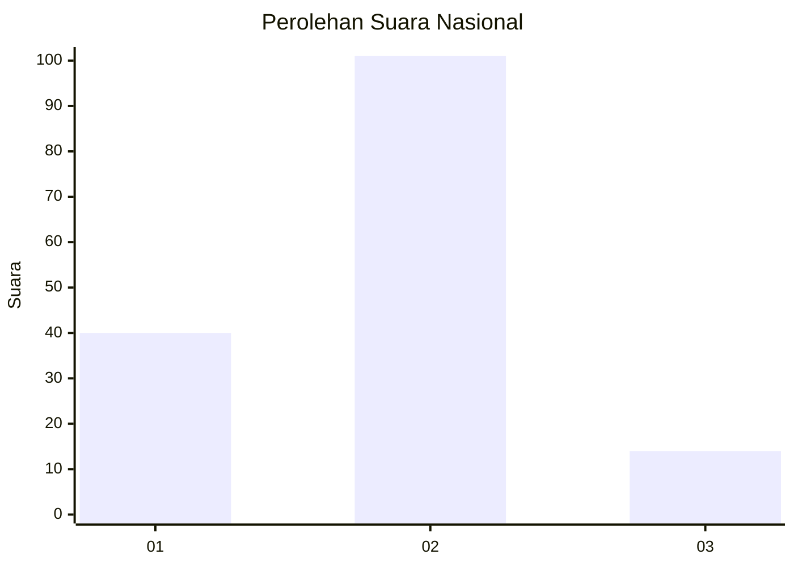
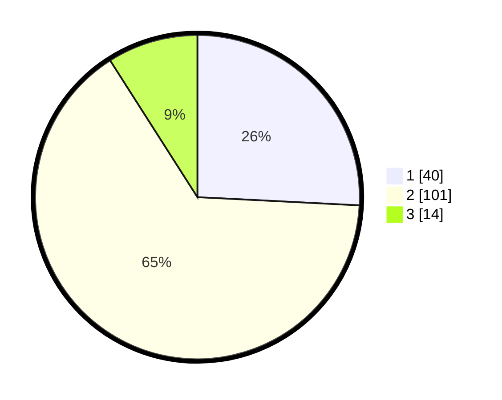

# Hasil

## Grafik

## Tabel

| No. | Nama Paslon    | Suara | Suara (raw) | Persentase |
|:--- |:-------------- | -----:| -----------:| ----------:|
| 1   | ANIES MUHAIMIN | 40    | [40][p-1]   | 25,81      |
| 2   | PRABOWO GIBRAN | 101   | [101][p-2]  | 65,16      |
| 3   | GANJAR MAHFUD  | 14    | [14][p-3]   | 9,03       |

[p-1]: https://github.com/gigit-pemilu/pemilu-2024/blob/main/pilpres/hitung-suara/sub/16-sumatera-selatan/sub/01-ogan-komering-ulu/sub/14-baturaja-timur/sub/1001-baturaja-lama/sub/018-tps/sub/paslon-1.txt
[p-2]: https://github.com/gigit-pemilu/pemilu-2024/blob/main/pilpres/hitung-suara/sub/16-sumatera-selatan/sub/01-ogan-komering-ulu/sub/14-baturaja-timur/sub/1001-baturaja-lama/sub/018-tps/sub/paslon-2.txt
[p-3]: https://github.com/gigit-pemilu/pemilu-2024/blob/main/pilpres/hitung-suara/sub/16-sumatera-selatan/sub/01-ogan-komering-ulu/sub/14-baturaja-timur/sub/1001-baturaja-lama/sub/018-tps/sub/paslon-3.txt

## Foto C Plano

https://sirekap-obj-formc.kpu.go.id/3c44/pemilu/ppwp/16/01/14/10/01/1601141001018-20240215-012926--bc21af57-f4b0-4ec8-8b1c-01c5deec0bff.jpg

https://sirekap-obj-formc.kpu.go.id/3c44/pemilu/ppwp/16/01/14/10/01/1601141001018-20240215-094204--88f2779d-ed8e-4fef-857b-776341a960f4.jpg

https://sirekap-obj-formc.kpu.go.id/3c44/pemilu/ppwp/16/01/14/10/01/1601141001018-20240215-013300--d00e710c-3a80-43e8-9672-afd2b5561a0d.jpg

## Metadata

| Key        | Value               |
| ---------- | ------------------- |
| Time Stamp | 2024-02-25 16:00:00 |

