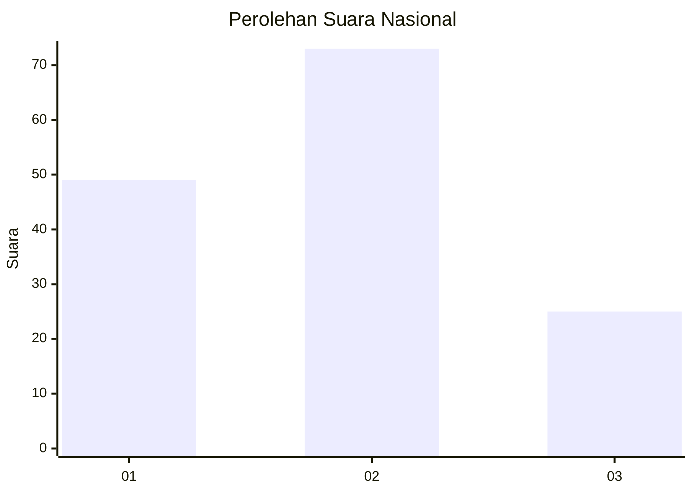
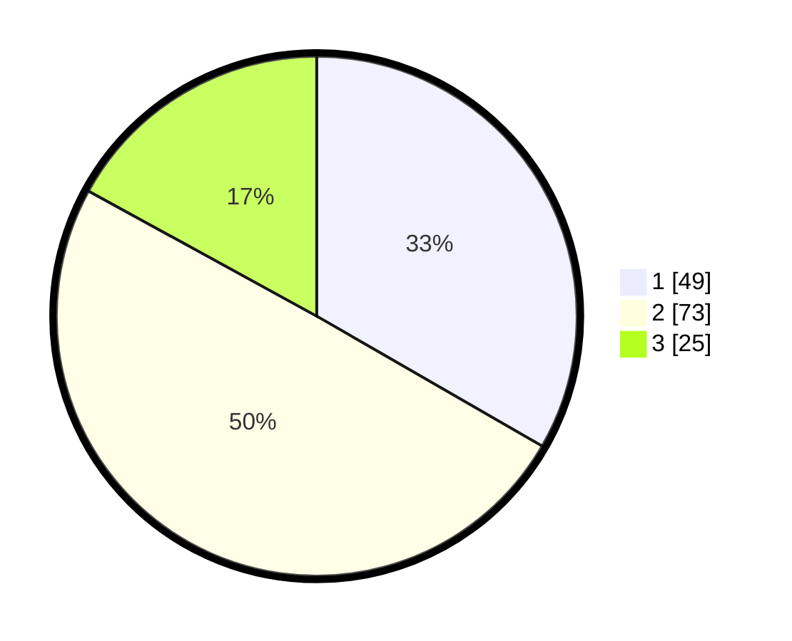

# Hasil

## Grafik

## Tabel

| No. | Nama Paslon    | Suara | Suara (raw) | Persentase |
|:--- |:-------------- | -----:| -----------:| ----------:|
| 1   | ANIES MUHAIMIN | 49    | [49][p-1]   | 33,33      |
| 2   | PRABOWO GIBRAN | 73    | [73][p-2]   | 49,66      |
| 3   | GANJAR MAHFUD  | 25    | [25][p-3]   | 17,01      |

[p-1]: https://github.com/gigit-pemilu/pemilu-2024/blob/main/pilpres/hitung-suara/sub/16-sumatera-selatan/sub/01-ogan-komering-ulu/sub/14-baturaja-timur/sub/1006-sukajadi/sub/001-tps/sub/paslon-1.txt
[p-2]: https://github.com/gigit-pemilu/pemilu-2024/blob/main/pilpres/hitung-suara/sub/16-sumatera-selatan/sub/01-ogan-komering-ulu/sub/14-baturaja-timur/sub/1006-sukajadi/sub/001-tps/sub/paslon-2.txt
[p-3]: https://github.com/gigit-pemilu/pemilu-2024/blob/main/pilpres/hitung-suara/sub/16-sumatera-selatan/sub/01-ogan-komering-ulu/sub/14-baturaja-timur/sub/1006-sukajadi/sub/001-tps/sub/paslon-3.txt

## Foto C Plano

https://sirekap-obj-formc.kpu.go.id/9367/pemilu/ppwp/16/01/14/10/06/1601141006001-20240214-231450--279c86bd-f2fe-4497-b3af-78151162cc9e.jpg

https://sirekap-obj-formc.kpu.go.id/9367/pemilu/ppwp/16/01/14/10/06/1601141006001-20240214-231620--f602ccb0-5209-4907-bc6b-fd66b032b15a.jpg

https://sirekap-obj-formc.kpu.go.id/9367/pemilu/ppwp/16/01/14/10/06/1601141006001-20240214-231728--0fe530fc-1fda-4993-8b73-337757a01ddd.jpg

## Metadata

| Key        | Value               |
| ---------- | ------------------- |
| Time Stamp | 2024-02-24 22:31:28 |

