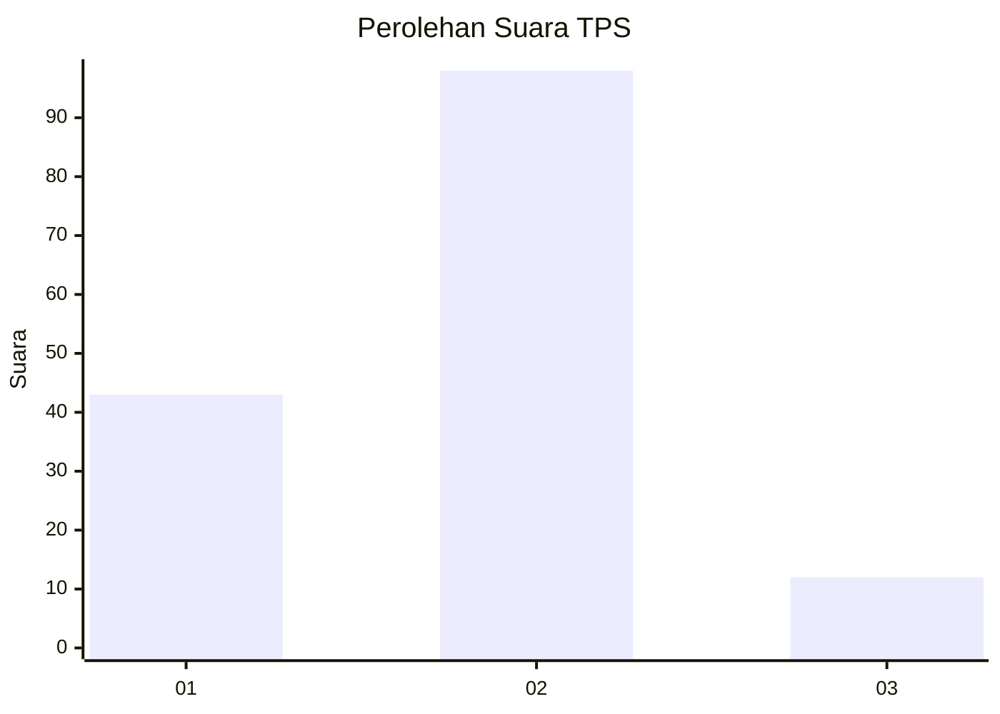
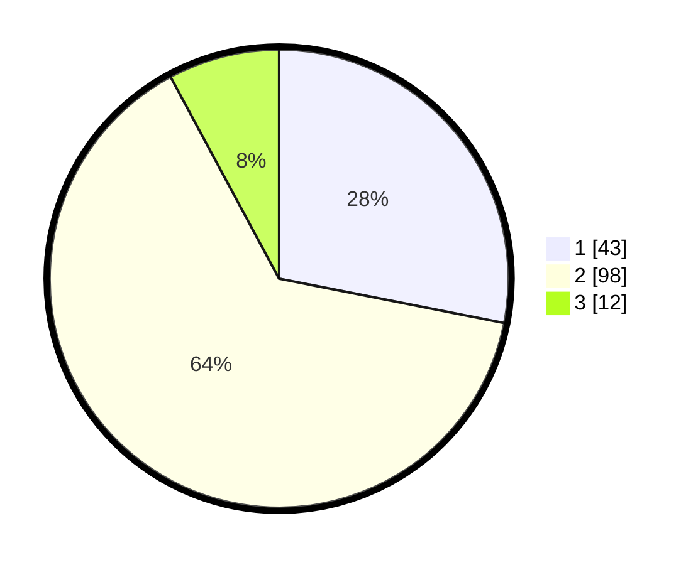

# Hasil

## Grafik

## Tabel

| No. | Nama Paslon    | Suara | Suara (raw) | Persentase |
|:--- |:-------------- | -----:| -----------:| ----------:|
| 1   | ANIES MUHAIMIN | 43    | [43][p-1]   | 28,10      |
| 2   | PRABOWO GIBRAN | 98    | [98][p-2]   | 64,05      |
| 3   | GANJAR MAHFUD  | 12    | [12][p-3]   | 7,84       |

[p-1]: https://github.com/gigit-pemilu/pemilu-2024-16-sumatera-selatan/blob/main/pilpres/hitung-suara/sub/16-sumatera-selatan/sub/01-ogan-komering-ulu/sub/14-baturaja-timur/sub/1014-sekar-jaya/sub/017-tps/sub/paslon-1.txt
[p-2]: https://github.com/gigit-pemilu/pemilu-2024-16-sumatera-selatan/blob/main/pilpres/hitung-suara/sub/16-sumatera-selatan/sub/01-ogan-komering-ulu/sub/14-baturaja-timur/sub/1014-sekar-jaya/sub/017-tps/sub/paslon-2.txt
[p-3]: https://github.com/gigit-pemilu/pemilu-2024-16-sumatera-selatan/blob/main/pilpres/hitung-suara/sub/16-sumatera-selatan/sub/01-ogan-komering-ulu/sub/14-baturaja-timur/sub/1014-sekar-jaya/sub/017-tps/sub/paslon-3.txt

## Foto C Plano

https://sirekap-obj-formc.kpu.go.id/ba7e/pemilu/ppwp/16/01/14/10/14/1601141014017-20240214-155443--43ac7716-490a-4225-a6e7-2c647d2c261a.jpg

https://sirekap-obj-formc.kpu.go.id/ba7e/pemilu/ppwp/16/01/14/10/14/1601141014017-20240214-155236--376e453d-6eb7-4b85-a78c-8dd2299d5904.jpg

https://sirekap-obj-formc.kpu.go.id/ba7e/pemilu/ppwp/16/01/14/10/14/1601141014017-20240214-232146--29a5d6e2-dc07-4efc-8083-4ccc091b5fbc.jpg

## Metadata

| Key        | Value               |
| ---------- | ------------------- |
| Time Stamp | 2024-02-26 16:00:00 |

