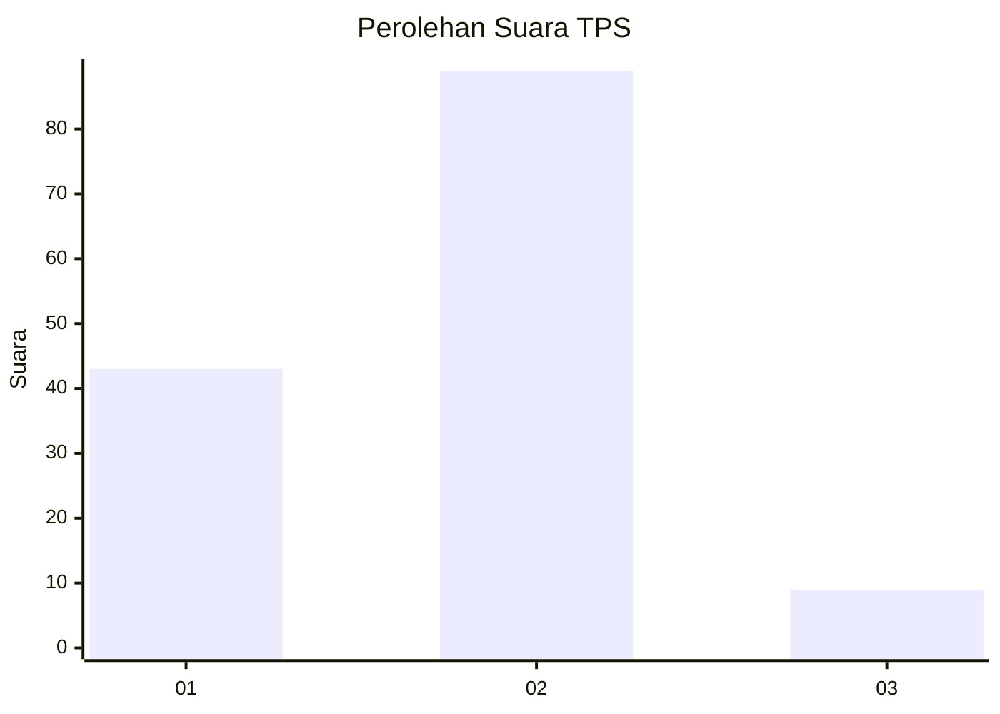
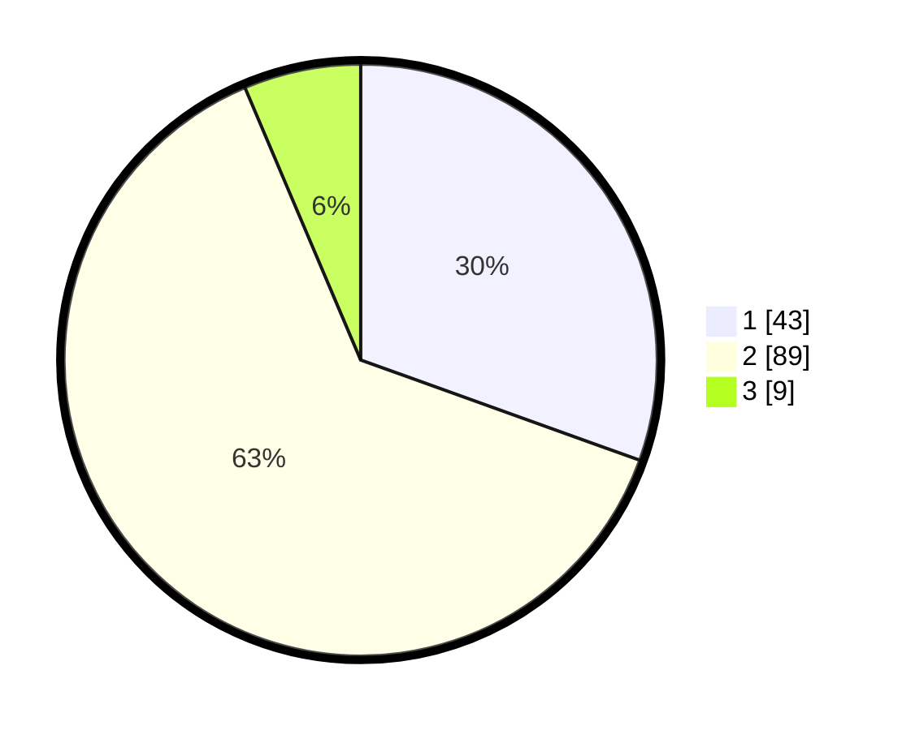

# Hasil

## Grafik

## Tabel

| No. | Nama Paslon    | Suara | Suara (raw) | Persentase |
|:--- |:-------------- | -----:| -----------:| ----------:|
| 1   | ANIES MUHAIMIN | 43    | [43][p-1]   | 30,50      |
| 2   | PRABOWO GIBRAN | 89    | [89][p-2]   | 63,12      |
| 3   | GANJAR MAHFUD  | 9     | [9][p-3]    | 6,38       |

[p-1]: https://github.com/gigit-pemilu/pemilu-2024-16-sumatera-selatan/blob/main/pilpres/hitung-suara/sub/16-sumatera-selatan/sub/01-ogan-komering-ulu/sub/14-baturaja-timur/sub/1014-sekar-jaya/sub/025-tps/sub/paslon-1.txt
[p-2]: https://github.com/gigit-pemilu/pemilu-2024-16-sumatera-selatan/blob/main/pilpres/hitung-suara/sub/16-sumatera-selatan/sub/01-ogan-komering-ulu/sub/14-baturaja-timur/sub/1014-sekar-jaya/sub/025-tps/sub/paslon-2.txt
[p-3]: https://github.com/gigit-pemilu/pemilu-2024-16-sumatera-selatan/blob/main/pilpres/hitung-suara/sub/16-sumatera-selatan/sub/01-ogan-komering-ulu/sub/14-baturaja-timur/sub/1014-sekar-jaya/sub/025-tps/sub/paslon-3.txt

## Foto C Plano

https://sirekap-obj-formc.kpu.go.id/2b22/pemilu/ppwp/16/01/14/10/14/1601141014025-20240215-013718--4d80b184-5bdd-430b-b52e-97ef20fc6d30.jpg

https://sirekap-obj-formc.kpu.go.id/2b22/pemilu/ppwp/16/01/14/10/14/1601141014025-20240215-013857--7547bf36-bbe2-4293-b6d6-8d65d999a59b.jpg

https://sirekap-obj-formc.kpu.go.id/2b22/pemilu/ppwp/16/01/14/10/14/1601141014025-20240214-223614--731589f2-62a5-43a2-8871-8173984f29f0.jpg

## Metadata

| Key        | Value               |
| ---------- | ------------------- |
| Time Stamp | 2024-02-24 22:31:28 |

