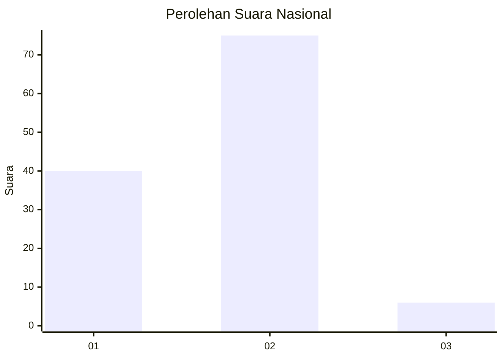
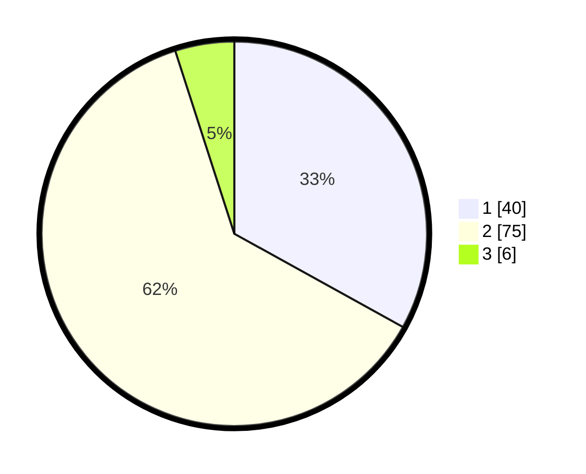

# Hasil

## Grafik

## Tabel

| No. | Nama Paslon    | Suara | Suara (raw) | Persentase |
|:--- |:-------------- | -----:| -----------:| ----------:|
| 1   | ANIES MUHAIMIN | 40    | [40][p-1]   | 33,06      |
| 2   | PRABOWO GIBRAN | 75    | [75][p-2]   | 61,98      |
| 3   | GANJAR MAHFUD  | 6     | [6][p-3]    | 4,96       |

[p-1]: https://github.com/gigit-pemilu/pemilu-2024/blob/main/pilpres/hitung-suara/sub/16-sumatera-selatan/sub/01-ogan-komering-ulu/sub/14-baturaja-timur/sub/1014-sekar-jaya/sub/026-tps/sub/paslon-1.txt
[p-2]: https://github.com/gigit-pemilu/pemilu-2024/blob/main/pilpres/hitung-suara/sub/16-sumatera-selatan/sub/01-ogan-komering-ulu/sub/14-baturaja-timur/sub/1014-sekar-jaya/sub/026-tps/sub/paslon-2.txt
[p-3]: https://github.com/gigit-pemilu/pemilu-2024/blob/main/pilpres/hitung-suara/sub/16-sumatera-selatan/sub/01-ogan-komering-ulu/sub/14-baturaja-timur/sub/1014-sekar-jaya/sub/026-tps/sub/paslon-3.txt

## Foto C Plano

https://sirekap-obj-formc.kpu.go.id/01bd/pemilu/ppwp/16/01/14/10/14/1601141014026-20240214-190816--cd55b874-e645-44c0-bb84-72d6b1f8e4f2.jpg

https://sirekap-obj-formc.kpu.go.id/01bd/pemilu/ppwp/16/01/14/10/14/1601141014026-20240214-190935--8e9e81fc-1905-43e2-abac-c003a37834a5.jpg

https://sirekap-obj-formc.kpu.go.id/01bd/pemilu/ppwp/16/01/14/10/14/1601141014026-20240214-211604--edd40ad2-69f7-4c0c-9a51-1c5a2a87d208.jpg

## Metadata

| Key        | Value               |
| ---------- | ------------------- |
| Time Stamp | 2024-02-15 03:06:03 |

