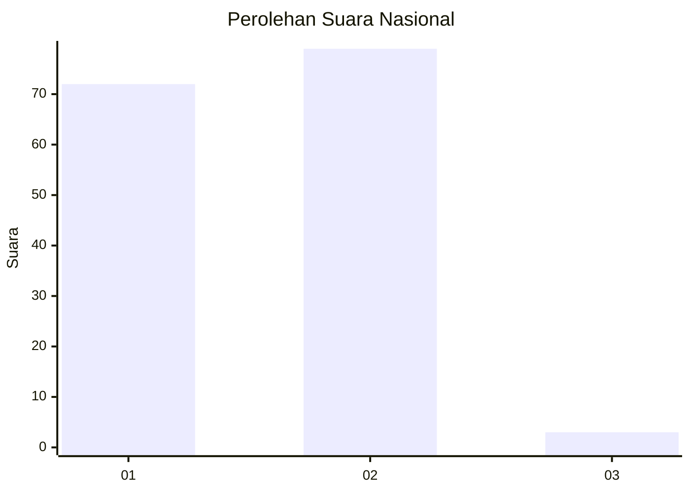
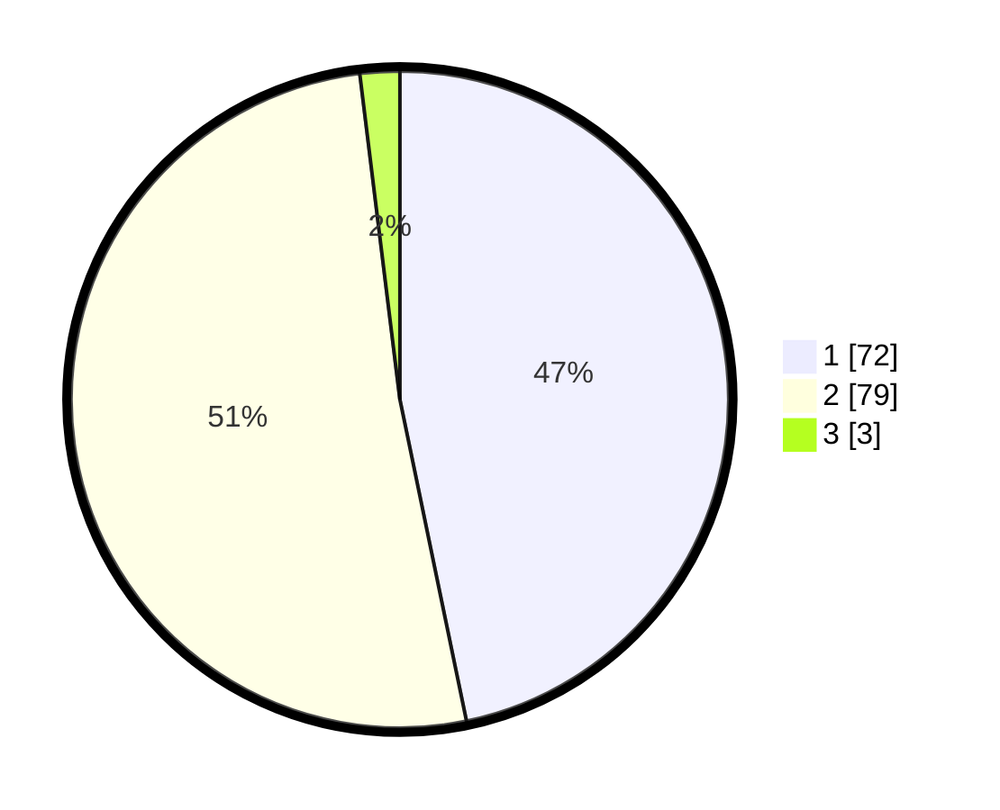

# Hasil

## Grafik

## Tabel

| No. | Nama Paslon    | Suara | Suara (raw) | Persentase |
|:--- |:-------------- | -----:| -----------:| ----------:|
| 1   | ANIES MUHAIMIN | 72    | [72][p-1]   | 46,75      |
| 2   | PRABOWO GIBRAN | 79    | [79][p-2]   | 51,30      |
| 3   | GANJAR MAHFUD  | 3     | [3][p-3]    | 1,95       |

[p-1]: https://github.com/gigit-pemilu/pemilu-2024/blob/main/pilpres/hitung-suara/sub/16-sumatera-selatan/sub/01-ogan-komering-ulu/sub/14-baturaja-timur/sub/2015-air-paoh/sub/022-tps/sub/paslon-1.txt
[p-2]: https://github.com/gigit-pemilu/pemilu-2024/blob/main/pilpres/hitung-suara/sub/16-sumatera-selatan/sub/01-ogan-komering-ulu/sub/14-baturaja-timur/sub/2015-air-paoh/sub/022-tps/sub/paslon-2.txt
[p-3]: https://github.com/gigit-pemilu/pemilu-2024/blob/main/pilpres/hitung-suara/sub/16-sumatera-selatan/sub/01-ogan-komering-ulu/sub/14-baturaja-timur/sub/2015-air-paoh/sub/022-tps/sub/paslon-3.txt

## Foto C Plano

https://sirekap-obj-formc.kpu.go.id/da38/pemilu/ppwp/16/01/14/20/15/1601142015022-20240214-141100--5714fb13-66b9-487a-8ee9-2f5673ca7159.jpg

https://sirekap-obj-formc.kpu.go.id/da38/pemilu/ppwp/16/01/14/20/15/1601142015022-20240214-141107--dc68579e-dd9d-450f-97f1-abf311b1fd52.jpg

https://sirekap-obj-formc.kpu.go.id/da38/pemilu/ppwp/16/01/14/20/15/1601142015022-20240214-141111--00f6f6f6-5a3b-4fc6-9ecc-4ccca479adb4.jpg

## Metadata

| Key        | Value               |
| ---------- | ------------------- |
| Time Stamp | 2024-02-15 03:06:03 |

