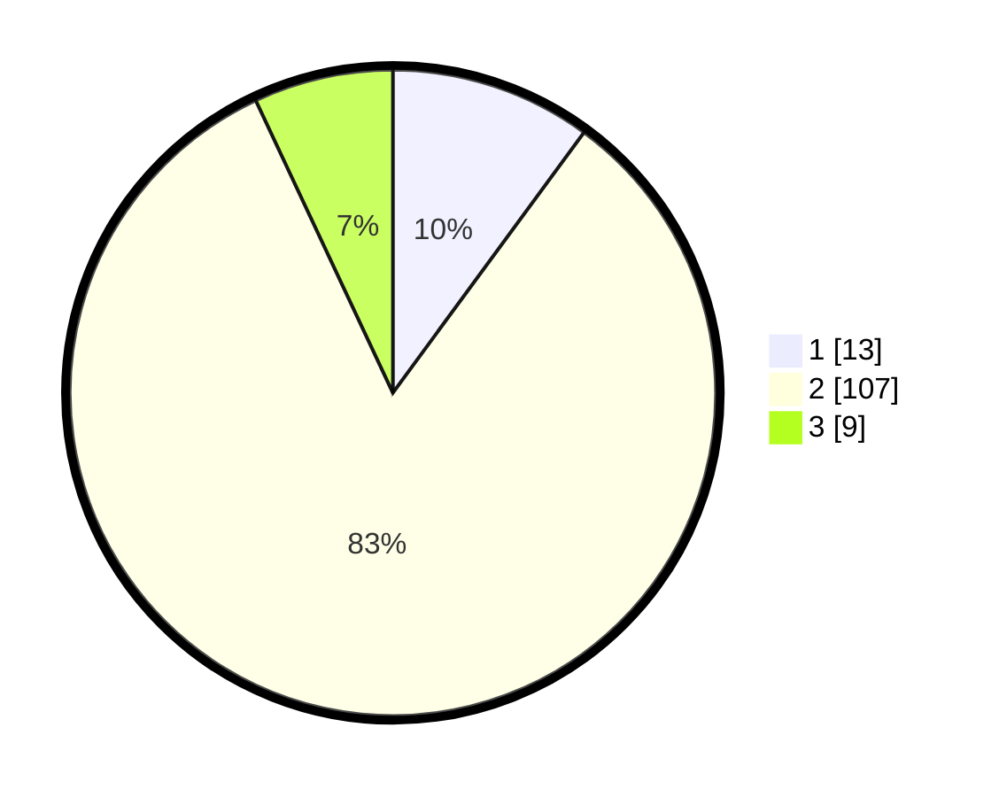

# Hasil

## Grafik

## Tabel

| No. | Nama Paslon    | Suara | Suara (raw) | Persentase |
|:--- |:-------------- | -----:| -----------:| ----------:|
| 1   | ANIES MUHAIMIN | 13    | [13][p-1]   | 10,08      |
| 2   | PRABOWO GIBRAN | 107   | [107][p-2]  | 82,95      |
| 3   | GANJAR MAHFUD  | 9     | [9][p-3]    | 6,98       |

[p-1]: https://github.com/gigit-pemilu/pemilu-2024-16-sumatera-selatan/blob/main/pilpres/hitung-suara/sub/16-sumatera-selatan/sub/01-ogan-komering-ulu/sub/20-ulu-ogan/sub/2006-sukajadi/sub/002-tps/sub/paslon-1.txt
[p-2]: https://github.com/gigit-pemilu/pemilu-2024-16-sumatera-selatan/blob/main/pilpres/hitung-suara/sub/16-sumatera-selatan/sub/01-ogan-komering-ulu/sub/20-ulu-ogan/sub/2006-sukajadi/sub/002-tps/sub/paslon-2.txt
[p-3]: https://github.com/gigit-pemilu/pemilu-2024-16-sumatera-selatan/blob/main/pilpres/hitung-suara/sub/16-sumatera-selatan/sub/01-ogan-komering-ulu/sub/20-ulu-ogan/sub/2006-sukajadi/sub/002-tps/sub/paslon-3.txt

## Foto C Plano

https://sirekap-obj-formc.kpu.go.id/dd86/pemilu/ppwp/16/01/20/20/06/1601202006002-20240214-205707--585f964b-cc75-4830-beb7-8b0234136efe.jpg

https://sirekap-obj-formc.kpu.go.id/dd86/pemilu/ppwp/16/01/20/20/06/1601202006002-20240214-195541--d482dda9-3946-4fab-844d-0ef818b45ce8.jpg

https://sirekap-obj-formc.kpu.go.id/dd86/pemilu/ppwp/16/01/20/20/06/1601202006002-20240214-205754--6cfe94de-8455-4537-951a-3f37eef5a259.jpg

## Metadata

| Key        | Value               |
| ---------- | ------------------- |
| Time Stamp | 2024-02-15 20:30:46 |

