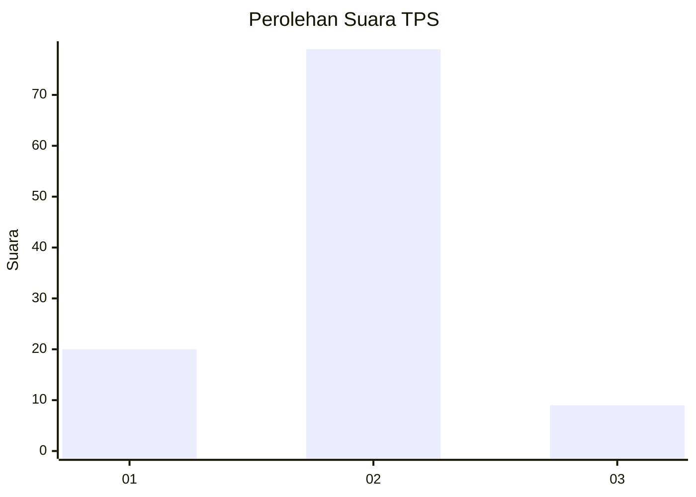
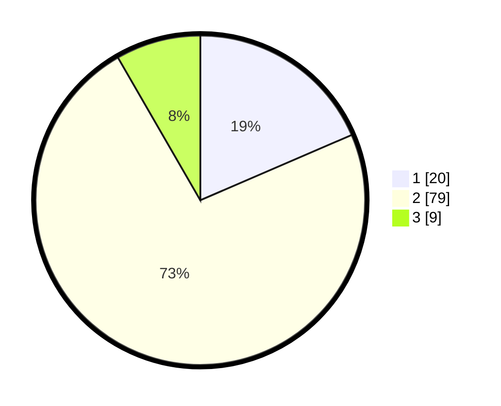

# Hasil

## Grafik

## Tabel

| No. | Nama Paslon    | Suara | Suara (raw) | Persentase |
|:--- |:-------------- | -----:| -----------:| ----------:|
| 1   | ANIES MUHAIMIN | 20    | [20][p-1]   | 18,52      |
| 2   | PRABOWO GIBRAN | 79    | [79][p-2]   | 73,15      |
| 3   | GANJAR MAHFUD  | 9     | [9][p-3]    | 8,33       |

[p-1]: https://github.com/gigit-pemilu/pemilu-2024-16-sumatera-selatan/blob/main/pilpres/hitung-suara/sub/16-sumatera-selatan/sub/01-ogan-komering-ulu/sub/21-semidang-aji/sub/2004-nyiur-sayak/sub/004-tps/sub/paslon-1.txt
[p-2]: https://github.com/gigit-pemilu/pemilu-2024-16-sumatera-selatan/blob/main/pilpres/hitung-suara/sub/16-sumatera-selatan/sub/01-ogan-komering-ulu/sub/21-semidang-aji/sub/2004-nyiur-sayak/sub/004-tps/sub/paslon-2.txt
[p-3]: https://github.com/gigit-pemilu/pemilu-2024-16-sumatera-selatan/blob/main/pilpres/hitung-suara/sub/16-sumatera-selatan/sub/01-ogan-komering-ulu/sub/21-semidang-aji/sub/2004-nyiur-sayak/sub/004-tps/sub/paslon-3.txt

## Foto C Plano

https://sirekap-obj-formc.kpu.go.id/6bd3/pemilu/ppwp/16/01/21/20/04/1601212004004-20240215-022339--919f1d8b-52b6-4ac9-89d7-1b6a279392b4.jpg

https://sirekap-obj-formc.kpu.go.id/6bd3/pemilu/ppwp/16/01/21/20/04/1601212004004-20240217-070644--51225a42-b30e-4cd7-a685-9a61bdec4ff3.jpg

https://sirekap-obj-formc.kpu.go.id/6bd3/pemilu/ppwp/16/01/21/20/04/1601212004004-20240217-071153--63109c5e-6717-44f2-b4c7-0d834965cfbf.jpg

## Metadata

| Key        | Value               |
| ---------- | ------------------- |
| Time Stamp | 2024-02-17 07:30:03 |

