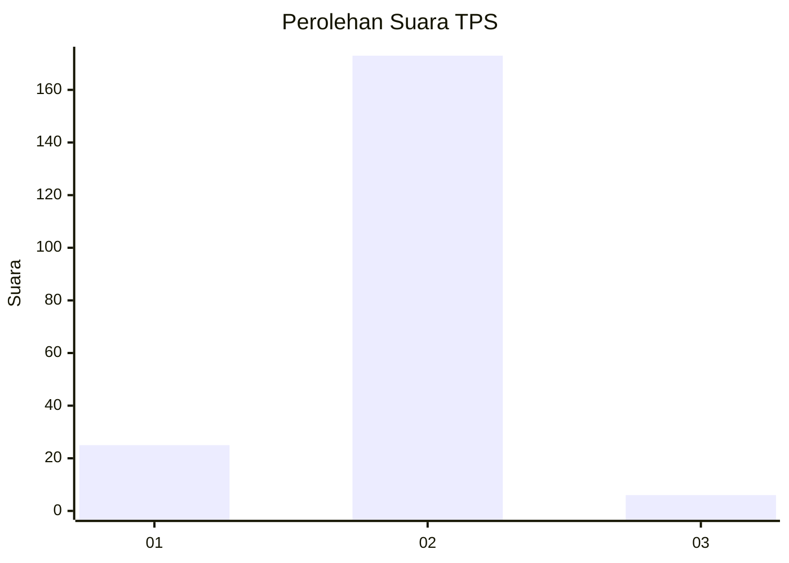
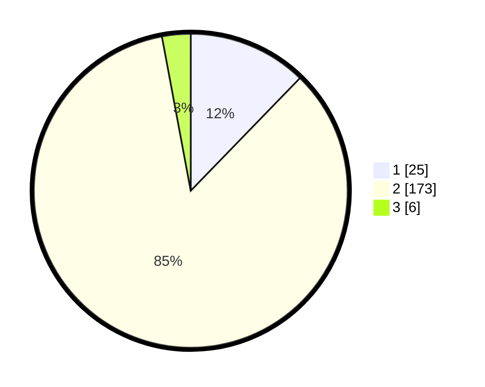

# Hasil

## Grafik

## Tabel

| No. | Nama Paslon    | Suara | Suara (raw) | Persentase |
|:--- |:-------------- | -----:| -----------:| ----------:|
| 1   | ANIES MUHAIMIN | 25    | [25][p-1]   | 12,25      |
| 2   | PRABOWO GIBRAN | 173   | [173][p-2]  | 84,80      |
| 3   | GANJAR MAHFUD  | 6     | [6][p-3]    | 2,94       |

[p-1]: https://github.com/gigit-pemilu/pemilu-2024-16-sumatera-selatan/blob/main/pilpres/hitung-suara/sub/16-sumatera-selatan/sub/01-ogan-komering-ulu/sub/21-semidang-aji/sub/2009-ulak-pandan/sub/010-tps/sub/paslon-1.txt
[p-2]: https://github.com/gigit-pemilu/pemilu-2024-16-sumatera-selatan/blob/main/pilpres/hitung-suara/sub/16-sumatera-selatan/sub/01-ogan-komering-ulu/sub/21-semidang-aji/sub/2009-ulak-pandan/sub/010-tps/sub/paslon-2.txt
[p-3]: https://github.com/gigit-pemilu/pemilu-2024-16-sumatera-selatan/blob/main/pilpres/hitung-suara/sub/16-sumatera-selatan/sub/01-ogan-komering-ulu/sub/21-semidang-aji/sub/2009-ulak-pandan/sub/010-tps/sub/paslon-3.txt

## Foto C Plano

https://sirekap-obj-formc.kpu.go.id/4b5c/pemilu/ppwp/16/01/21/20/09/1601212009010-20240215-180555--e1da9e70-b6b6-428e-b675-cad9968d9a8a.jpg

https://sirekap-obj-formc.kpu.go.id/4b5c/pemilu/ppwp/16/01/21/20/09/1601212009010-20240215-180726--f8ae899e-966d-4521-ac00-ca4c6d64354f.jpg

https://sirekap-obj-formc.kpu.go.id/4b5c/pemilu/ppwp/16/01/21/20/09/1601212009010-20240215-060506--0dbe7851-32d1-48ec-a532-c62471ab513f.jpg

## Metadata

| Key        | Value               |
| ---------- | ------------------- |
| Time Stamp | 2024-02-25 15:00:00 |

