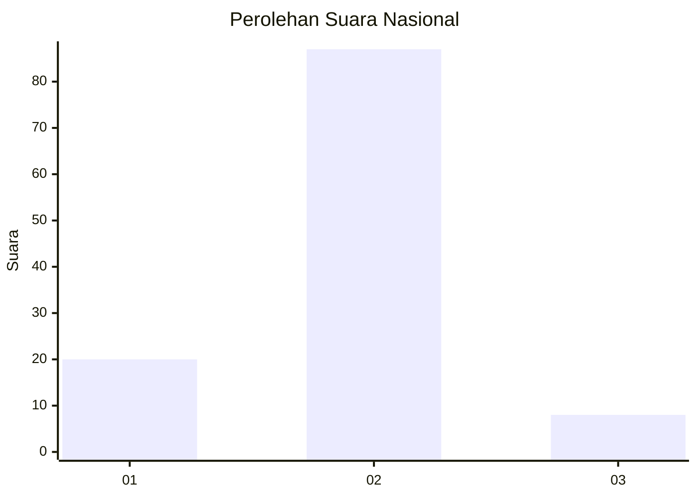
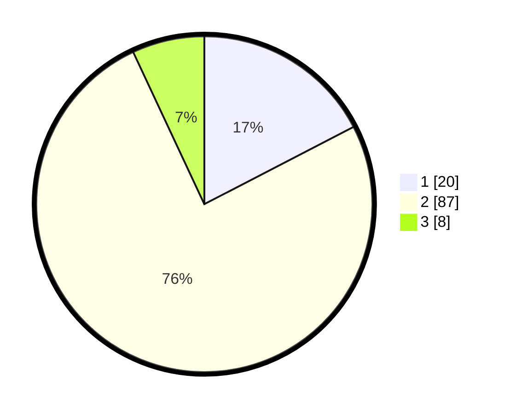

# Hasil

## Grafik

## Tabel

| No. | Nama Paslon    | Suara | Suara (raw) | Persentase |
|:--- |:-------------- | -----:| -----------:| ----------:|
| 1   | ANIES MUHAIMIN | 20    | [20][p-1]   | 17,39      |
| 2   | PRABOWO GIBRAN | 87    | [87][p-2]   | 75,65      |
| 3   | GANJAR MAHFUD  | 8     | [8][p-3]    | 6,96       |

[p-1]: https://github.com/gigit-pemilu/pemilu-2024/blob/main/pilpres/hitung-suara/sub/16-sumatera-selatan/sub/01-ogan-komering-ulu/sub/21-semidang-aji/sub/2010-keban-agung/sub/003-tps/sub/paslon-1.txt
[p-2]: https://github.com/gigit-pemilu/pemilu-2024/blob/main/pilpres/hitung-suara/sub/16-sumatera-selatan/sub/01-ogan-komering-ulu/sub/21-semidang-aji/sub/2010-keban-agung/sub/003-tps/sub/paslon-2.txt
[p-3]: https://github.com/gigit-pemilu/pemilu-2024/blob/main/pilpres/hitung-suara/sub/16-sumatera-selatan/sub/01-ogan-komering-ulu/sub/21-semidang-aji/sub/2010-keban-agung/sub/003-tps/sub/paslon-3.txt

## Foto C Plano

https://sirekap-obj-formc.kpu.go.id/48e7/pemilu/ppwp/16/01/21/20/10/1601212010003-20240214-200623--be1aaa64-6917-4b23-acd1-d7021b4ba7cf.jpg

https://sirekap-obj-formc.kpu.go.id/48e7/pemilu/ppwp/16/01/21/20/10/1601212010003-20240215-062957--749bed00-6413-435e-9268-b9cdbddf7c3d.jpg

https://sirekap-obj-formc.kpu.go.id/48e7/pemilu/ppwp/16/01/21/20/10/1601212010003-20240215-025601--8759a146-ac98-4188-a2c6-23b8f2558542.jpg

## Metadata

| Key        | Value               |
| ---------- | ------------------- |
| Time Stamp | 2024-02-24 22:31:28 |

## DATA PEMILIH TETAP

Jumlah pemilih dalam DPT: **154**.
 * L: **78**.
 * P: **76**.

## DATA PENGGUNA HAK PILIH

Jumlah pengguna hak pilih dalam DPT: **116**.
 * L: **60**.
 * P: **56**.

Jumlah pengguna hak pilih dalam DPTb: **5**.
 * L: **805**.
 * P: **0**.

Jumlah pengguna hak pilih dalam DPK: **2**.
 * L: **0**.
 * P: **2**.

Jumlah pengguna hak pilih: **123**.
 * L: **65**.
 * P: **58**.

## JUMLAH SUARA SAH DAN TIDAK SAH

JUMLAH SELURUH SUARA SAH: **115**.

JUMLAH SUARA TIDAK SAH: **8**.

JUMLAH SELURUH SUARA SAH DAN SUARA TIDAK SAH: **123**.

