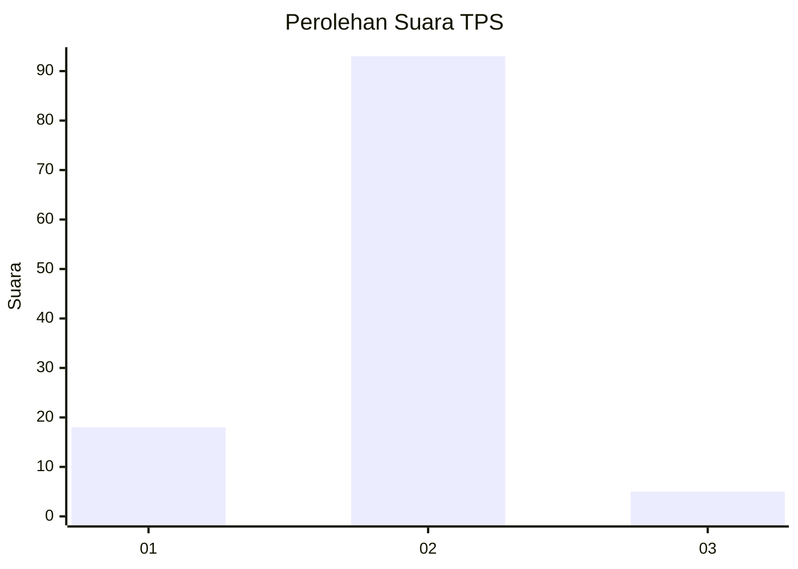
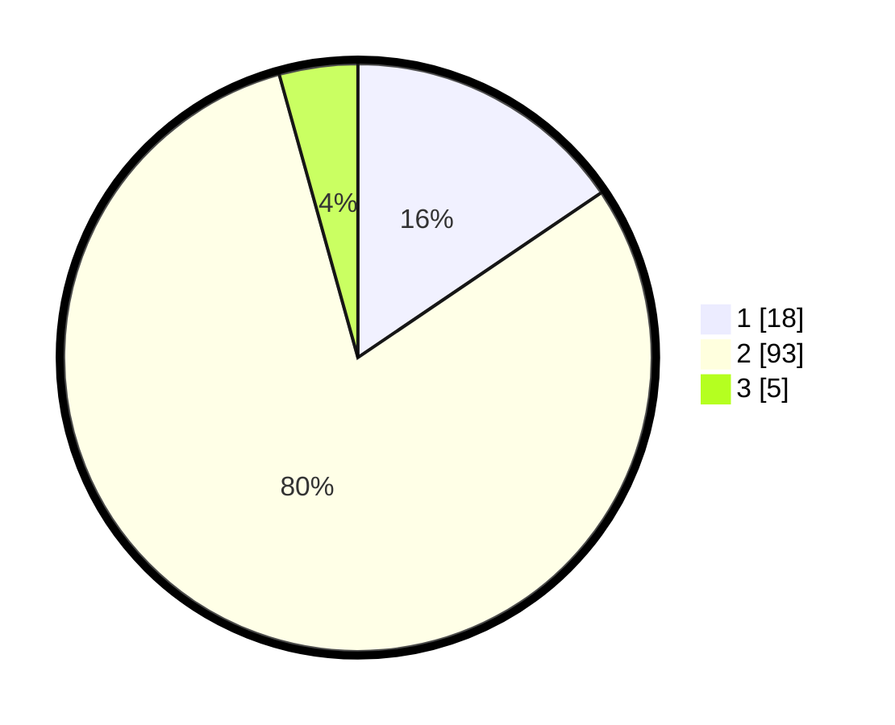

# Hasil

## Grafik

## Tabel

| No. | Nama Paslon    | Suara | Suara (raw) | Persentase |
|:--- |:-------------- | -----:| -----------:| ----------:|
| 1   | ANIES MUHAIMIN | 18    | [18][p-1]   | 15,52      |
| 2   | PRABOWO GIBRAN | 93    | [93][p-2]   | 80,17      |
| 3   | GANJAR MAHFUD  | 5     | [5][p-3]    | 4,31       |

[p-1]: https://github.com/gigit-pemilu/pemilu-2024-16-sumatera-selatan/blob/main/pilpres/hitung-suara/sub/16-sumatera-selatan/sub/01-ogan-komering-ulu/sub/21-semidang-aji/sub/2010-keban-agung/sub/004-tps/sub/paslon-1.txt
[p-2]: https://github.com/gigit-pemilu/pemilu-2024-16-sumatera-selatan/blob/main/pilpres/hitung-suara/sub/16-sumatera-selatan/sub/01-ogan-komering-ulu/sub/21-semidang-aji/sub/2010-keban-agung/sub/004-tps/sub/paslon-2.txt
[p-3]: https://github.com/gigit-pemilu/pemilu-2024-16-sumatera-selatan/blob/main/pilpres/hitung-suara/sub/16-sumatera-selatan/sub/01-ogan-komering-ulu/sub/21-semidang-aji/sub/2010-keban-agung/sub/004-tps/sub/paslon-3.txt

## Foto C Plano

https://sirekap-obj-formc.kpu.go.id/3a02/pemilu/ppwp/16/01/21/20/10/1601212010004-20240215-042251--b8edf5ed-205e-40d0-a3ce-61c3894b7d92.jpg

https://sirekap-obj-formc.kpu.go.id/3a02/pemilu/ppwp/16/01/21/20/10/1601212010004-20240215-042716--31ff6601-cc6d-4d65-9ccf-75b4ac11e8fa.jpg

https://sirekap-obj-formc.kpu.go.id/3a02/pemilu/ppwp/16/01/21/20/10/1601212010004-20240215-042841--198f0a62-3a16-4065-a987-9eb8d9916eb9.jpg

## Metadata

| Key        | Value               |
| ---------- | ------------------- |
| Time Stamp | 2024-02-25 17:00:00 |

