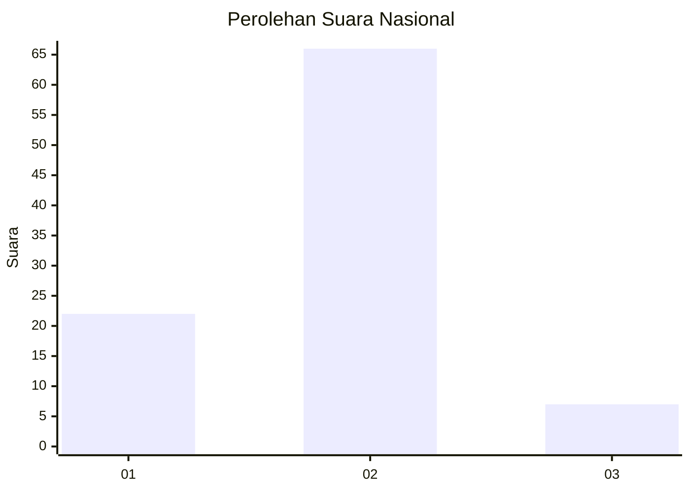
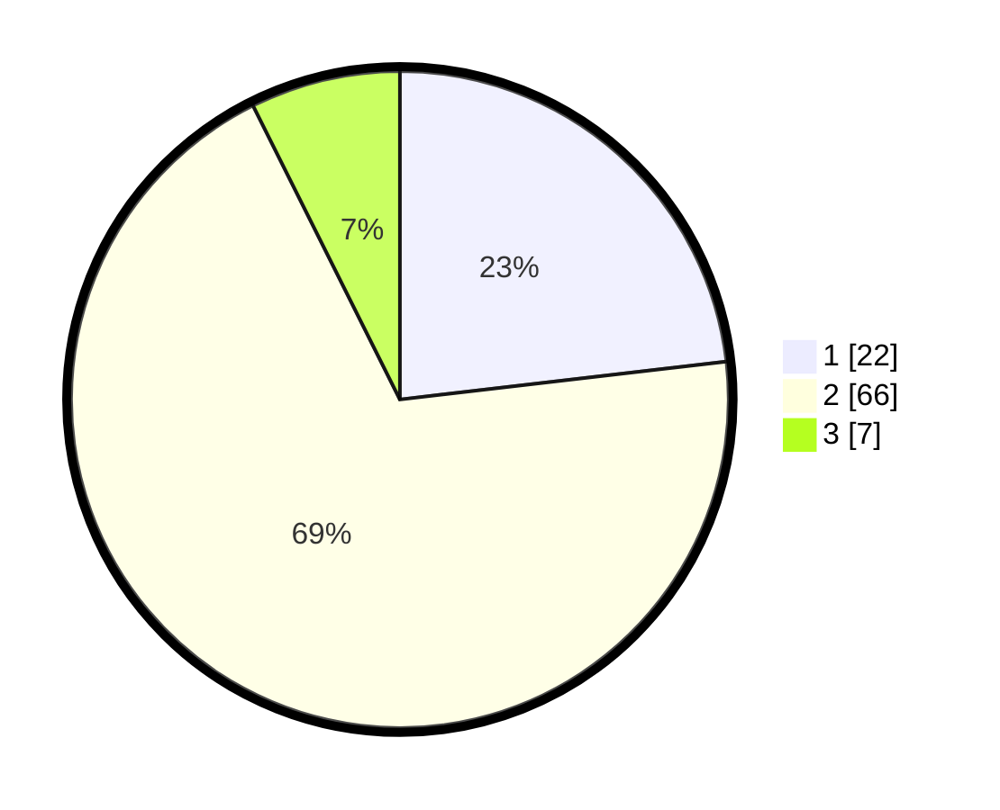

# Hasil

## Grafik

## Tabel

| No. | Nama Paslon    | Suara | Suara (raw) | Persentase |
|:--- |:-------------- | -----:| -----------:| ----------:|
| 1   | ANIES MUHAIMIN | 22    | [22][p-1]   | 23,16      |
| 2   | PRABOWO GIBRAN | 66    | [66][p-2]   | 69,47      |
| 3   | GANJAR MAHFUD  | 7     | [7][p-3]    | 7,37       |

[p-1]: https://github.com/gigit-pemilu/pemilu-2024/blob/main/pilpres/hitung-suara/sub/16-sumatera-selatan/sub/01-ogan-komering-ulu/sub/21-semidang-aji/sub/2010-keban-agung/sub/005-tps/sub/paslon-1.txt
[p-2]: https://github.com/gigit-pemilu/pemilu-2024/blob/main/pilpres/hitung-suara/sub/16-sumatera-selatan/sub/01-ogan-komering-ulu/sub/21-semidang-aji/sub/2010-keban-agung/sub/005-tps/sub/paslon-2.txt
[p-3]: https://github.com/gigit-pemilu/pemilu-2024/blob/main/pilpres/hitung-suara/sub/16-sumatera-selatan/sub/01-ogan-komering-ulu/sub/21-semidang-aji/sub/2010-keban-agung/sub/005-tps/sub/paslon-3.txt

## Foto C Plano

https://sirekap-obj-formc.kpu.go.id/30a6/pemilu/ppwp/16/01/21/20/10/1601212010005-20240215-031733--088711a9-9339-4f7b-a819-c6a8fea2b883.jpg

https://sirekap-obj-formc.kpu.go.id/30a6/pemilu/ppwp/16/01/21/20/10/1601212010005-20240215-031908--dfe2f418-3f44-4414-bba4-eb05ef85d6ca.jpg

https://sirekap-obj-formc.kpu.go.id/30a6/pemilu/ppwp/16/01/21/20/10/1601212010005-20240215-032052--32b7b9a0-6980-4453-9683-2efaf72b8ed0.jpg

## Metadata

| Key        | Value               |
| ---------- | ------------------- |
| Time Stamp | 2024-02-25 16:00:00 |

