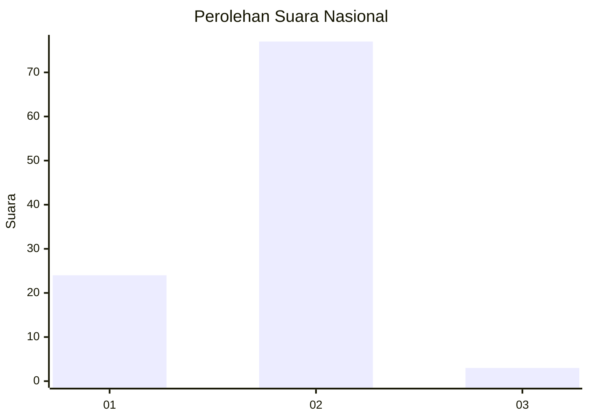
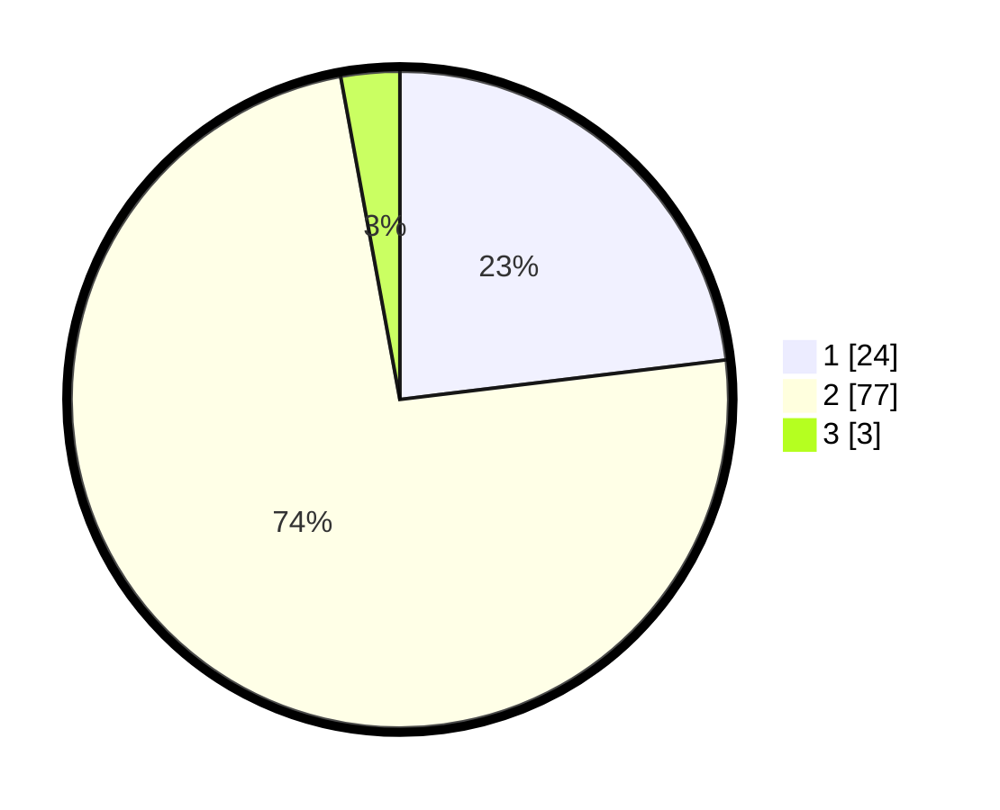

# Hasil

## Grafik

## Tabel

| No. | Nama Paslon    | Suara | Suara (raw) | Persentase |
|:--- |:-------------- | -----:| -----------:| ----------:|
| 1   | ANIES MUHAIMIN | 24    | [24][p-1]   | 23,08      |
| 2   | PRABOWO GIBRAN | 77    | [77][p-2]   | 74,04      |
| 3   | GANJAR MAHFUD  | 3     | [3][p-3]    | 2,88       |

[p-1]: https://github.com/gigit-pemilu/pemilu-2024/blob/main/pilpres/hitung-suara/sub/16-sumatera-selatan/sub/01-ogan-komering-ulu/sub/21-semidang-aji/sub/2011-tubohan/sub/004-tps/sub/paslon-1.txt
[p-2]: https://github.com/gigit-pemilu/pemilu-2024/blob/main/pilpres/hitung-suara/sub/16-sumatera-selatan/sub/01-ogan-komering-ulu/sub/21-semidang-aji/sub/2011-tubohan/sub/004-tps/sub/paslon-2.txt
[p-3]: https://github.com/gigit-pemilu/pemilu-2024/blob/main/pilpres/hitung-suara/sub/16-sumatera-selatan/sub/01-ogan-komering-ulu/sub/21-semidang-aji/sub/2011-tubohan/sub/004-tps/sub/paslon-3.txt

## Foto C Plano

https://sirekap-obj-formc.kpu.go.id/6ec1/pemilu/ppwp/16/01/21/20/11/1601212011004-20240215-022707--1e31da4b-dc5c-41a7-a91e-b4abb45a658b.jpg

https://sirekap-obj-formc.kpu.go.id/6ec1/pemilu/ppwp/16/01/21/20/11/1601212011004-20240216-125706--bf8e67d2-8a2e-4654-9d2f-1ebd9a62d23e.jpg

https://sirekap-obj-formc.kpu.go.id/6ec1/pemilu/ppwp/16/01/21/20/11/1601212011004-20240214-205319--35783788-92fb-4c88-80aa-50cff4bef50b.jpg

## Metadata

| Key        | Value               |
| ---------- | ------------------- |
| Time Stamp | 2024-02-24 22:31:28 |

