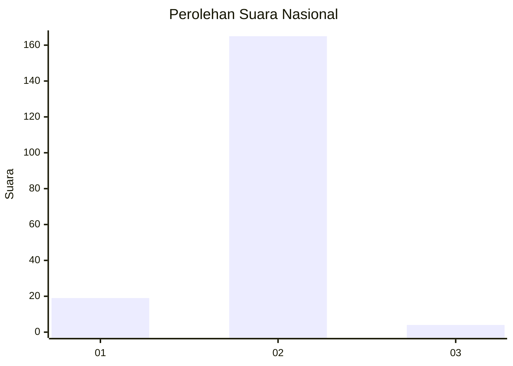
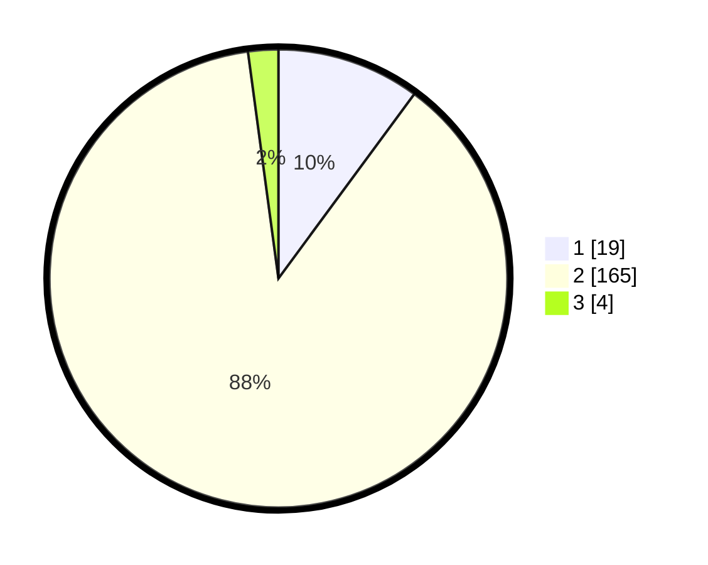

# Hasil

## Grafik

## Tabel

| No. | Nama Paslon    | Suara | Suara (raw) | Persentase |
|:--- |:-------------- | -----:| -----------:| ----------:|
| 1   | ANIES MUHAIMIN | 19    | [19][p-1]   | 10,11      |
| 2   | PRABOWO GIBRAN | 165   | [165][p-2]  | 87,77      |
| 3   | GANJAR MAHFUD  | 4     | [4][p-3]    | 2,13       |

[p-1]: https://github.com/gigit-pemilu/pemilu-2024/blob/main/pilpres/hitung-suara/sub/16-sumatera-selatan/sub/01-ogan-komering-ulu/sub/21-semidang-aji/sub/2014-kebun-jati/sub/001-tps/sub/paslon-1.txt
[p-2]: https://github.com/gigit-pemilu/pemilu-2024/blob/main/pilpres/hitung-suara/sub/16-sumatera-selatan/sub/01-ogan-komering-ulu/sub/21-semidang-aji/sub/2014-kebun-jati/sub/001-tps/sub/paslon-2.txt
[p-3]: https://github.com/gigit-pemilu/pemilu-2024/blob/main/pilpres/hitung-suara/sub/16-sumatera-selatan/sub/01-ogan-komering-ulu/sub/21-semidang-aji/sub/2014-kebun-jati/sub/001-tps/sub/paslon-3.txt

## Foto C Plano

https://sirekap-obj-formc.kpu.go.id/dc7a/pemilu/ppwp/16/01/21/20/14/1601212014001-20240214-234405--a2f97a4e-6a06-46e7-94b2-81a7e2ed1dae.jpg

https://sirekap-obj-formc.kpu.go.id/dc7a/pemilu/ppwp/16/01/21/20/14/1601212014001-20240215-024046--64dea3ad-0d99-4706-8667-7da555e3e9ec.jpg

https://sirekap-obj-formc.kpu.go.id/dc7a/pemilu/ppwp/16/01/21/20/14/1601212014001-20240214-234821--b904f632-5083-40e3-abab-5108714d29e3.jpg

## Metadata

| Key        | Value               |
| ---------- | ------------------- |
| Time Stamp | 2024-02-25 15:00:00 |

