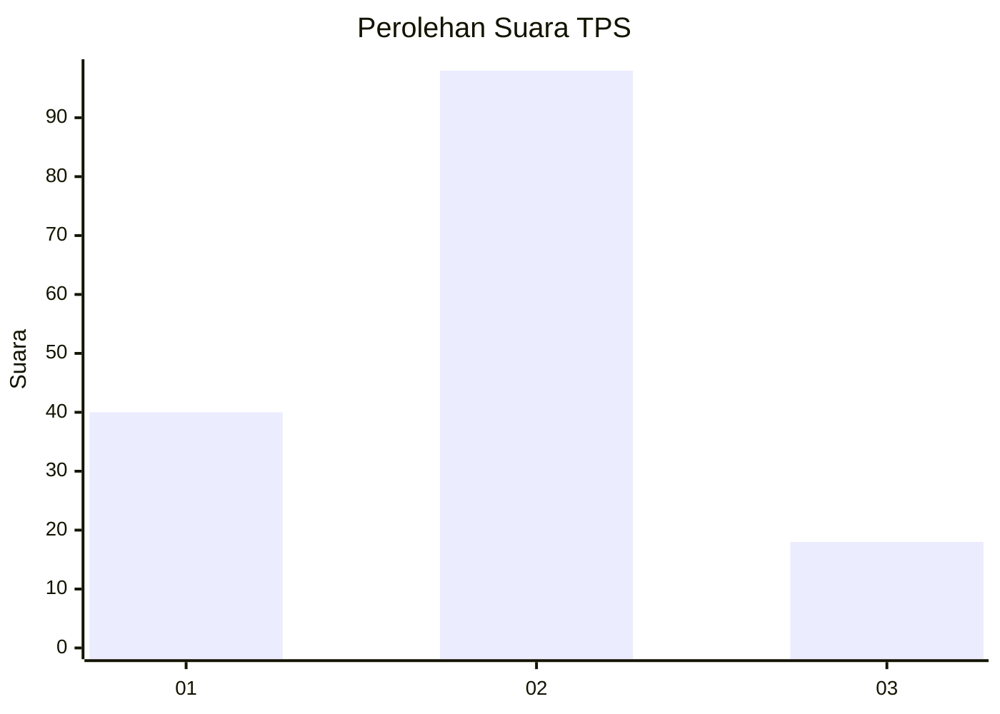
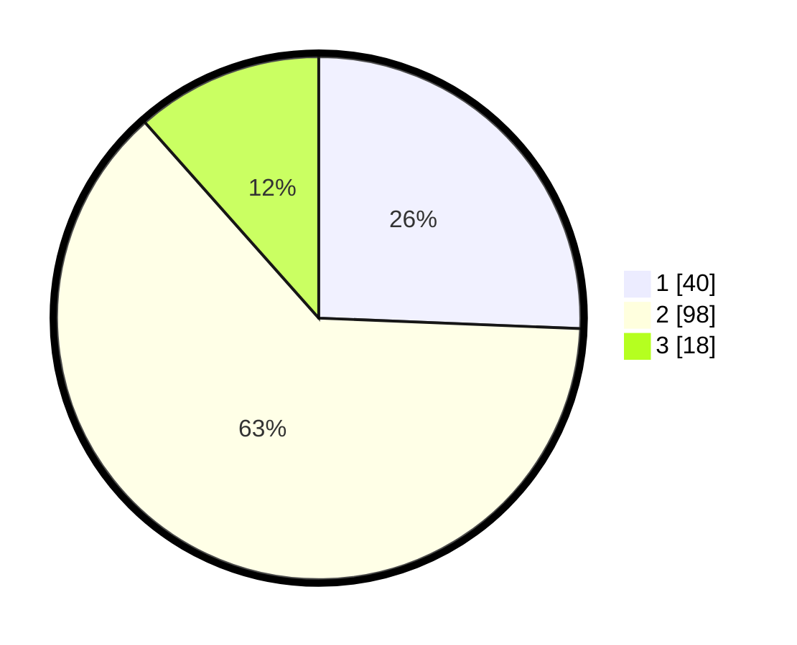

# Hasil

## Grafik

## Tabel

| No. | Nama Paslon    | Suara | Suara (raw) | Persentase |
|:--- |:-------------- | -----:| -----------:| ----------:|
| 1   | ANIES MUHAIMIN | 40    | [40][p-1]   | 25,64      |
| 2   | PRABOWO GIBRAN | 98    | [98][p-2]   | 62,82      |
| 3   | GANJAR MAHFUD  | 18    | [18][p-3]   | 11,54      |

[p-1]: https://github.com/gigit-pemilu/pemilu-2024-16-sumatera-selatan/blob/main/pilpres/hitung-suara/sub/16-sumatera-selatan/sub/01-ogan-komering-ulu/sub/21-semidang-aji/sub/2022-tebing-kampung/sub/002-tps/sub/paslon-1.txt
[p-2]: https://github.com/gigit-pemilu/pemilu-2024-16-sumatera-selatan/blob/main/pilpres/hitung-suara/sub/16-sumatera-selatan/sub/01-ogan-komering-ulu/sub/21-semidang-aji/sub/2022-tebing-kampung/sub/002-tps/sub/paslon-2.txt
[p-3]: https://github.com/gigit-pemilu/pemilu-2024-16-sumatera-selatan/blob/main/pilpres/hitung-suara/sub/16-sumatera-selatan/sub/01-ogan-komering-ulu/sub/21-semidang-aji/sub/2022-tebing-kampung/sub/002-tps/sub/paslon-3.txt

## Foto C Plano

https://sirekap-obj-formc.kpu.go.id/5207/pemilu/ppwp/16/01/21/20/22/1601212022002-20240215-040040--055ceb99-0065-488c-941e-bba1b340b7e6.jpg

https://sirekap-obj-formc.kpu.go.id/5207/pemilu/ppwp/16/01/21/20/22/1601212022002-20240215-050724--b2ab7584-712d-4d53-a2c1-2dcb99cf6de0.jpg

https://sirekap-obj-formc.kpu.go.id/5207/pemilu/ppwp/16/01/21/20/22/1601212022002-20240215-071654--d8d47e14-8924-4750-998d-a2104a66d975.jpg

## Metadata

| Key        | Value               |
| ---------- | ------------------- |
| Time Stamp | 2024-02-25 13:00:00 |

