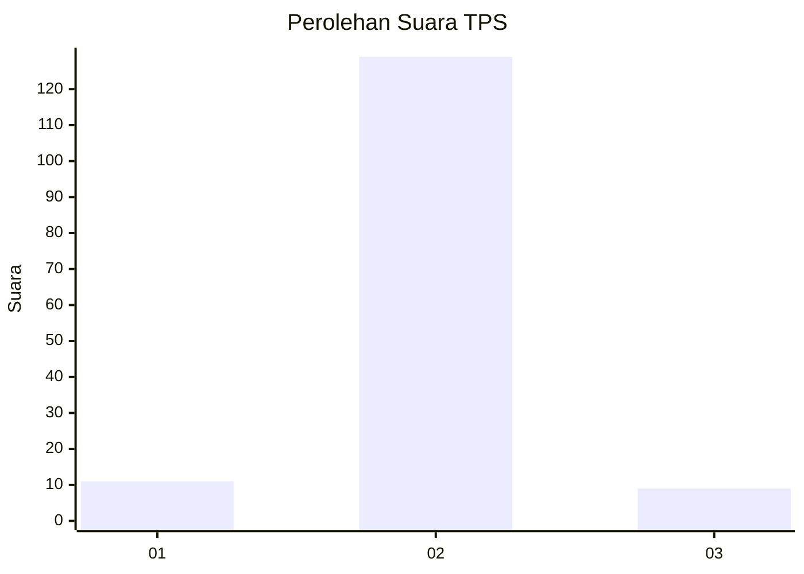
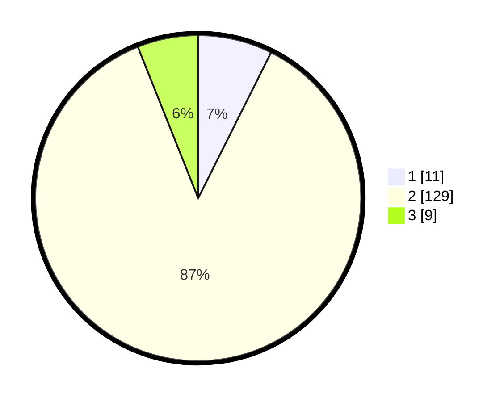

# Hasil

## Grafik

## Tabel

| No. | Nama Paslon    | Suara | Suara (raw) | Persentase |
|:--- |:-------------- | -----:| -----------:| ----------:|
| 1   | ANIES MUHAIMIN | 11    | [11][p-1]   | 7,38       |
| 2   | PRABOWO GIBRAN | 129   | [129][p-2]  | 86,58      |
| 3   | GANJAR MAHFUD  | 9     | [9][p-3]    | 6,04       |

[p-1]: https://github.com/gigit-pemilu/pemilu-2024-16-sumatera-selatan/blob/main/pilpres/hitung-suara/sub/16-sumatera-selatan/sub/01-ogan-komering-ulu/sub/22-lubuk-batang/sub/2001-merbau/sub/003-tps/sub/paslon-1.txt
[p-2]: https://github.com/gigit-pemilu/pemilu-2024-16-sumatera-selatan/blob/main/pilpres/hitung-suara/sub/16-sumatera-selatan/sub/01-ogan-komering-ulu/sub/22-lubuk-batang/sub/2001-merbau/sub/003-tps/sub/paslon-2.txt
[p-3]: https://github.com/gigit-pemilu/pemilu-2024-16-sumatera-selatan/blob/main/pilpres/hitung-suara/sub/16-sumatera-selatan/sub/01-ogan-komering-ulu/sub/22-lubuk-batang/sub/2001-merbau/sub/003-tps/sub/paslon-3.txt

## Foto C Plano

https://sirekap-obj-formc.kpu.go.id/b9da/pemilu/ppwp/16/01/22/20/01/1601222001003-20240215-074509--a4092ee1-7c2b-494b-9888-b61c57e5a535.jpg

https://sirekap-obj-formc.kpu.go.id/b9da/pemilu/ppwp/16/01/22/20/01/1601222001003-20240214-234844--f84ba7cc-9545-4e3b-9062-d38a230ba8f6.jpg

https://sirekap-obj-formc.kpu.go.id/b9da/pemilu/ppwp/16/01/22/20/01/1601222001003-20240214-235155--baec7ecc-a60c-4c53-9074-01f3d0d8b184.jpg

## Metadata

| Key        | Value               |
| ---------- | ------------------- |
| Time Stamp | 2024-02-25 12:00:00 |

