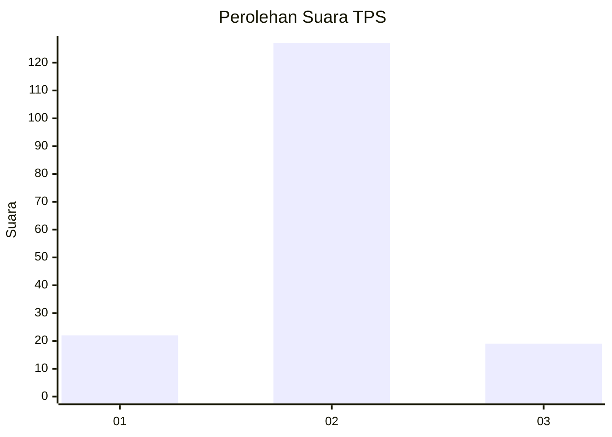
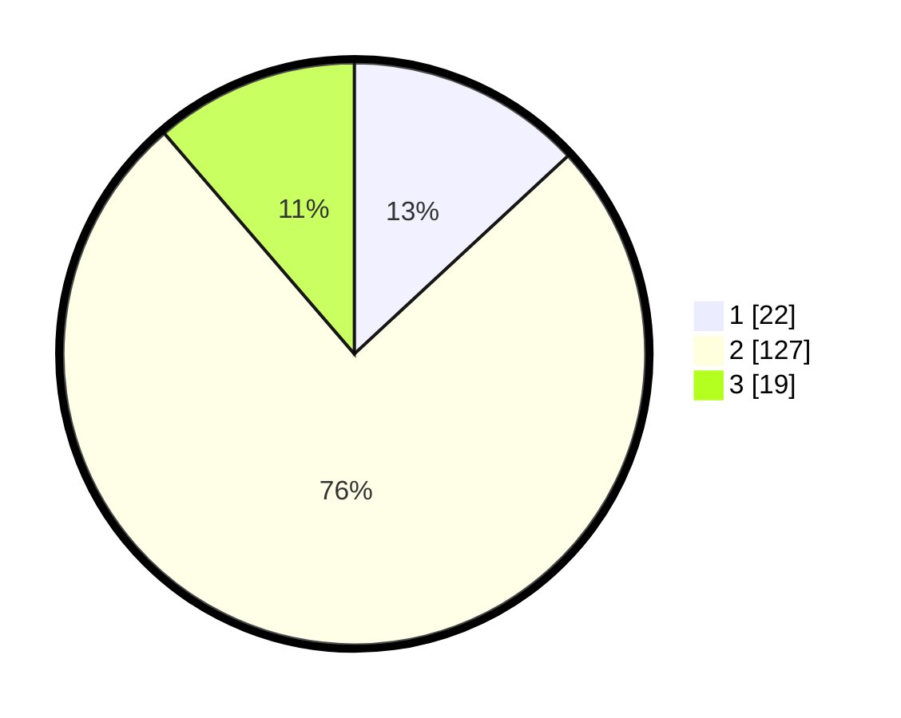

# Hasil

## Grafik

## Tabel

| No. | Nama Paslon    | Suara | Suara (raw) | Persentase |
|:--- |:-------------- | -----:| -----------:| ----------:|
| 1   | ANIES MUHAIMIN | 22    | [22][p-1]   | 13,10      |
| 2   | PRABOWO GIBRAN | 127   | [127][p-2]  | 75,60      |
| 3   | GANJAR MAHFUD  | 19    | [19][p-3]   | 11,31      |

[p-1]: https://github.com/gigit-pemilu/pemilu-2024-16-sumatera-selatan/blob/main/pilpres/hitung-suara/sub/16-sumatera-selatan/sub/01-ogan-komering-ulu/sub/22-lubuk-batang/sub/2001-merbau/sub/006-tps/sub/paslon-1.txt
[p-2]: https://github.com/gigit-pemilu/pemilu-2024-16-sumatera-selatan/blob/main/pilpres/hitung-suara/sub/16-sumatera-selatan/sub/01-ogan-komering-ulu/sub/22-lubuk-batang/sub/2001-merbau/sub/006-tps/sub/paslon-2.txt
[p-3]: https://github.com/gigit-pemilu/pemilu-2024-16-sumatera-selatan/blob/main/pilpres/hitung-suara/sub/16-sumatera-selatan/sub/01-ogan-komering-ulu/sub/22-lubuk-batang/sub/2001-merbau/sub/006-tps/sub/paslon-3.txt

## Foto C Plano

https://sirekap-obj-formc.kpu.go.id/538c/pemilu/ppwp/16/01/22/20/01/1601222001006-20240214-233159--947efb6a-1526-4af8-b7ba-3c1edd1e375f.jpg

https://sirekap-obj-formc.kpu.go.id/538c/pemilu/ppwp/16/01/22/20/01/1601222001006-20240215-015449--a4fc456d-d07d-4ece-8a43-238e9bbc6664.jpg

https://sirekap-obj-formc.kpu.go.id/538c/pemilu/ppwp/16/01/22/20/01/1601222001006-20240214-233742--ee836268-dd88-4f1d-b5ed-0441f2ebda06.jpg

## Metadata

| Key        | Value               |
| ---------- | ------------------- |
| Time Stamp | 2024-02-24 23:00:00 |

