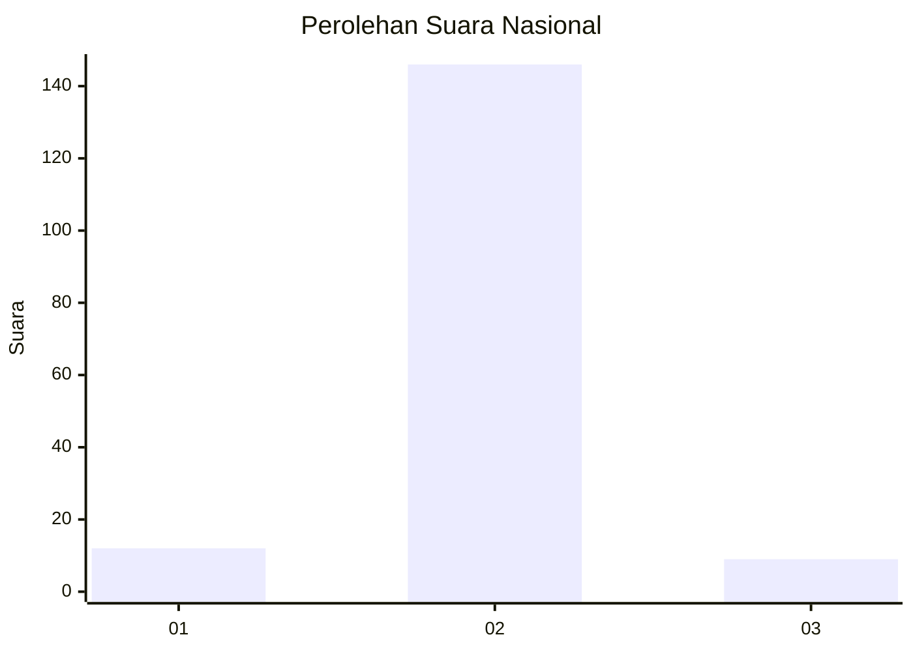
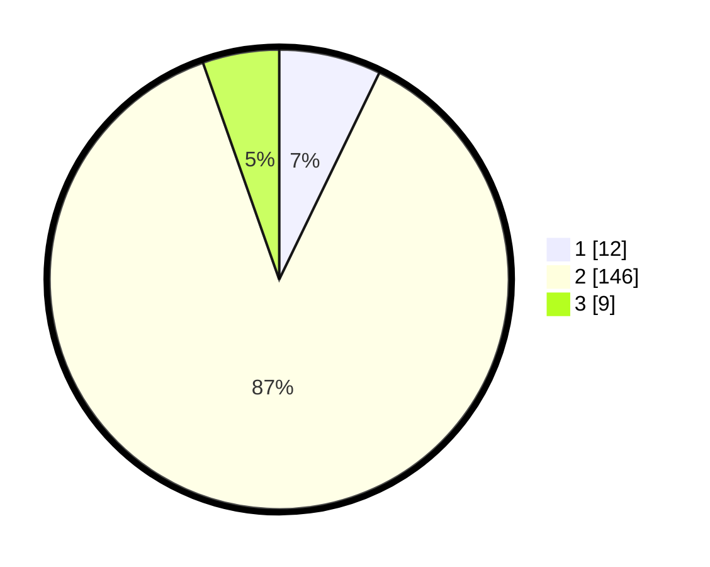

# Hasil

## Grafik

## Tabel

| No. | Nama Paslon    | Suara | Suara (raw) | Persentase |
|:--- |:-------------- | -----:| -----------:| ----------:|
| 1   | ANIES MUHAIMIN | 12    | [12][p-1]   | 7,19       |
| 2   | PRABOWO GIBRAN | 146   | [146][p-2]  | 87,43      |
| 3   | GANJAR MAHFUD  | 9     | [9][p-3]    | 5,39       |

[p-1]: https://github.com/gigit-pemilu/pemilu-2024/blob/main/pilpres/hitung-suara/sub/16-sumatera-selatan/sub/01-ogan-komering-ulu/sub/22-lubuk-batang/sub/2003-kurup/sub/003-tps/sub/paslon-1.txt
[p-2]: https://github.com/gigit-pemilu/pemilu-2024/blob/main/pilpres/hitung-suara/sub/16-sumatera-selatan/sub/01-ogan-komering-ulu/sub/22-lubuk-batang/sub/2003-kurup/sub/003-tps/sub/paslon-2.txt
[p-3]: https://github.com/gigit-pemilu/pemilu-2024/blob/main/pilpres/hitung-suara/sub/16-sumatera-selatan/sub/01-ogan-komering-ulu/sub/22-lubuk-batang/sub/2003-kurup/sub/003-tps/sub/paslon-3.txt

## Foto C Plano

https://sirekap-obj-formc.kpu.go.id/21fd/pemilu/ppwp/16/01/22/20/03/1601222003003-20240214-195817--91ecc35d-dcf2-421c-bfe6-d733e4049717.jpg

https://sirekap-obj-formc.kpu.go.id/21fd/pemilu/ppwp/16/01/22/20/03/1601222003003-20240214-225902--5250ed44-9116-401e-b817-a46578b8644d.jpg

https://sirekap-obj-formc.kpu.go.id/21fd/pemilu/ppwp/16/01/22/20/03/1601222003003-20240214-200057--f6476613-4831-4bbc-959f-8a1b3ea634a8.jpg

## Metadata

| Key        | Value               |
| ---------- | ------------------- |
| Time Stamp | 2024-02-25 00:00:00 |

