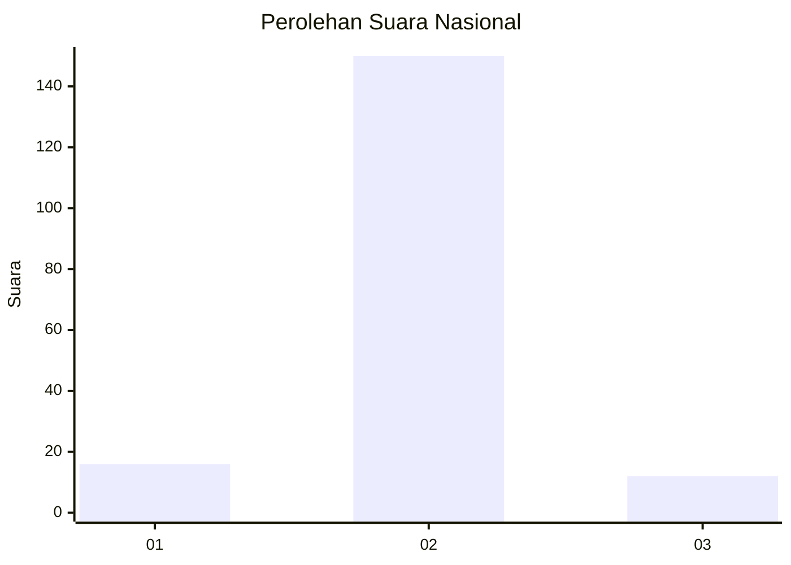
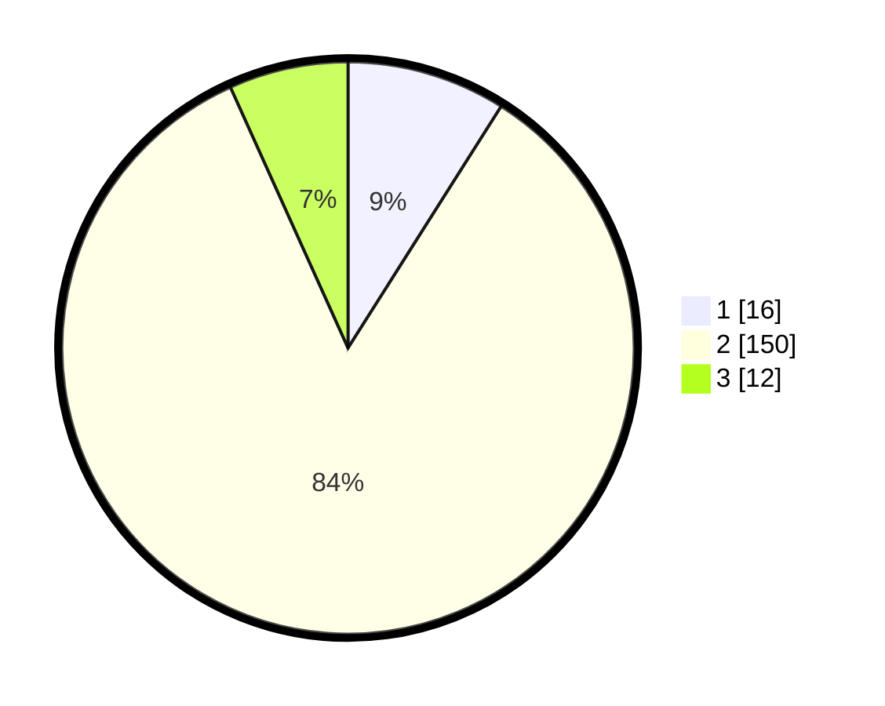

# Hasil

## Grafik

## Tabel

| No. | Nama Paslon    | Suara | Suara (raw) | Persentase |
|:--- |:-------------- | -----:| -----------:| ----------:|
| 1   | ANIES MUHAIMIN | 16    | [16][p-1]   | 8,99       |
| 2   | PRABOWO GIBRAN | 150   | [150][p-2]  | 84,27      |
| 3   | GANJAR MAHFUD  | 12    | [12][p-3]   | 6,74       |

[p-1]: https://github.com/gigit-pemilu/pemilu-2024/blob/main/pilpres/hitung-suara/sub/16-sumatera-selatan/sub/01-ogan-komering-ulu/sub/22-lubuk-batang/sub/2003-kurup/sub/007-tps/sub/paslon-1.txt
[p-2]: https://github.com/gigit-pemilu/pemilu-2024/blob/main/pilpres/hitung-suara/sub/16-sumatera-selatan/sub/01-ogan-komering-ulu/sub/22-lubuk-batang/sub/2003-kurup/sub/007-tps/sub/paslon-2.txt
[p-3]: https://github.com/gigit-pemilu/pemilu-2024/blob/main/pilpres/hitung-suara/sub/16-sumatera-selatan/sub/01-ogan-komering-ulu/sub/22-lubuk-batang/sub/2003-kurup/sub/007-tps/sub/paslon-3.txt

## Foto C Plano

https://sirekap-obj-formc.kpu.go.id/e83b/pemilu/ppwp/16/01/22/20/03/1601222003007-20240214-204209--b74dfb22-b97c-4c47-ab10-078c101d06ac.jpg

https://sirekap-obj-formc.kpu.go.id/e83b/pemilu/ppwp/16/01/22/20/03/1601222003007-20240214-224026--ea578d41-d3c4-4348-a312-2dd46a3f536d.jpg

https://sirekap-obj-formc.kpu.go.id/e83b/pemilu/ppwp/16/01/22/20/03/1601222003007-20240214-204633--1e9a7a03-99ed-4e48-a2f2-265bc1b5e934.jpg

## Metadata

| Key        | Value               |
| ---------- | ------------------- |
| Time Stamp | 2024-02-25 16:00:00 |

