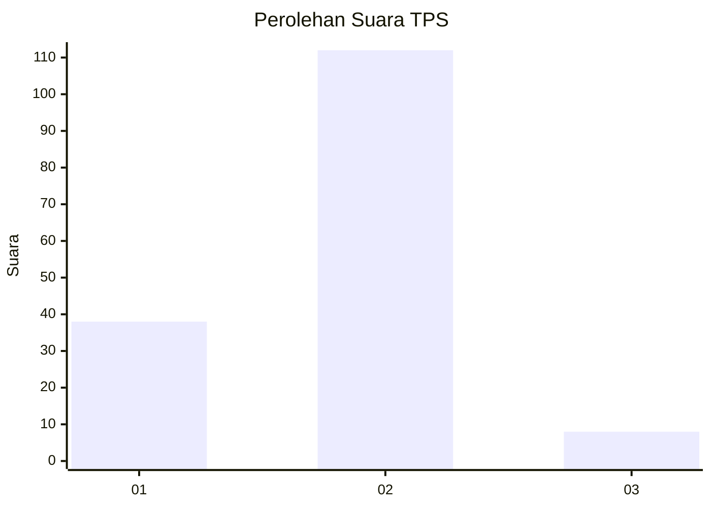
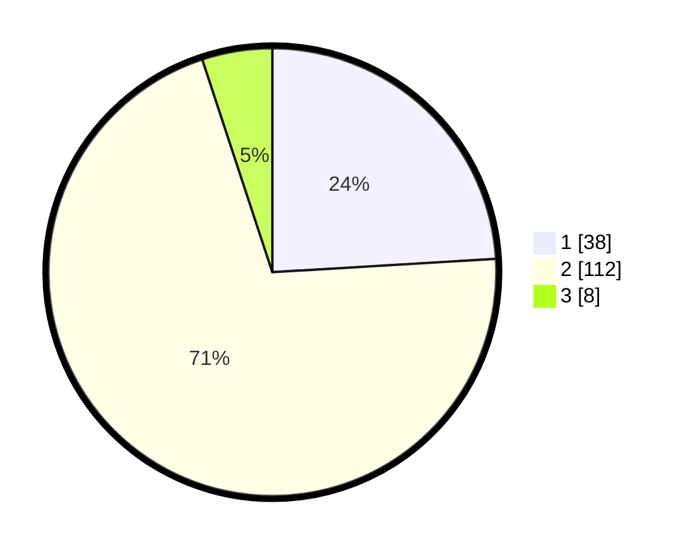

# Hasil

## Grafik

## Tabel

| No. | Nama Paslon    | Suara | Suara (raw) | Persentase |
|:--- |:-------------- | -----:| -----------:| ----------:|
| 1   | ANIES MUHAIMIN | 38    | [38][p-1]   | 24,05      |
| 2   | PRABOWO GIBRAN | 112   | [112][p-2]  | 70,89      |
| 3   | GANJAR MAHFUD  | 8     | [8][p-3]    | 5,06       |

[p-1]: https://github.com/gigit-pemilu/pemilu-2024-16-sumatera-selatan/blob/main/pilpres/hitung-suara/sub/16-sumatera-selatan/sub/01-ogan-komering-ulu/sub/22-lubuk-batang/sub/2005-tanjung-dalam/sub/002-tps/sub/paslon-1.txt
[p-2]: https://github.com/gigit-pemilu/pemilu-2024-16-sumatera-selatan/blob/main/pilpres/hitung-suara/sub/16-sumatera-selatan/sub/01-ogan-komering-ulu/sub/22-lubuk-batang/sub/2005-tanjung-dalam/sub/002-tps/sub/paslon-2.txt
[p-3]: https://github.com/gigit-pemilu/pemilu-2024-16-sumatera-selatan/blob/main/pilpres/hitung-suara/sub/16-sumatera-selatan/sub/01-ogan-komering-ulu/sub/22-lubuk-batang/sub/2005-tanjung-dalam/sub/002-tps/sub/paslon-3.txt

## Foto C Plano

https://sirekap-obj-formc.kpu.go.id/ff72/pemilu/ppwp/16/01/22/20/05/1601222005002-20240214-233432--cce4234d-cd00-431d-bdf8-c00b24690fe8.jpg

https://sirekap-obj-formc.kpu.go.id/ff72/pemilu/ppwp/16/01/22/20/05/1601222005002-20240214-233831--f0cd16df-0f26-4402-b9ab-2335a6d21ae3.jpg

https://sirekap-obj-formc.kpu.go.id/ff72/pemilu/ppwp/16/01/22/20/05/1601222005002-20240214-234507--d5ded24e-91d4-4ce1-8b86-a7ec0eb40e7e.jpg

## Metadata

| Key        | Value               |
| ---------- | ------------------- |
| Time Stamp | 2024-02-24 22:31:28 |

