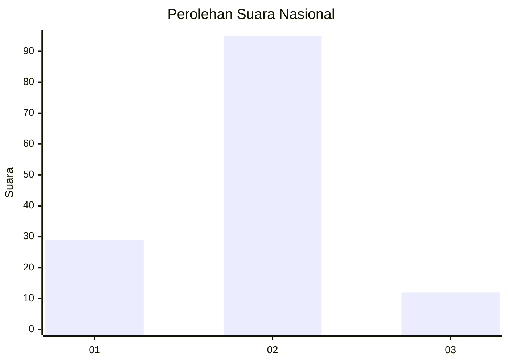

# Hasil

## Grafik

## Tabel

| No. | Nama Paslon    | Suara | Suara (raw) | Persentase |
|:--- |:-------------- | -----:| -----------:| ----------:|
| 1   | ANIES MUHAIMIN | 29    | [29][p-1]   | 21,32      |
| 2   | PRABOWO GIBRAN | 95    | [95][p-2]   | 69,85      |
| 3   | GANJAR MAHFUD  | 12    | [12][p-3]   | 8,82       |

[p-1]: https://github.com/gigit-pemilu/pemilu-2024/blob/main/pilpres/hitung-suara/sub/16-sumatera-selatan/sub/01-ogan-komering-ulu/sub/22-lubuk-batang/sub/2006-lubuk-batang-baru/sub/003-tps/sub/paslon-1.txt
[p-2]: https://github.com/gigit-pemilu/pemilu-2024/blob/main/pilpres/hitung-suara/sub/16-sumatera-selatan/sub/01-ogan-komering-ulu/sub/22-lubuk-batang/sub/2006-lubuk-batang-baru/sub/003-tps/sub/paslon-2.txt
[p-3]: https://github.com/gigit-pemilu/pemilu-2024/blob/main/pilpres/hitung-suara/sub/16-sumatera-selatan/sub/01-ogan-komering-ulu/sub/22-lubuk-batang/sub/2006-lubuk-batang-baru/sub/003-tps/sub/paslon-3.txt

## Foto C Plano

https://sirekap-obj-formc.kpu.go.id/6f93/pemilu/ppwp/16/01/22/20/06/1601222006003-20240215-020756--d9cdf641-4414-4f7e-b1d6-11e5ac9c1c3d.jpg

https://sirekap-obj-formc.kpu.go.id/6f93/pemilu/ppwp/16/01/22/20/06/1601222006003-20240215-020914--e0291048-2694-405f-b165-33c40e0bfd5a.jpg

https://sirekap-obj-formc.kpu.go.id/6f93/pemilu/ppwp/16/01/22/20/06/1601222006003-20240215-020954--ca74c415-8272-4dcf-82d9-b20631a2a762.jpg

## Metadata

| Key        | Value               |
| ---------- | ------------------- |
| Time Stamp | 2024-02-24 22:31:28 |

