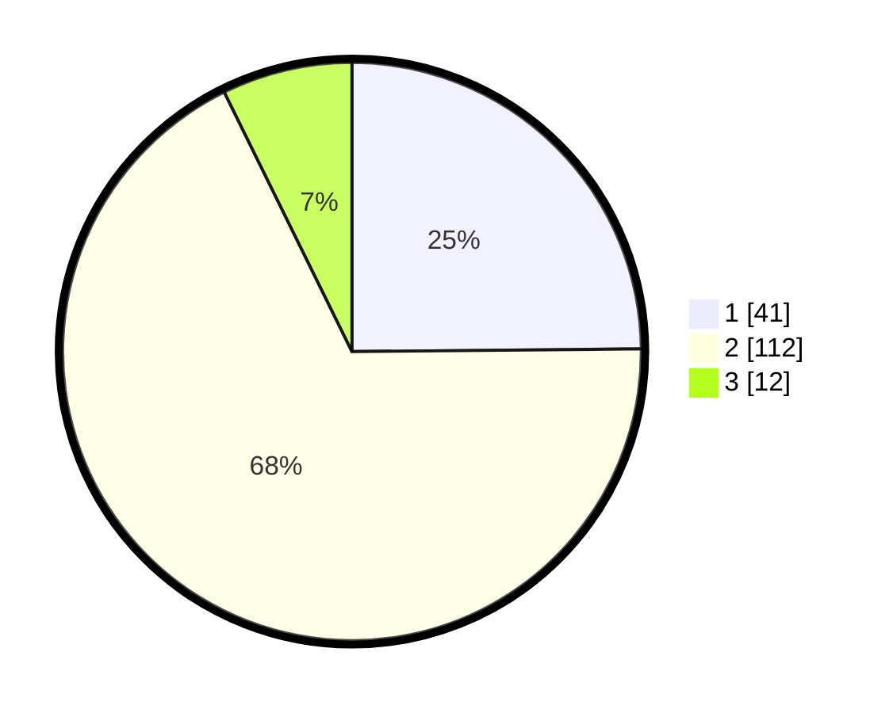

# Hasil

## Grafik

## Tabel

| No. | Nama Paslon    | Suara | Suara (raw) | Persentase |
|:--- |:-------------- | -----:| -----------:| ----------:|
| 1   | ANIES MUHAIMIN | 41    | [41][p-1]   | 24,85      |
| 2   | PRABOWO GIBRAN | 112   | [112][p-2]  | 67,88      |
| 3   | GANJAR MAHFUD  | 12    | [12][p-3]   | 7,27       |

[p-1]: https://github.com/gigit-pemilu/pemilu-2024-16-sumatera-selatan/blob/main/pilpres/hitung-suara/sub/16-sumatera-selatan/sub/01-ogan-komering-ulu/sub/22-lubuk-batang/sub/2008-belatung/sub/001-tps/sub/paslon-1.txt
[p-2]: https://github.com/gigit-pemilu/pemilu-2024-16-sumatera-selatan/blob/main/pilpres/hitung-suara/sub/16-sumatera-selatan/sub/01-ogan-komering-ulu/sub/22-lubuk-batang/sub/2008-belatung/sub/001-tps/sub/paslon-2.txt
[p-3]: https://github.com/gigit-pemilu/pemilu-2024-16-sumatera-selatan/blob/main/pilpres/hitung-suara/sub/16-sumatera-selatan/sub/01-ogan-komering-ulu/sub/22-lubuk-batang/sub/2008-belatung/sub/001-tps/sub/paslon-3.txt

## Foto C Plano

https://sirekap-obj-formc.kpu.go.id/e660/pemilu/ppwp/16/01/22/20/08/1601222008001-20240214-215308--def39e74-e4c0-4a18-9372-d3b7a9f3f04e.jpg

https://sirekap-obj-formc.kpu.go.id/e660/pemilu/ppwp/16/01/22/20/08/1601222008001-20240214-215815--f268ef3c-1179-461f-a84f-4ca6a4a2c057.jpg

https://sirekap-obj-formc.kpu.go.id/e660/pemilu/ppwp/16/01/22/20/08/1601222008001-20240214-215900--a4cfccde-426f-4cd0-8ae2-e5208acdf872.jpg

## Metadata

| Key        | Value               |
| ---------- | ------------------- |
| Time Stamp | 2024-02-25 18:00:00 |

