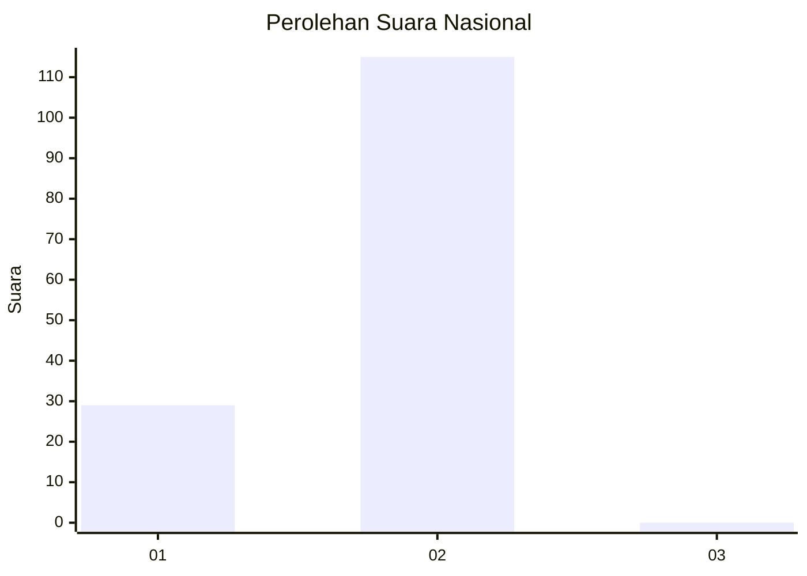
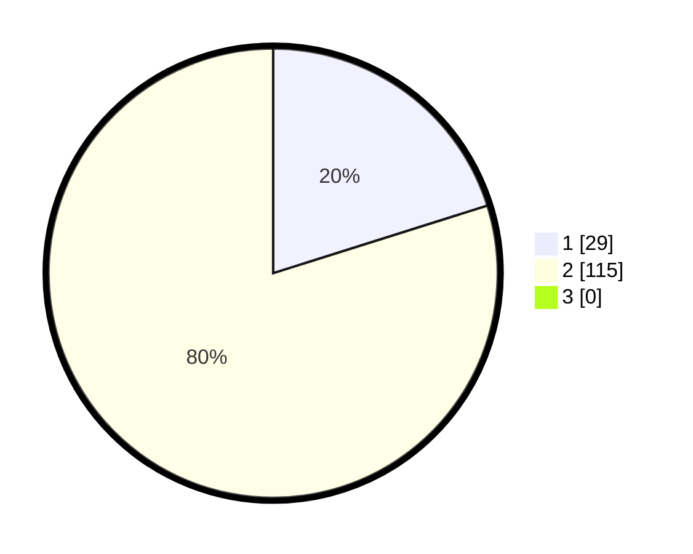

# Hasil

## Grafik

## Tabel

| No. | Nama Paslon    | Suara | Suara (raw) | Persentase |
|:--- |:-------------- | -----:| -----------:| ----------:|
| 1   | ANIES MUHAIMIN | 29    | [29][p-1]   | 20,14      |
| 2   | PRABOWO GIBRAN | 115   | [115][p-2]  | 79,86      |
| 3   | GANJAR MAHFUD  | 0     | [0][p-3]    | 0,00       |

[p-1]: https://github.com/gigit-pemilu/pemilu-2024/blob/main/pilpres/hitung-suara/sub/16-sumatera-selatan/sub/01-ogan-komering-ulu/sub/22-lubuk-batang/sub/2008-belatung/sub/005-tps/sub/paslon-1.txt
[p-2]: https://github.com/gigit-pemilu/pemilu-2024/blob/main/pilpres/hitung-suara/sub/16-sumatera-selatan/sub/01-ogan-komering-ulu/sub/22-lubuk-batang/sub/2008-belatung/sub/005-tps/sub/paslon-2.txt
[p-3]: https://github.com/gigit-pemilu/pemilu-2024/blob/main/pilpres/hitung-suara/sub/16-sumatera-selatan/sub/01-ogan-komering-ulu/sub/22-lubuk-batang/sub/2008-belatung/sub/005-tps/sub/paslon-3.txt

## Foto C Plano

https://sirekap-obj-formc.kpu.go.id/d83b/pemilu/ppwp/16/01/22/20/08/1601222008005-20240214-223710--788aca7e-9fb1-4a5f-bba7-11f9e74cec80.jpg

https://sirekap-obj-formc.kpu.go.id/d83b/pemilu/ppwp/16/01/22/20/08/1601222008005-20240214-224014--fefeb7b9-c263-4a2d-bd42-dc45df26edc7.jpg

https://sirekap-obj-formc.kpu.go.id/d83b/pemilu/ppwp/16/01/22/20/08/1601222008005-20240214-224156--b18eebfe-cd07-482c-a5ea-b67324942f58.jpg

## Metadata

| Key        | Value               |
| ---------- | ------------------- |
| Time Stamp | 2024-02-25 17:00:00 |

