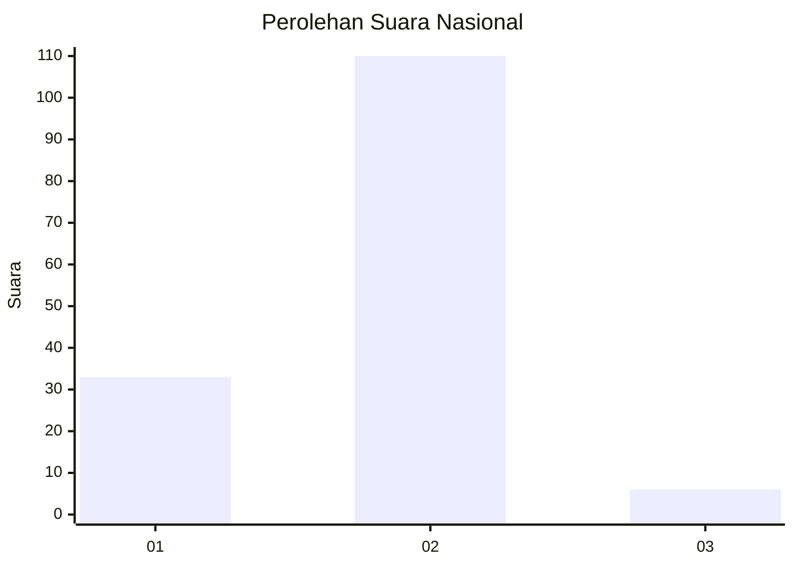

# Hasil

## Grafik

## Tabel

| No. | Nama Paslon    | Suara | Suara (raw) | Persentase |
|:--- |:-------------- | -----:| -----------:| ----------:|
| 1   | ANIES MUHAIMIN | 33    | [33][p-1]   | 22,15      |
| 2   | PRABOWO GIBRAN | 110   | [110][p-2]  | 73,83      |
| 3   | GANJAR MAHFUD  | 6     | [6][p-3]    | 4,03       |

[p-1]: https://github.com/gigit-pemilu/pemilu-2024/blob/main/pilpres/hitung-suara/sub/16-sumatera-selatan/sub/01-ogan-komering-ulu/sub/22-lubuk-batang/sub/2008-belatung/sub/006-tps/sub/paslon-1.txt
[p-2]: https://github.com/gigit-pemilu/pemilu-2024/blob/main/pilpres/hitung-suara/sub/16-sumatera-selatan/sub/01-ogan-komering-ulu/sub/22-lubuk-batang/sub/2008-belatung/sub/006-tps/sub/paslon-2.txt
[p-3]: https://github.com/gigit-pemilu/pemilu-2024/blob/main/pilpres/hitung-suara/sub/16-sumatera-selatan/sub/01-ogan-komering-ulu/sub/22-lubuk-batang/sub/2008-belatung/sub/006-tps/sub/paslon-3.txt

## Foto C Plano

https://sirekap-obj-formc.kpu.go.id/79f7/pemilu/ppwp/16/01/22/20/08/1601222008006-20240214-223852--c1b1ebff-f0ed-4d28-908b-a0cf6ef08b83.jpg

https://sirekap-obj-formc.kpu.go.id/79f7/pemilu/ppwp/16/01/22/20/08/1601222008006-20240214-223809--3f2103d2-711e-4878-b466-7bc5e1802230.jpg

https://sirekap-obj-formc.kpu.go.id/79f7/pemilu/ppwp/16/01/22/20/08/1601222008006-20240214-223725--3926bf2c-094b-4883-b1ed-0fb67f16df5e.jpg

## Metadata

| Key        | Value               |
| ---------- | ------------------- |
| Time Stamp | 2024-02-25 19:00:00 |

