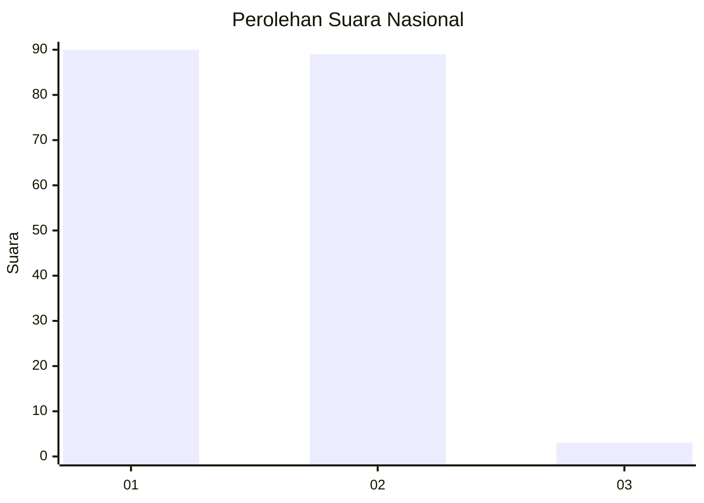
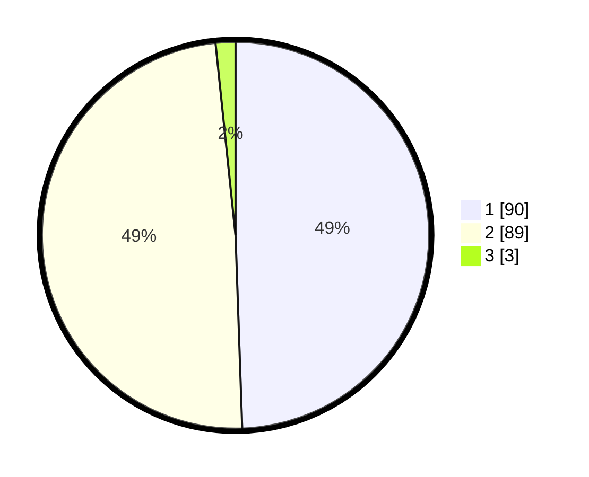

# Hasil

## Grafik

## Tabel

| No. | Nama Paslon    | Suara | Suara (raw) | Persentase |
|:--- |:-------------- | -----:| -----------:| ----------:|
| 1   | ANIES MUHAIMIN | 90    | [90][p-1]   | 49,45      |
| 2   | PRABOWO GIBRAN | 89    | [89][p-2]   | 48,90      |
| 3   | GANJAR MAHFUD  | 3     | [3][p-3]    | 1,65       |

[p-1]: https://github.com/gigit-pemilu/pemilu-2024/blob/main/pilpres/hitung-suara/sub/16-sumatera-selatan/sub/01-ogan-komering-ulu/sub/22-lubuk-batang/sub/2009-karta-mulya/sub/002-tps/sub/paslon-1.txt
[p-2]: https://github.com/gigit-pemilu/pemilu-2024/blob/main/pilpres/hitung-suara/sub/16-sumatera-selatan/sub/01-ogan-komering-ulu/sub/22-lubuk-batang/sub/2009-karta-mulya/sub/002-tps/sub/paslon-2.txt
[p-3]: https://github.com/gigit-pemilu/pemilu-2024/blob/main/pilpres/hitung-suara/sub/16-sumatera-selatan/sub/01-ogan-komering-ulu/sub/22-lubuk-batang/sub/2009-karta-mulya/sub/002-tps/sub/paslon-3.txt

## Foto C Plano

https://sirekap-obj-formc.kpu.go.id/6166/pemilu/ppwp/16/01/22/20/09/1601222009002-20240215-012608--f9b05e20-b324-4635-a309-838528415441.jpg

https://sirekap-obj-formc.kpu.go.id/6166/pemilu/ppwp/16/01/22/20/09/1601222009002-20240215-012722--aa425c82-bafb-4360-b105-6e09d3230a40.jpg

https://sirekap-obj-formc.kpu.go.id/6166/pemilu/ppwp/16/01/22/20/09/1601222009002-20240215-012805--61ec9f20-f6b0-49fd-8369-ce2a81642772.jpg

## Metadata

| Key        | Value               |
| ---------- | ------------------- |
| Time Stamp | 2024-02-25 18:00:00 |

