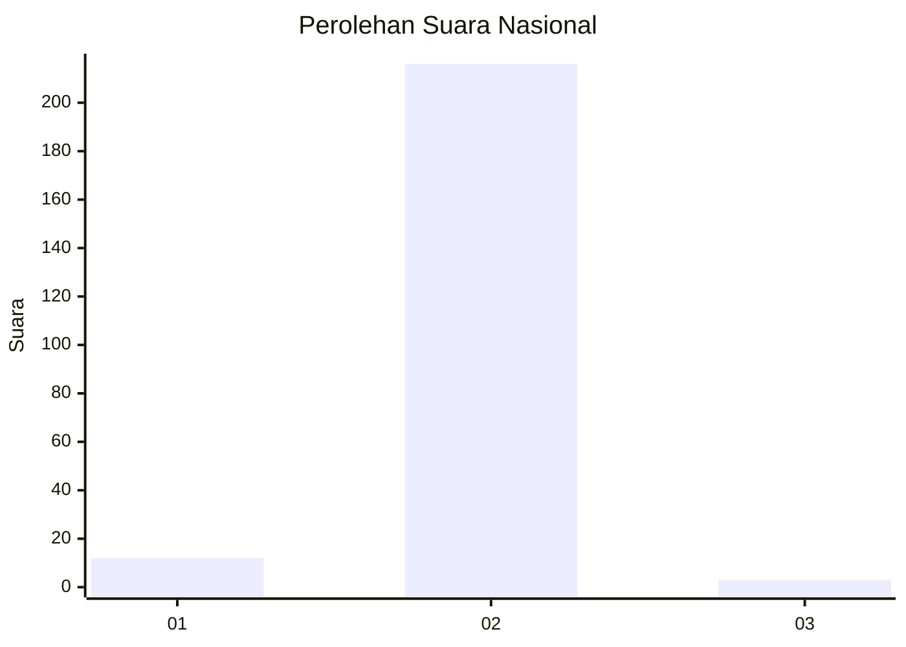
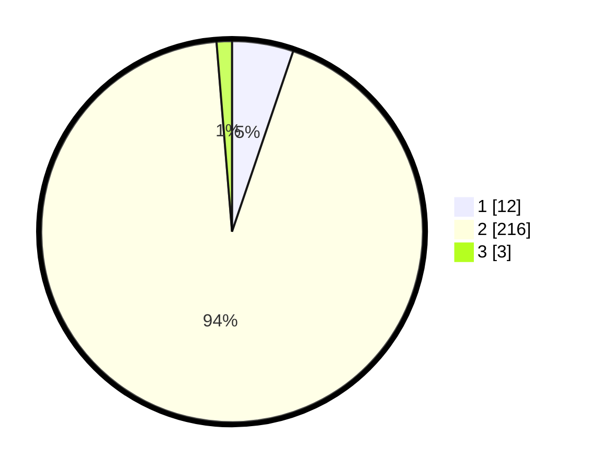

# Hasil

## Grafik

## Tabel

| No. | Nama Paslon    | Suara | Suara (raw) | Persentase |
|:--- |:-------------- | -----:| -----------:| ----------:|
| 1   | ANIES MUHAIMIN | 12    | [12][p-1]   | 5,19       |
| 2   | PRABOWO GIBRAN | 216   | [216][p-2]  | 93,51      |
| 3   | GANJAR MAHFUD  | 3     | [3][p-3]    | 1,30       |

[p-1]: https://github.com/gigit-pemilu/pemilu-2024/blob/main/pilpres/hitung-suara/sub/16-sumatera-selatan/sub/01-ogan-komering-ulu/sub/22-lubuk-batang/sub/2010-lunggaian/sub/001-tps/sub/paslon-1.txt
[p-2]: https://github.com/gigit-pemilu/pemilu-2024/blob/main/pilpres/hitung-suara/sub/16-sumatera-selatan/sub/01-ogan-komering-ulu/sub/22-lubuk-batang/sub/2010-lunggaian/sub/001-tps/sub/paslon-2.txt
[p-3]: https://github.com/gigit-pemilu/pemilu-2024/blob/main/pilpres/hitung-suara/sub/16-sumatera-selatan/sub/01-ogan-komering-ulu/sub/22-lubuk-batang/sub/2010-lunggaian/sub/001-tps/sub/paslon-3.txt

## Foto C Plano

https://sirekap-obj-formc.kpu.go.id/89de/pemilu/ppwp/16/01/22/20/10/1601222010001-20240215-112535--c5532558-0a76-46d6-bae2-3ba324897590.jpg

https://sirekap-obj-formc.kpu.go.id/89de/pemilu/ppwp/16/01/22/20/10/1601222010001-20240219-113501--ecc4d1c4-7fd0-4632-8113-79bf6a3855e6.jpg

https://sirekap-obj-formc.kpu.go.id/89de/pemilu/ppwp/16/01/22/20/10/1601222010001-20240219-113822--740e40ad-0519-489c-80d8-d2eba7c7dc7a.jpg

## Metadata

| Key        | Value               |
| ---------- | ------------------- |
| Time Stamp | 2024-02-19 12:00:00 |

