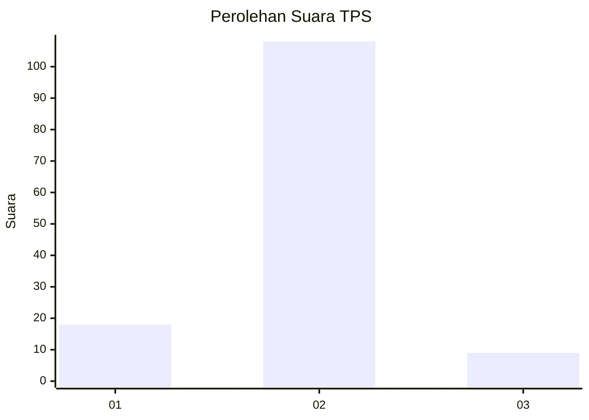
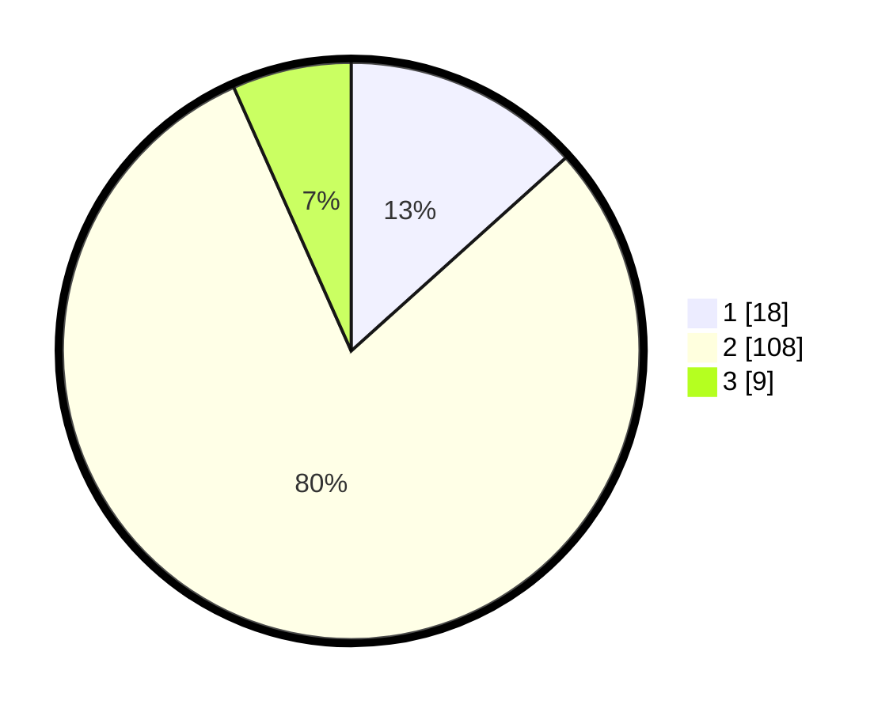

# Hasil

## Grafik

## Tabel

| No. | Nama Paslon    | Suara | Suara (raw) | Persentase |
|:--- |:-------------- | -----:| -----------:| ----------:|
| 1   | ANIES MUHAIMIN | 18    | [18][p-1]   | 13,33      |
| 2   | PRABOWO GIBRAN | 108   | [108][p-2]  | 80,00      |
| 3   | GANJAR MAHFUD  | 9     | [9][p-3]    | 6,67       |

[p-1]: https://github.com/gigit-pemilu/pemilu-2024-16-sumatera-selatan/blob/main/pilpres/hitung-suara/sub/16-sumatera-selatan/sub/01-ogan-komering-ulu/sub/28-lengkiti/sub/2006-tanjunglengkayap/sub/004-tps/sub/paslon-1.txt
[p-2]: https://github.com/gigit-pemilu/pemilu-2024-16-sumatera-selatan/blob/main/pilpres/hitung-suara/sub/16-sumatera-selatan/sub/01-ogan-komering-ulu/sub/28-lengkiti/sub/2006-tanjunglengkayap/sub/004-tps/sub/paslon-2.txt
[p-3]: https://github.com/gigit-pemilu/pemilu-2024-16-sumatera-selatan/blob/main/pilpres/hitung-suara/sub/16-sumatera-selatan/sub/01-ogan-komering-ulu/sub/28-lengkiti/sub/2006-tanjunglengkayap/sub/004-tps/sub/paslon-3.txt

## Foto C Plano

https://sirekap-obj-formc.kpu.go.id/f9b0/pemilu/ppwp/16/01/28/20/06/1601282006004-20240214-200114--f1880dbb-7674-4cda-96dc-8fd9153894cf.jpg

https://sirekap-obj-formc.kpu.go.id/f9b0/pemilu/ppwp/16/01/28/20/06/1601282006004-20240214-223907--08c711a5-f59a-4dd3-abf8-3d72fa01fd86.jpg

https://sirekap-obj-formc.kpu.go.id/f9b0/pemilu/ppwp/16/01/28/20/06/1601282006004-20240215-010355--84df01d8-6937-4fef-a60e-ab545f3e5657.jpg

## Metadata

| Key        | Value               |
| ---------- | ------------------- |
| Time Stamp | 2024-02-15 04:00:24 |

