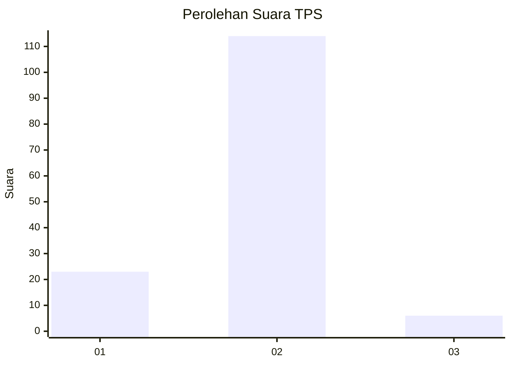
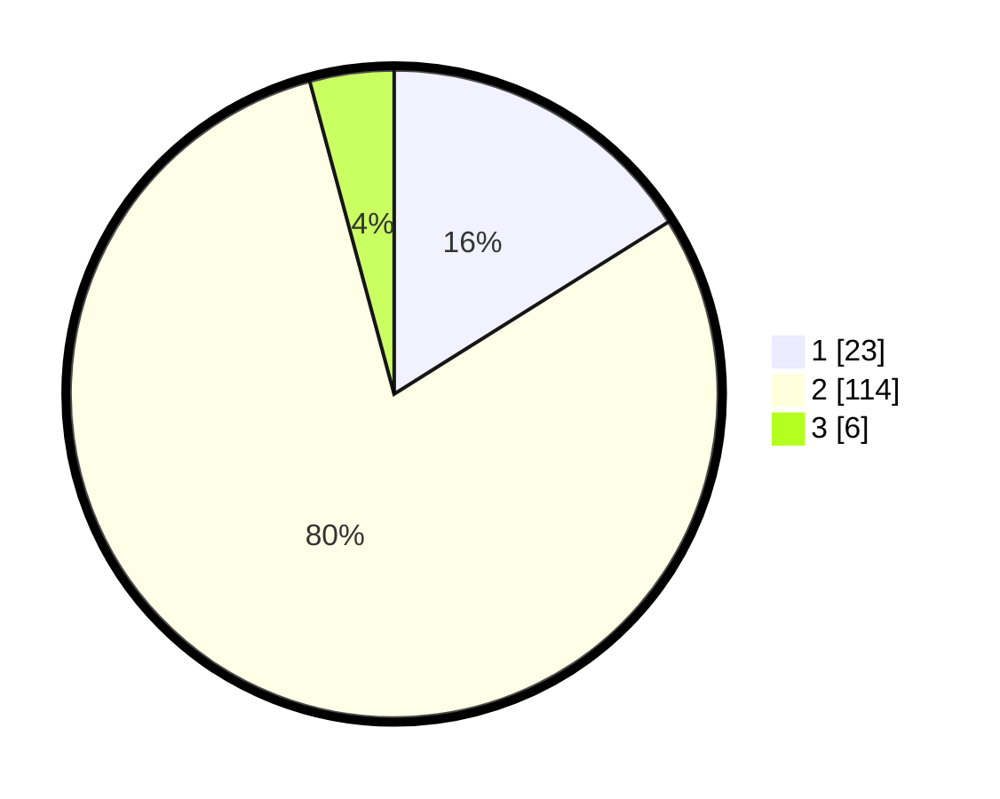

# Hasil

## Grafik

## Tabel

| No. | Nama Paslon    | Suara | Suara (raw) | Persentase |
|:--- |:-------------- | -----:| -----------:| ----------:|
| 1   | ANIES MUHAIMIN | 23    | [23][p-1]   | 16,08      |
| 2   | PRABOWO GIBRAN | 114   | [114][p-2]  | 79,72      |
| 3   | GANJAR MAHFUD  | 6     | [6][p-3]    | 4,20       |

[p-1]: https://github.com/gigit-pemilu/pemilu-2024-16-sumatera-selatan/blob/main/pilpres/hitung-suara/sub/16-sumatera-selatan/sub/01-ogan-komering-ulu/sub/28-lengkiti/sub/2015-tualang/sub/004-tps/sub/paslon-1.txt
[p-2]: https://github.com/gigit-pemilu/pemilu-2024-16-sumatera-selatan/blob/main/pilpres/hitung-suara/sub/16-sumatera-selatan/sub/01-ogan-komering-ulu/sub/28-lengkiti/sub/2015-tualang/sub/004-tps/sub/paslon-2.txt
[p-3]: https://github.com/gigit-pemilu/pemilu-2024-16-sumatera-selatan/blob/main/pilpres/hitung-suara/sub/16-sumatera-selatan/sub/01-ogan-komering-ulu/sub/28-lengkiti/sub/2015-tualang/sub/004-tps/sub/paslon-3.txt

## Foto C Plano

https://sirekap-obj-formc.kpu.go.id/a5ba/pemilu/ppwp/16/01/28/20/15/1601282015004-20240214-224842--91831f4c-bb9e-4479-8e58-20d22e5fdf1a.jpg

https://sirekap-obj-formc.kpu.go.id/a5ba/pemilu/ppwp/16/01/28/20/15/1601282015004-20240214-225106--8eaeb358-1325-4ceb-a9f2-8da24ba3a2f5.jpg

https://sirekap-obj-formc.kpu.go.id/a5ba/pemilu/ppwp/16/01/28/20/15/1601282015004-20240214-225215--5ec67b17-6fcd-4f0d-bcd5-eb9023927796.jpg

## Metadata

| Key        | Value               |
| ---------- | ------------------- |
| Time Stamp | 2024-02-24 22:31:28 |

