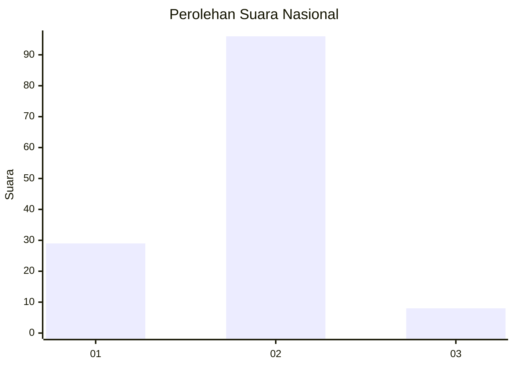
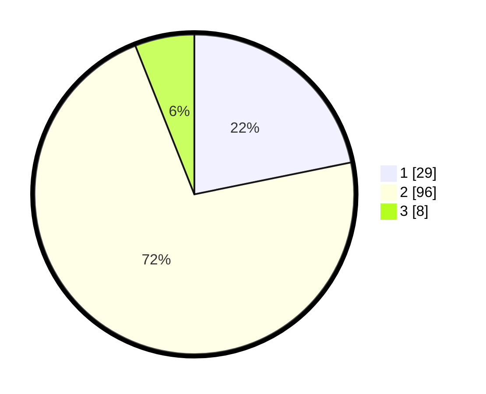

# Hasil

## Grafik

## Tabel

| No. | Nama Paslon    | Suara | Suara (raw) | Persentase |
|:--- |:-------------- | -----:| -----------:| ----------:|
| 1   | ANIES MUHAIMIN | 29    | [29][p-1]   | 21,80      |
| 2   | PRABOWO GIBRAN | 96    | [96][p-2]   | 72,18      |
| 3   | GANJAR MAHFUD  | 8     | [8][p-3]    | 6,02       |

[p-1]: https://github.com/gigit-pemilu/pemilu-2024/blob/main/pilpres/hitung-suara/sub/16-sumatera-selatan/sub/01-ogan-komering-ulu/sub/31-muara-jaya/sub/2003-muara-saeh/sub/006-tps/sub/paslon-1.txt
[p-2]: https://github.com/gigit-pemilu/pemilu-2024/blob/main/pilpres/hitung-suara/sub/16-sumatera-selatan/sub/01-ogan-komering-ulu/sub/31-muara-jaya/sub/2003-muara-saeh/sub/006-tps/sub/paslon-2.txt
[p-3]: https://github.com/gigit-pemilu/pemilu-2024/blob/main/pilpres/hitung-suara/sub/16-sumatera-selatan/sub/01-ogan-komering-ulu/sub/31-muara-jaya/sub/2003-muara-saeh/sub/006-tps/sub/paslon-3.txt

## Foto C Plano

https://sirekap-obj-formc.kpu.go.id/c446/pemilu/ppwp/16/01/31/20/03/1601312003006-20240215-074445--b4784fb6-6c61-44cc-8aac-03743c622807.jpg

https://sirekap-obj-formc.kpu.go.id/c446/pemilu/ppwp/16/01/31/20/03/1601312003006-20240215-074751--05225374-ab69-46ca-882d-cb80f8d3219b.jpg

https://sirekap-obj-formc.kpu.go.id/c446/pemilu/ppwp/16/01/31/20/03/1601312003006-20240215-075018--f522e88f-653a-4c9a-9f4d-a82aba7742bd.jpg

## Metadata

| Key        | Value               |
| ---------- | ------------------- |
| Time Stamp | 2024-02-25 22:00:00 |

